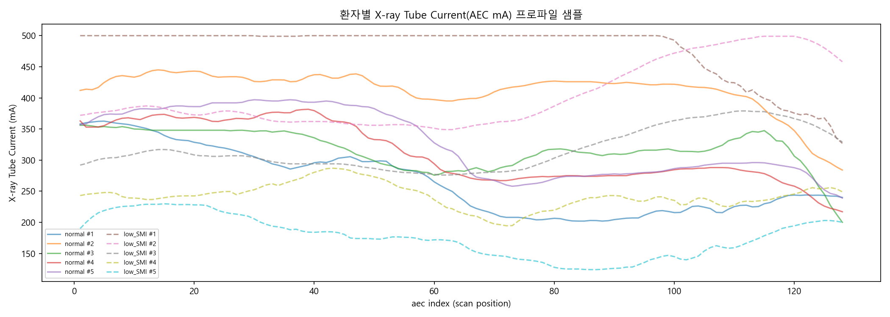
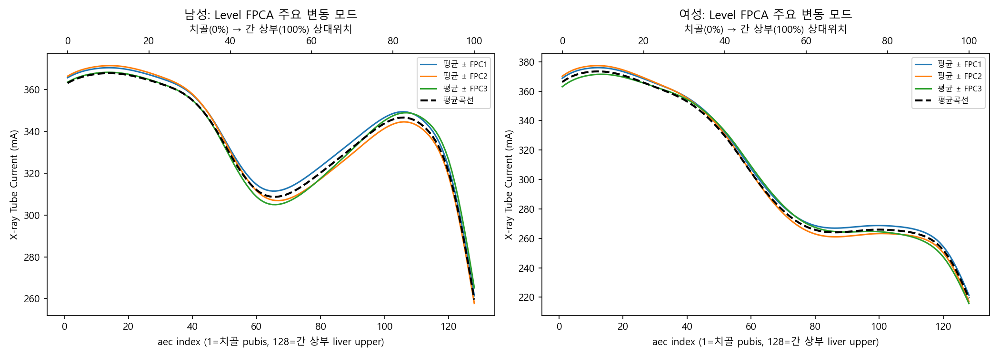
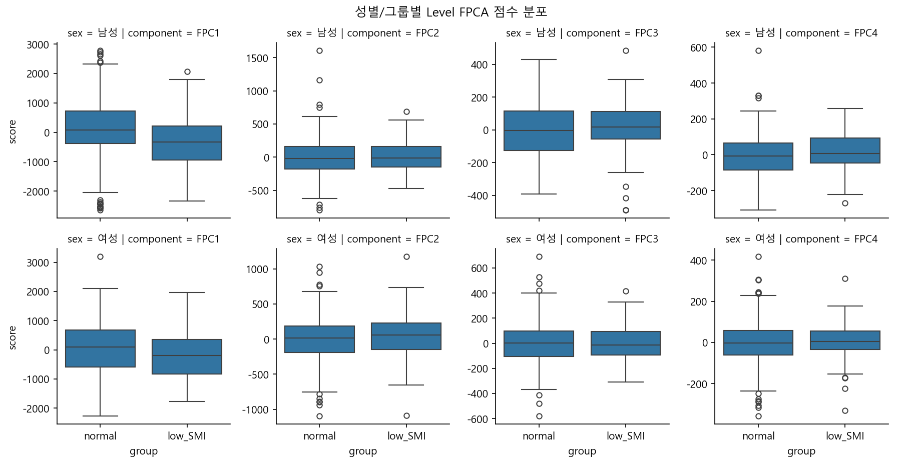
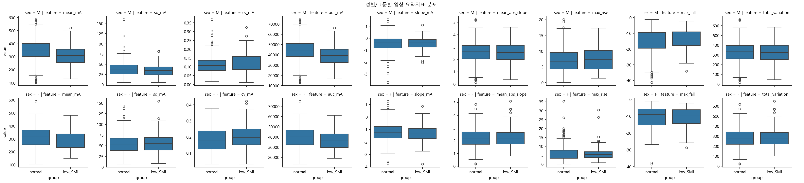
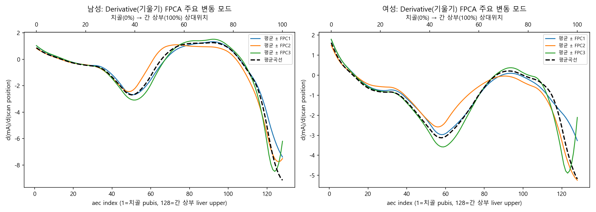
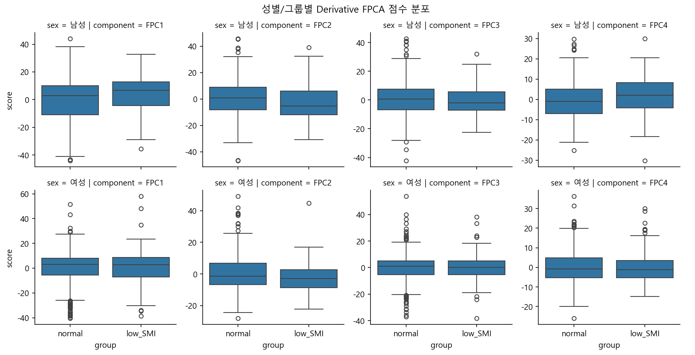
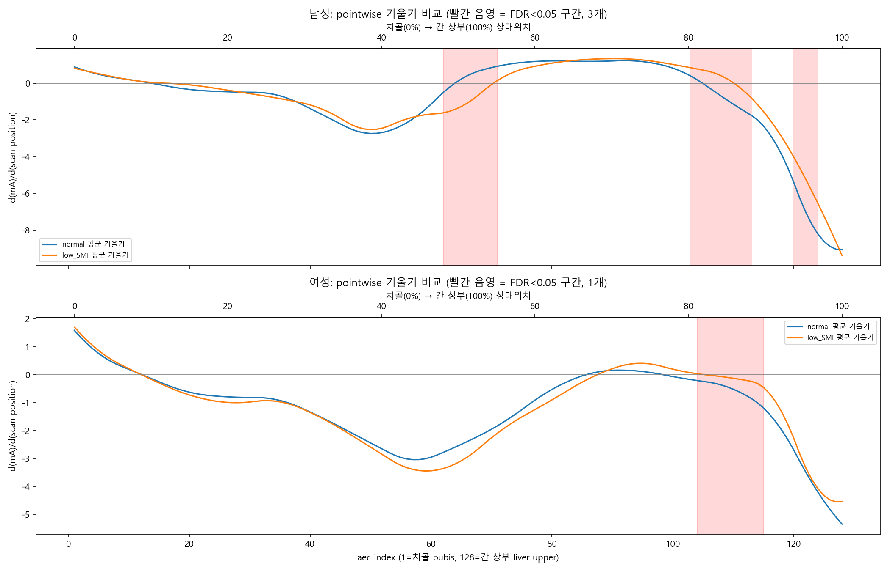
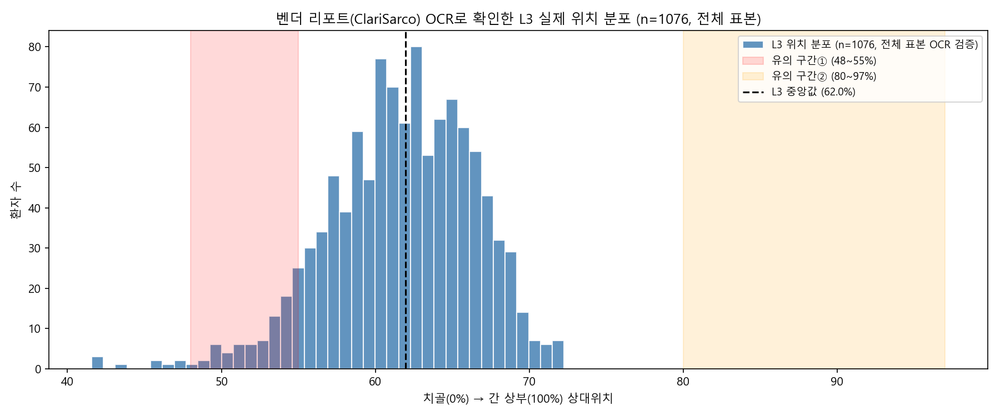

# 강남_aec_128 연구 요약

## 1. 데이터 정의

`aec_1`~`aec_128`은 128개의 독립 변수가 아니라, **CT 스캔 중 X-ray Tube Current(mA) 프로파일**이다 (AEC = Automatic Exposure Control). 환자별로 하나의 연속 곡선이며, **`aec_1`=치골(pubis), `aec_128`=간 상부(liver upper)**가 되도록 환자마다 랜드마크 정규화되어 있다. 즉 index는 물리적 mm 위치가 아니라 pubis(0%)→liver upper(100%) 상대위치이며, 이 정규화 덕분에 환자 간 pointwise 비교가 방법론적으로 타당하다(FDA의 landmark registration과 동일).

- `SMI`: 골격근지수(Skeletal Muscle Index), 표준 임상 공식으로 **L3 척추 레벨에서만** 계산됨
- `Output`: 0=정상, 1=저SMI(근감소증)
- 시트 구성: `M_normal`, `M_low_SMI`, `F_normal`, `F_low_SMI` (성별 층화), `aec_128`은 4개 그룹을 합친 것(분석에서 제외 — 성별 혼재로 confounding 위험)

## 2. 방법론 발전 과정

| 단계      | 접근                                                                                                                    | 결과                                                                                |
| --------- | ----------------------------------------------------------------------------------------------------------------------- | ----------------------------------------------------------------------------------- |
| 1차       | 128개 aec를 독립 변수로 간주 → 단변량 검정 + 상관 클러스터링(dendrogram) + PCA + Elastic Net                           | 실제로는 곡선 데이터라는 게 밝혀지며**방법론적으로 부적절함이 확인되어 폐기** |
| 2차(최종) | **Functional Data Analysis** (Ramsay & Silverman): B-spline 스무딩 → Level/Derivative FPCA → pointwise FDR 검정 | 채택                                                                                |

## 3. 그림으로 보는 분석 결과

### ① 원곡선: aec가 실제로 어떻게 생겼는가

정상군/저SMI군 각 5명씩의 실제 곡선. 128개 지점이 서로 독립적인 값이 아니라 **하나의 매끄러운 곡선**임이 한눈에 보인다 — 이게 이 데이터를 Functional Data Analysis로 다뤄야 하는 이유다.

### ② Level FPCA: 곡선의 "높이" 차이

- PC1이 분산의 88.5%(남)/85.3%(여)를 설명 — 곡선 변동의 대부분이 "전체적으로 높다/낮다"는 하나의 축에 집중
- Permutation 검정: 남 p=0.0025, 여 p=0.0005 → **곡선 높이 자체가 그룹 간 유의하게 다름**

### ③ 임상 요약지표: 평균 관전류가 핵심 신호

`mean_mA`, `auc_mA`가 남녀 모두 강하게 유의 (FDR p<0.001, Cohen's d ≈ 0.34~0.47) — **저SMI(근감소) 환자일수록 평균 관전류가 낮다.** 체격/감쇠 차이로 설명 가능한, 가장 강하고 해석이 쉬운 신호.

### ④ Derivative FPCA: "높이"로 설명 안 되는 기울기 패턴

- Permutation 검정: 남 p=0.0025, 여 p=0.034 → **기울기 패턴도 유의**
- 그러나 전체 선형회귀 slope, 평균|기울기| 같은 단순 스칼라 지표는 전부 **유의하지 않음** → 차이가 국소적이라는 뜻. 어디서 나는지는 다음 그림에서 특정

### ⑤ Pointwise FDR 검정: 정확히 어디서 차이가 나는가

곡선을 지점별로 비교(FDR 보정)해서 특정한 유의 구간:

| 성별 | 유의 구간 (index) | pubis~liver 상대위치 | 방향                                              |
| ---- | ----------------- | -------------------- | ------------------------------------------------- |
| 남   | aec_62~71         | 48~55%               | normal은 상승 시작, low_SMI는 계속 하강 (d=0.41)  |
| 남   | aec_103~113       | 80~88%               | normal은 하강 시작, low_SMI는 아직 상승 (d=-0.46) |
| 남   | aec_120~124       | 94~97%               | 둘 다 급락하나 low_SMI가 덜 가파름 (d=-0.30)      |
| 여   | aec_104~115       | 81~90%               | normal이 더 완만하게 하강 (d=-0.22)               |

### ⑥ L3 위치 검증: 유의 구간이 실제 근육 측정 위치와 겹치는가

벤더 AI 리포트(ClariSarco)에 찍힌 **"L3 Level (Slice #NN)"**을 OCR로 읽어 전체 환자(n=1076, 성공률 99.4%)의 L3 실제 위치를 확인한 결과:

- **L3 위치: 평균 61.7% ± SD 4.7%, 중앙값 62.0%, IQR 58.7~65.1%**
- 유의 구간①(48~55%)과 겹치는 환자: **72/1076 (6.7%)** — L3 분포의 왼쪽 꼬리만 살짝 걸침
- 유의 구간②(80~97%)와 겹치는 환자: **0/1076 (0%)** — 전체 표본에서 단 한 명도 겹치지 않음

그림에서 보듯 L3(파란 히스토그램)는 두 유의 구간(빨강/주황 음영) 사이의 빈 공간에 매우 좁고 안정적으로 분포한다.

#### 검증 과정

가설(48~55%=L3 근방) → TotalSegmentator 자체 세그멘테이션(65.8%) → 벤더 리포트 OCR(66.2%, 0.4%p 이내 일치, 이후 TotalSegmentator는 제거) → 40명 샘플 확장 중 `InstanceNumber` 시작값이 1이 아닌 시리즈 버그 발견/수정 → 전체 표본 재검증(n=1076).

## 4. 결론

1. **AEC 곡선의 "높이"(평균값)는 저SMI군에서 유의하게 낮다** (p<0.001, d≈0.34~0.47)
2. **곡선의 "기울기 패턴"도 유의하게 다르며**, pointwise FDR 검정으로 두 개의 구체적 구간(48~55%, 80~97%)을 특정함
3. **그러나 이 두 유의 구간은 실제 L3(SMI 측정 위치, 평균 61.7%)와 거의 겹치지 않는다** (n=1076 기준 각각 6.7%, 0%만 겹침) — 발견된 신호는 L3 근육 단면적 자체보다는 **인접 부위(L4-L5 방향 또는 간/내장지방 방향)의 체성분 차이**를 반영할 가능성이 높음

## 5. 산출물

### 스크립트

- `aec_pipeline.py` — 성별 층화 pointwise 검정(baseline)
- `aec_fda_pipeline.py` — FDA 메인 분석 (Level/Derivative FPCA, pointwise FDR)
- `l3_ocr_pipeline.py` — 벤더 리포트 OCR 기반 L3 위치 추출 (핵심 로직)
- `l3_ocr_batch_all.py` — 전체 환자 대상 배치 실행 스크립트

### 결과 파일

- `aec_analysis_results.xlsx`, `aec_fda_results.xlsx`, `l3_ocr_results_full.csv` (n=1082, 성공 1076)

### 참조 원본

- `강남_aec_128.xlsx` (aec 데이터), `강남_z_bounds.xlsx` (환자별 pubis/liver 랜드마크 z좌표 + 사용 시리즈)
