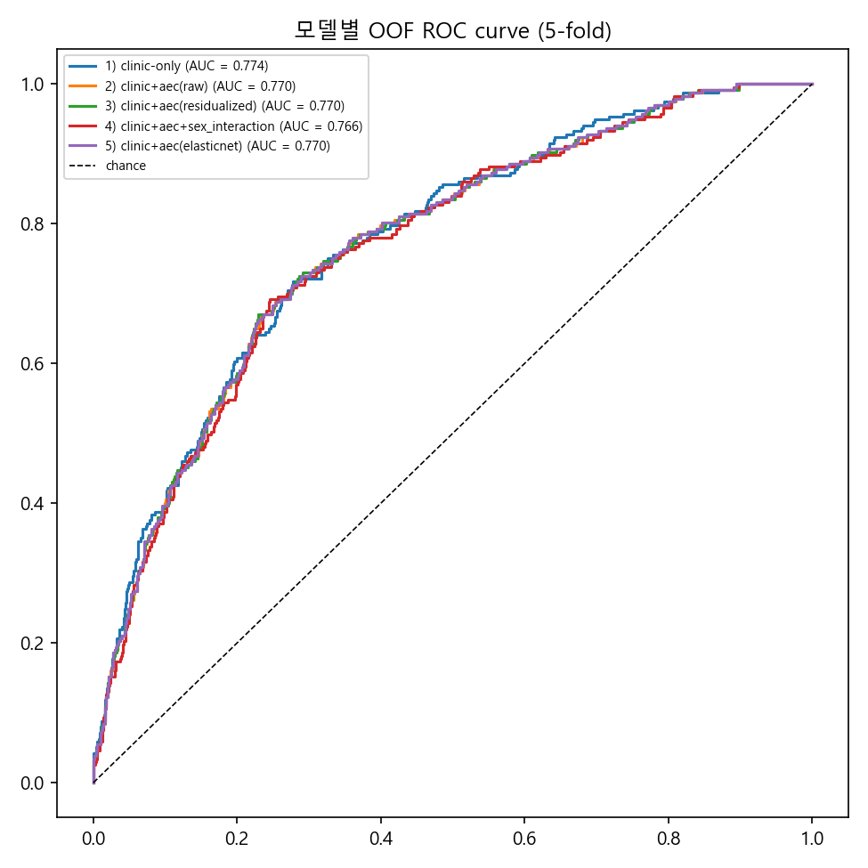
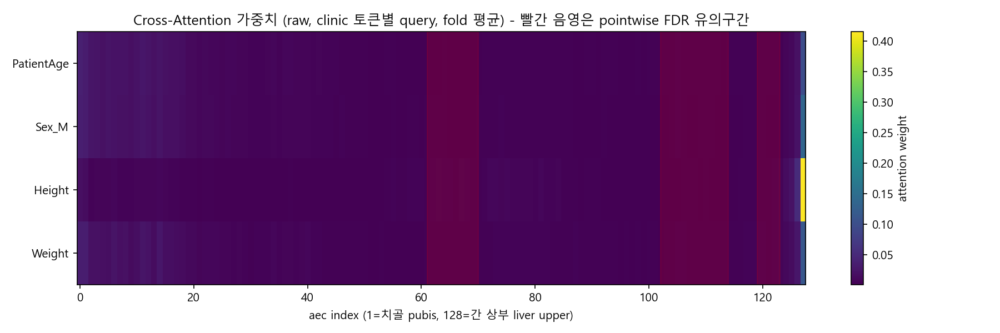
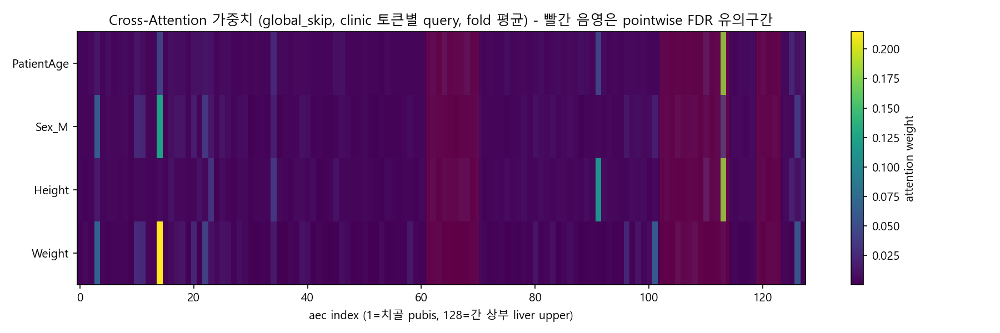

# 강남_aec_128 연구 요약 (0702) — "곡선 신호를 예측 모델에 넣으면 도움이 되는가?"

[0701_RESEARCH_SUMMARY.md](0701_RESEARCH_SUMMARY.md)에서 FDA로 유의구간(pointwise FDR)을 찾아냈다. 이번 작업은 "그 신호를 실제 저SMI 예측 모델에 추가하면 clinic 변수만 쓸 때보다 나아지는가?"를 검증했다. 결론부터 말하면 **아니오** — 스칼라 피처든 원곡선+attention이든, clinic-only(나이/성별/키/몸무게) 로지스틱 회귀를 넘어서지 못했다.

## 0. 코드 재구성

기존 4개 스크립트를 실행 순서대로 `01_aec_pipeline.py` / `02_aec_fda_pipeline.py` / `03_l3_ocr_pipeline.py`로 번호를 매겨 정리하고(내용은 0701과 동일), 이번에 만든 `04_build_model_features.py` / `05_compare_models.py` / `06_cross_attention_model.py`를 뒤에 이어 붙였다.

## 1. 모델 피처 테이블 구축 (`04_build_model_features.py`)

`강남_liver_merged_features.xlsx`(clinic metadata + aec_128)와 `강남_aec_128.xlsx`(Output 라벨)를 PatientID로 조인해서 `excel/강남_model_features.xlsx`(1082행 x 11열)를 만들었다. clinic 4개(PatientAge, PatientSex, Height, Weight)는 그대로 두고, aec_128 원곡선에서 0701의 pointwise FDR 유의구간 근거로 4개 스칼라 피처만 뽑았다:

- `mean_mA`: 곡선 전체 평균 높이 (auc_mA와 상관 0.99999라 별도로 안 뽑음)
- `slope_48_55` (aec_62~71), `slope_80_90` (aec_103~115), `slope_94_97` (aec_120~124): 각 유의구간의 평균 1차 차분

Output 분포: 정상 845 / 저SMI 237 (비율 21.9%).

## 2. clinic vs clinic+aec 비교 (`05_compare_models.py`)

같은 `RepeatedStratifiedKFold(5-fold)` 위에서 5가지 변형을 Wilcoxon paired test로 비교(피처가 아니라 **fold를 고정**해서 짝지음).

| 변형 | ROC-AUC | PR-AUC | ROC-AUC diff(vs 1) | p | PR-AUC diff(vs 1) | p |
| --- | --- | --- | --- | --- | --- | --- |
| 1) clinic-only | 0.7764 | 0.5196 | — | — | — | — |
| 2) clinic+aec(raw) | 0.7722 | 0.5084 | -0.0042 | 0.625 | -0.0112 | 0.1875 |
| 3) clinic+aec(residualized) | 0.7727 | 0.5096 | -0.0037 | 0.625 | -0.0100 | 0.1875 |
| 4) clinic+aec+sex_interaction | 0.7691 | 0.5000 | -0.0073 | 0.0625 | -0.0196 | 0.0625 |
| 5) clinic+aec(elasticnet) | 0.7727 | 0.5100 | -0.0037 | 0.8125 | -0.0096 | 0.1875 |

- aec를 어떤 방식으로 넣어도(raw/잔차화/성별 교차항/elasticnet) **개선되지 않고, 오히려 4)번은 소폭 나빠지는 쪽으로 기움** (n=5 fold라 Wilcoxon 최소 p가 0.0625라 유의성 판단엔 한계 있음).
- Elasticnet 표준화 계수: `Height`(1.39), `Weight`(-1.33), `PatientAge`(0.64), `Sex_M`(-0.25)가 지배적이고, aec 4개는 전부 작음(`mean_mA` -0.04, `slope_48_55` ≈0, `slope_80_90` 0.18, `slope_94_97` 0.13). 성별교차항 중에는 `SexM_x_mean_mA`(-0.22)가 가장 크지만 여전히 clinic 계수보다 작다.
- 스크립트 주석에 남아있는 사전 관찰: `mean_mA`-`Weight` 상관 0.54, `slope_48_55`-`Weight` 상관 0.40 → **aec 신호 상당수가 이미 체중에 들어있는 정보와 중복**된다는 가설과 일치하는 결과.

## 3. Cross-Attention 신경망으로 원곡선 전체 활용 (`06_cross_attention_model.py`)

스칼라 피처로 요약하지 않고, `aec_1`~`aec_128` 원곡선 전체를 key/value로, clinic 4개를 query로 하는 `nn.MultiheadAttention` 기반 신경망(d_model=16, 2 heads)이 스스로 어디에 주목할지 학습하게 했다. 5가지 변형을 같은 `RepeatedStratifiedKFold(5-fold)`(코드 주석엔 "5-fold x 4 repeat" 설계 의도가 적혀 있으나 실제 실행은 `N_REPEATS=1`, 즉 5-fold만 수행됨 — 통계 검정력이 의도보다 낮다는 점 참고) 위에서 비교:

| 변형 | 설명 | ROC-AUC | PR-AUC | vs clinic-only(0.7764/0.5196) p |
| --- | --- | --- | --- | --- |
| raw | aec 원본 값 그대로 입력 | 0.5420 | 0.2681 | p=0.0625 / 0.0625 (크게 나쁨, 거의 chance 수준) |
| global | train fold 전체 평균/표준편차로 정규화 | 0.7159 | 0.4083 | p=0.0625 / 0.0625 |
| global_skip | clinic-only 로지스틱과 동등한 선형항을 residual로 추가(DAFT류 skip) | 0.7525 | 0.4809 | p=0.125 / 0.125 |
| global_skip_smooth | +B-spline 스무딩(20 basis) | 0.7528 | 0.4818 | p=0.125 / 0.125 |
| global_skip_estop | +early stopping (patience 10) | 0.7535 | 0.4674 | p=0.125 / 0.125 |

단독 기여도 (Wilcoxon paired, 같은 fold):

| 비교 | ROC-AUC 차이 | p | PR-AUC 차이 | p |
| --- | --- | --- | --- | --- |
| global − raw | +0.174 | 0.0625 | +0.140 | 0.0625 |
| global_skip − global | +0.037 | 0.0625 | +0.073 | 0.0625 |
| global_skip_smooth − global_skip | +0.0004 | 0.75 | +0.001 | 1.0 |
| global_skip_estop − global_skip | +0.001 | 1.0 | -0.014 | 0.4375 |

- **정규화(raw→global)와 clinic-skip(global→global_skip) 두 아이디어가 실질적 개선을 만들었다** — 정규화 없이는 신경망이 거의 학습을 못했고(0.54 AUC), skip connection이 clinic 정보를 보존해줘야 attention이 제 역할을 함.
- **스무딩과 early-stopping은 추가 효과가 없었다** (거의 0에 가까운 차이, p 모두 무의미).
- 최선인 `global_skip` 계열도 clinic-only(0.7764) 대비 ROC-AUC -0.024 ~ PR-AUC -0.05 낮고, 5-fold 기준 Wilcoxon p=0.125로 통계적으로 유의하게 다르다고 할 수도 없지만, **더 나아졌다는 근거도 없다** — 즉 원곡선을 신경망에 통째로 줘도 clinic-only를 이기지 못한다는 결론은 5)의 스칼라 피처 접근과 동일.

### Attention이 실제로 어디를 보는가

정규화 전(raw)에는 attention이 거의 균일하게 퍼져 있다가 맨 끝 구간(index~127, liver 근처)에만 예외적으로 쏠리는 반면, `global_skip`에서는 clinic 4개 토큰 모두 곡선의 **양쪽 경계 근방(index~14, ~114)**에 뚜렷한 피크가 생긴다. index~114는 0701에서 찾은 유의구간 중 하나(aec_103~115, 80~88%)와 겹치지만, 다른 유의구간(aec_62~71, aec_120~124, 그림의 빨간 음영)에는 뚜렷한 피크가 없다 — 신경망이 학습으로 찾아낸 주목 위치와 pointwise FDR로 찾은 유의구간이 **부분적으로만** 일치한다.

## 4. 결론(1차, 5-fold 기준)

1. **clinic 변수(나이/성별/키/몸무게)만으로도 ROC-AUC 0.776 수준의 준수한 baseline**이 나오며, 이 위에 0701에서 찾은 aec FDA 신호를 어떤 형태로 추가해도(스칼라 요약, 잔차화, 성별교차항, elasticnet, 원곡선+cross-attention 전부) **유의한 개선이 없었다.**
2. aec 신호는 통계적으로는 유의(0701 결론)하지만, 그 정보의 상당 부분이 이미 체중/키 등 clinic 변수에 들어있는 것으로 보인다(상관 0.4~0.54, elasticnet에서 aec 계수가 clinic 대비 미미함).
3. Cross-Attention 신경망 실험에서는 **정규화와 clinic-skip 설계가 핵심**이었고(둘 다 없으면 거의 chance 수준), 스무딩/early-stopping 같은 정교화는 추가 이득이 없었다 — 즉 "더 복잡한 모델"이 문제가 아니라 애초에 clinic 대비 추가 정보량 자체가 제한적이라는 5)번 결론을 신경망 쪽에서도 재확인.
4. **실무적 함의**: 저SMI 스크리닝에 aec_128 곡선을 추가로 확보/전처리할 실익이 크지 않다 — clinic 4변수 로지스틱 회귀가 현재까지 가장 간단하고 경쟁력 있는 모델.

## 5. 후속 실험: 통계 검정력 확보 + skip warm-start + FDA-prior (`07_cross_attention_v2.py`)

0701 결과에서 `global_skip`(clinic-only와 근접)이 가장 유망했지만, 06의 비교는 `N_REPEATS=1`(5-fold만)이라
Wilcoxon 최소 p가 0.125로 유의성 판단이 애초에 불가능했다. 이를 보완하기 위해 세 가지를 검증했다:

1. **N_REPEATS 1→4로 실제 5x4=20-fold 재실행** — `global_skip` vs clinic-only 갭이 노이즈인지 확인.
2. **Skip warm-start(two-stage)**: `clinic_skip_linear`가 clinic-only와 동등한 선형항을 담당하는데,
   attention branch와 처음부터 같이 학습하면 attention의 초기 노이즈가 공유 로짓(logit = head(pooled) +
   skip_linear(clinic))을 통해 skip 학습까지 흔들 수 있다는 가설. EPOCHS=60 예산 안에서 앞 15 epoch은
   `attn_scale=0`(skip만 학습), 다음 10 epoch은 0→1 선형 램프, 나머지 35 epoch은 정상 학습.
3. **FDA 유의구간 attention prior**: 06에서 attention이 유의구간과 부분적으로만 겹쳤던 관찰(index~114만
   일치)을 이용해, attention이 유의구간(48~55%, 80~90%, 94~97%) 쪽에 더 많은 확률질량을 두도록 유도하는
   cross-entropy 정규화 항(`lambda_prior=0.05`)을 손실에 추가. 두 아이디어를 합친 `warmstart_prior`도 비교.
4. **(추가) global vs patient-wise 정규화**: 위 1~3은 전부 "global"(population 단일 스칼라, 레벨 보존)
   정규화만 썼다. `09_patient_wise_normalization.py`에서 "patient-wise"(환자 자신의 평균/표준편차, 레벨
   제거) 정규화가 skip 없이는 global보다 유의하게 나았지만 skip이 있으면 차이가 사라진다는 결과가 나왔는데,
   07의 모델은 항상 skip이 켜져 있으므로 warmstart/prior와 결합해도 같은 결론이 유지되는지 `pw_*` 4개
   변형으로 재실행해서 대조했다.

### 결과 (5-fold x 4 repeat = 20 fold, GPU)

| 변형 | ROC-AUC | PR-AUC | vs clinic-only ROC-AUC(p) | vs clinic-only PR-AUC(p) |
| --- | --- | --- | --- | --- |
| clinic-only | 0.7731 | 0.5202 | — | — |
| global_skip | 0.7560 | 0.4809 | -0.0171 (p=0.044) | -0.0393 (p=0.0017) |
| warmstart | 0.7526 | 0.4797 | -0.0205 (p=0.0064) | -0.0405 (p=8.2e-5) |
| prior | 0.7539 | 0.4868 | -0.0192 (p=0.021) | -0.0334 (p=0.0037) |
| warmstart_prior | 0.7536 | 0.4818 | -0.0196 (p=0.0094) | -0.0384 (p=0.00032) |
| pw_skip (patient-wise) | 0.7630 | 0.4789 | -0.0101 (p=0.189, **n.s.**) | -0.0413 (p=0.00048) |
| pw_warmstart | 0.7631 | 0.4898 | -0.0100 (p=0.053, 경계) | -0.0304 (p=0.00039) |
| pw_prior | 0.7548 | 0.4794 | -0.0183 (p=0.0073) | -0.0409 (p=0.00085) |
| pw_warmstart_prior | 0.7507 | 0.4633 | -0.0225 (p=0.0027) | -0.0569 (p=9.5e-6) |

`warmstart`, `prior`, `warmstart_prior`를 각각 `global_skip`과 직접 짝지어 비교(pairwise Wilcoxon)해도
유의한 차이 없음(ROC-AUC p=0.41~0.55, PR-AUC p=0.18~0.70) — 두 아이디어 모두 `global_skip` 대비 개선이나
악화를 만들지 못했다. `pw_skip`도 `global_skip`과 유의한 차이가 없다(ROC p=0.165, PR p=0.927 — 09의
결과를 이 아키텍처에서 재확인). 그런데 `pw_prior`/`pw_warmstart_prior`는 `pw_skip` 대비 **유의하게
나빴다**(ROC-AUC p=0.017 / p=0.011) — global 정규화에서는 중립이던 FDA-prior가 patient-wise 정규화와
결합하면 오히려 해가 된다.

### 해석

1. **검정력을 확보하니 갭이 실제였다**: 5-fold(0702 1차)에서는 "차이가 있는지 판단 불가"였지만, 20-fold에서는
   `global_skip`이 clinic-only보다 **유의하게 낮다**(ROC-AUC p=0.044, PR-AUC p=0.0017). "cross-attention이
   clinic-only에 근접했다"는 이전 인상은 노이즈였고, clinic-only가 유의하게 더 나은 모델이다.
2. **Warm-start와 FDA-prior 둘 다 기각(global 기준)**: "joint training이 skip 경로 학습을 방해한다"는 가설과
   "attention을 유의구간 쪽으로 유도하면 도움 된다"는 가설 모두 지지되지 않았다. warmstart는 오히려 소폭
   나빴고(n.s.), prior는 PR-AUC에서 미세하게 나았지만(+0.0059, n.s.) 유의하지 않았다.
3. **patient-wise + warmstart/prior 조합**: `pw_skip`/`pw_warmstart`는 8개 변형 중 clinic-only에 ROC-AUC로
   가장 가깝지만(각각 p=0.189, p=0.053 — 둘 다 통계적으로 "유의하게 다르다"고 확언하긴 어려움) `global_skip`
   대비 유의하게 낫다는 근거는 없다(n.s.). 반면 FDA-prior를 patient-wise와 결합하면(`pw_prior`,
   `pw_warmstart_prior`) `pw_skip` 대비 유의하게 나빠진다 — patient-wise 정규화는 이미 레벨을 제거해
   attention이 "모양"에만 의존하게 만드는데, 여기에 특정 구간으로 강제로 유도하는 prior까지 더하면
   과도하게 제약되어 오히려 손해로 보인다.
4. **정리**: 8개 변형 중 어느 것도 clinic-only를 유의하게 이기지 못했다 — 갭은 최적화 불안정성 문제가
   아니라 **정보량 자체의 한계**로 보인다. `pw_skip`/`pw_warmstart`가 근소하게 가장 근접했다는 점은
   09의 관찰(patient-wise가 skip 없이는 도움되고 skip과 결합하면 중립)과 일관되지만, 이 라인의 추가
   아키텍처 튜닝보다는 애초에 clinic 4변수를 넘어설 다른 정보원(예: 다른 영상 바이오마커, 종단 데이터)을
   찾는 쪽이 더 생산적일 가능성이 높다.

## 6. 성별 미스매치 검증 (`08_sex_stratified_model.py`)

04~07의 모델은 전부 남녀를 풀링한 하나의 모델이었고, `Sex_M`은 나이/키/몸무게와 같은 레벨의
입력 변수 하나로만 취급됐다. 그런데 0701의 pointwise FDR 결과는 남/여 유의구간이 서로 다르다
(남: 62~71/103~113/120~124, 여: 104~115 하나뿐). 그럼에도 `04_build_model_features.py`의
`slope_48_55`/`slope_94_97`은 **남성 유의구간을 여성에게도 그대로** 적용하고 있었고, 06/07의
attention-plot 음영·FDA-prior도 남녀를 뭉뚱그린 근사 구간 하나만 썼다. 이 미스매치를 교정하면
성능이 달라지는지 같은 20-fold 위에서 검증했다:

- **로지스틱 스칼라 피처**: 여성에게 유의하지 않은 구간(48~55%, 94~97%)은 0으로 마스킹하고,
  80~90%대 구간은 남/여 각자의 실제 유의구간 윈도우(103~113 / 104~115)를 따로 사용하는
  "sex-aware" 피처 vs 기존 04의 "pooled"(남성 구간을 남녀 모두에게 적용) 피처.
- **Cross-Attention FDA-prior**: 같은 배치 안에서 남성 행은 prior_M(3구간), 여성 행은
  prior_F(1구간)로 각각 다른 정규화 타깃을 적용하는 "sex_prior" vs 기존 07의 "pooled_prior".
- **(추가) global vs patient-wise 정규화**: 위 no_prior/pooled_prior/sex_prior는 전부 "global"
  정규화만 썼다. 09/07의 결론(patient-wise가 skip 없이는 도움되고 skip과 결합하면 중립)이 성별
  조건부 prior와 결합해도 유지되는지, 세 변형을 patient-wise(`pw_*`) 버전으로도 재실행했다.

### 결과 (성별 미스매치 교정)

| 로지스틱 변형 | ROC-AUC | PR-AUC | vs clinic-only |
| --- | --- | --- | --- |
| clinic-only | 0.7731 | 0.5202 | — |
| pooled(기존 04) | 0.7711 | 0.5088 | ROC p=0.47(n.s.) / PR p=0.0083 |
| sex-aware(교정) | 0.7713 | 0.5049 | ROC p=0.23(n.s.) / PR p=0.0014 |

sex-aware vs pooled: ROC diff +0.0002(p=1, 사실상 동일) / PR diff -0.0039(p=0.14, n.s.)

| Cross-Attention 변형 | ROC-AUC | PR-AUC | vs clinic-only |
| --- | --- | --- | --- |
| no_prior(=global_skip) | 0.7560 | 0.4809 | 유의하게 낮음(ROC p=0.044, PR p=0.0017) |
| pooled_prior | 0.7539 | 0.4868 | 유의하게 낮음 |
| sex_prior(교정) | 0.7544 | 0.4807 | 유의하게 낮음(ROC p=0.019, PR p=0.00026) |
| pw_no_prior(=patient_wise_skip) | 0.7630 | 0.4789 | ROC p=0.189(**n.s.**), PR p=0.00048 |
| pw_pooled_prior | 0.7548 | 0.4794 | (07의 `pw_prior`와 동일 조건, 재현값 일치) |
| pw_sex_prior(교정) | 0.7582 | 0.4851 | ROC p=0.058(경계), PR p=0.0027 |

sex_prior vs no_prior: 차이 없음(p=0.57/0.90). sex_prior vs pooled_prior: ROC 차이 없음(p=0.49),
PR-AUC는 **sex_prior가 오히려 유의하게 더 낮음**(diff -0.0061, p=0.024). patient-wise 쪽도 같은
패턴이다: pw_sex_prior vs pw_no_prior 차이 없음(p=0.114/0.33), pw_sex_prior vs pw_pooled_prior도
차이 없음(p=0.41/0.33). global과 patient-wise를 같은 prior 구조끼리 직접 비교해도(sex_prior vs
pw_sex_prior) 유의한 차이가 없다(p=0.65/0.52).

### 해석 (성별 미스매치 교정)

1. **미스매치는 방법론적으로 실재했지만, 교정해도 결과는 바뀌지 않았다.** sex-aware 피처와
   sex-conditional prior 둘 다 기존 pooled 방식과 통계적으로 구분되지 않는다(대부분 p>0.4).
2. sex_prior가 pooled_prior보다 PR-AUC에서 유의하게 더 낮다는 건, 성별로 나눠 각자 다른 구간에
   집중하도록 강제하는 게 오히려 손해라는 뜻 — 서브그룹(남 388/여 694)으로 쪼개면서 attention
   정규화 신호 자체가 더 노이즈에 취약해졌을 가능성이 크다.
3. **patient-wise에서도 같은 결론이 재현된다**: `pw_sex_prior`가 `pw_no_prior`/`pw_pooled_prior`
   대비 유의한 차이가 없고, global과 patient-wise를 같은 prior 조건끼리 비교해도 차이가 없다 —
   즉 "성별 조건부 유도가 도움 안 된다"는 결론은 정규화 방식과 무관하게 성립한다. 다만 6개 변형
   중에서는 `pw_no_prior`(patient_wise_skip)가 clinic-only에 ROC-AUC로 가장 근접했다(p=0.189,
   유일하게 명확히 유의하지 않음) — 5번 섹션의 관찰과 일관되게, prior를 얹을수록(global이든
   patient-wise든) clinic-only와의 격차가 다시 벌어지는 경향이 보인다.
4. **결론**: aec 신호가 clinic 대비 줄 수 있는 추가 정보 자체가 워낙 작아서, 어떤 구간(남성/여성/
   풀링)이나 정규화 방식(global/patient-wise)을 쓰든 결과가 비슷한 바닥에 수렴한다. 성별 미스매치
   교정은 방법론적으로는 옳은 조치지만 이 데이터셋에서는 실익이 없었다 — 5번 섹션의 결론(다른
   정보원을 찾는 게 더 생산적)을 다시 한번 재확인.

## 8. Patient-wise 정규화 검증 (`09_patient_wise_normalization.py`)

06/07의 "global" aec 정규화는 train fold 전체를 합친 **단일 스칼라 평균/표준편차**로 정규화해서
곡선 모양은 보존하되 스케일만 통일한다 — 즉 환자 개인의 절대 mA **레벨** 차이는 그대로 모델에
들어간다. 그런데 05번 결론은 "레벨 신호(mean_mA)가 Weight와 상관 0.54라서 clinic 변수와 이미
중복된다"였다. 그렇다면 각 환자를 **자기 자신의** 128개 값의 평균/표준편차로 정규화해서
레벨을 명시적으로 제거하고 곡선 "모양"만 남기는 patient-wise 정규화가, global보다 clinic과
덜 중복되는 신호를 줄 수 있는지 검증했다. 06처럼 5-fold만 쓰면 검정력이 부족하다는 07의 교훈을
반영해 처음부터 5-fold x 4 repeat = 20-fold로 실행(clinic_skip 유무를 교차한 4개 변형).

| 변형 | ROC-AUC | PR-AUC | vs clinic-only ROC-AUC(p) | vs clinic-only PR-AUC(p) |
| --- | --- | --- | --- | --- |
| clinic-only | 0.7731 | 0.5202 | — | — |
| global | 0.7082 | 0.4038 | 유의하게 낮음(p=0.00019) | 유의하게 낮음(p=3.8e-6) |
| global_skip | 0.7560 | 0.4809 | 유의하게 낮음(p=0.044) | 유의하게 낮음(p=0.0017) |
| patient_wise | 0.7264 | 0.4086 | 유의하게 낮음(p=1.9e-5) | 유의하게 낮음(p=1.9e-6) |
| patient_wise_skip | 0.7630 | 0.4789 | **유의한 차이 없음(p=0.189)** | 유의하게 낮음(p=0.00048) |

단독 기여도(같은 fold로 짝지은 Wilcoxon):

| 비교 | ROC-AUC diff | p | PR-AUC diff | p |
| --- | --- | --- | --- | --- |
| patient_wise − global | +0.0182 | 0.038 | +0.0048 | 0.452 |
| patient_wise_skip − global_skip | +0.0070 | 0.165 | -0.0020 | 0.927 |
| patient_wise_skip − patient_wise | +0.0366 | 0.0001 | +0.0703 | 1.9e-6 |

### 해석 (patient-wise 정규화)

1. **skip이 없을 때는 patient-wise가 global보다 ROC-AUC에서 유의하게 낫다**(+0.018, p=0.038) —
   레벨(체격) 정보를 미리 제거하고 모양만 남기는 게, skip 없이 clinic 정보를 전혀 못 보는
   attention 혼자만으로는 더 학습하기 쉬운 입력이었다는 뜻. 다만 PR-AUC 차이는 유의하지 않다.
2. **그러나 clinic-skip을 추가하면 이 우위가 사라진다** — patient_wise_skip과 global_skip은
   ROC/PR 모두 유의한 차이가 없다(p=0.165 / 0.927). skip이 이미 clinic 경로로 체격(레벨) 정보를
   따로 공급하기 때문에, attention 입력에서 레벨을 미리 제거해주는 이점이 skip과 **중복**되는
   것으로 보인다.
3. **흥미로운 지점**: patient_wise_skip은 지금까지 시도한 모든 cross-attention 변형 중
   clinic-only 대비 ROC-AUC 격차가 **처음으로 통계적으로 유의하지 않다**(p=0.189) — global_skip은
   유의하게 낮았다(p=0.044). 다만 patient_wise_skip vs global_skip 직접 비교 자체는 유의하지
   않으므로(p=0.165), "patient-wise가 확실히 더 낫다"고 결론 내리긴 이르다 — 표본 노이즈
   범위 안일 수 있다. PR-AUC 격차는 patient_wise_skip에서도 여전히 유의하게 남아있다(p=0.00048).
4. **종합**: patient-wise 정규화는 특히 skip이 없을 때 global보다 약간 더 낫다는, 통계적으로
   실재하는 차이를 보였고 이는 "레벨 신호가 이미 clinic과 중복된다"는 05번 가설과 방향이
   일치한다. 그러나 최선의 조합(patient_wise_skip)조차 clinic-only를 능가하지 못했고 PR-AUC
   격차는 여전히 유의하다 — 정규화 방식을 바꿔도 5·6·7번의 결론("aec가 clinic 대비 줄 수 있는
   추가 정보의 상한이 제한적")은 다시 한번 확인됐다.

## 9. Propensity Score Matching: Confounding 여부 직접 검증 (`10_propensity_matched_curve_comparison.py`)

01~09는 전부 "AEC를 예측 모델에 어떻게 넣을지"를 반복해서 바꾸는 접근이었다. 이번엔 방법론
자체를 바꿨다: 회귀/신경망으로 clinic 영향을 **통계적으로 통제**하는 대신, **Propensity Score
Matching**으로 Age/Height/Weight가 사실상 동일한 low-SMI - normal 짝을 성별 층화해서 구성해
confounding을 **구조적으로 제거**한 뒤, 그 matched pair 안에서만 AEC 곡선을 재검정했다
(로지스틱 propensity score -> caliper=0.2xSD(logit ps) greedy 1:1 매칭, Austin 2011 권장값).

### 매칭 품질

| 성별 | case | control | 매칭 pair | 매칭률 |
| --- | --- | --- | --- | --- |
| M | 87 | 301 | 80 | 92.0% |
| F | 150 | 544 | 130 | 86.7% |

Covariate balance(SMD, `|SMD|<0.1`이면 balanced):

| 성별 | 변수 | 매칭 전 SMD | 매칭 후 SMD |
| --- | --- | --- | --- |
| M | PatientAge | 0.517 | -0.001 |
| M | Height | 0.105 | 0.063 |
| M | Weight | -0.654 | 0.057 |
| F | PatientAge | 0.073 | 0.058 |
| F | Height | 0.358 | -0.076 |
| F | Weight | -0.696 | -0.045 |

매칭 전 Weight(M -0.65, F -0.70)와 M의 Age(0.52) SMD가 컸다 — low-SMI군이 원래 훨씬 가볍고
(그리고 남성은 나이도 다른) 집단이었다는 뜻이며, 이게 clinic 변수와 AEC 레벨(체격에 좌우되는
tube current) 사이에 confounding이 있을 수 있다는 정황이다. 매칭 후에는 전부 `|SMD|<0.1`로
균형이 잘 맞았다.

### 결과: FDR 유의성은 전부 사라지지만, 방향은 대부분 유지된 채 크기만 줄어든다

(부호는 02번/0701과 동일하게 **normal − low_SMI**로 통일. 즉 양수 d = normal이 더 큼.)

| 성별 | 지표 | 매칭 전(0701, 전체 표본 unpaired) | 매칭 후(paired, confounding 제거) |
| --- | --- | --- | --- |
| M | mean_mA | FDR p<0.001, d≈+0.34~+0.47 | diff=+13.8, d=**+0.117**, p=0.418(n.s.) |
| F | mean_mA | FDR p<0.001, d≈+0.34~+0.47 | diff=-9.5, d=**-0.101**, p=0.277(n.s., **방향 역전**) |
| M/F | pointwise level FDR구간 | (0701에서 미실시) | 없음(128개 위치 중 0개, 남녀 모두) |
| M/F | pointwise derivative FDR구간 | 아래 표 | 없음(남녀 모두) |

FDR<0.05 기준 유의구간은 matched 표본에서 128개 위치 전부 사라진다(level/derivative, 남녀 모두).
그런데 **0701이 찾은 유의구간 4개를 개별적으로 다시 뜯어보면** 방향은 대부분 그대로다:

| 성별 | 구간 | 0701 d(unmatched) | matched d | 방향 일치 | matched/0701 크기비 | 구간 내 최소 p(uncorrected) |
| --- | --- | --- | --- | --- | --- | --- |
| M | 62-71 | +0.41 | +0.031 | 예 | 7.5% | 0.154 |
| M | 103-113 | -0.46 | -0.099 | 예 | 21.4% | 0.054 |
| M | 120-124 | -0.30 | -0.158 | 예 | 52.8% | 0.135 |
| F | 104-115 | -0.22 | -0.064 | 예 | 29.0% | 0.067 |

derivative 4개 구간은 전부 0701과 **같은 방향**을 유지했지만 크기가 원래의 7.5~53%로 줄었고,
어느 구간도 uncorrected p조차 0.05를 밑돌지 못했다(M 103-113이 p=0.054로 가장 근접). 반면
mean_mA는 M은 방향이 유지(+0.117, 약 25~34% 크기)됐지만 **F는 방향이 뒤집혔다**(+에서 -로,
다만 crude n.s.라 노이즈일 가능성이 큼).

### 해석 (Propensity Matching)

1. **"신호가 완전히 사라진다"보다 "방향은 남아있지만 크기 대부분이 confounding으로 설명된다"가
   더 정확한 요약이다.** derivative 4구간 모두 0701과 같은 부호를 유지했는데, 이는 매칭 표본이
   단순히 노이즈로 신호를 지운 게 아니라(그랬다면 방향이 무작위로 섞였을 것) 실제 효과가 존재는
   하되 원래 크기의 상당 부분이 체격(Age/Height/Weight) 차이에서 왔다는 뜻에 가깝다.
2. **그럼에도 매칭 전/후 크기 차이는 크다** — 가장 잘 버틴 M 120-124조차 원래 크기의 53%,
   나머지는 7~29%까지 줄었고 전부 유의성을 잃었다. 즉 0701이 보고한 효과크기(d≈0.3~0.47)의
   대부분은 체격 confounding으로 설명되고, confounding을 걷어낸 뒤 남는 "진짜" 신호가 있다 해도
   훨씬 작다(d 대략 0.03~0.16 수준)는 것이 지금까지 가장 직접적인 증거다.
3. 이건 0702 전체(05~09)가 "AEC를 clinic 위에 얹어도 예측력이 안 늘어난다"는 결과를 낸 이유를
   자연스럽게 설명한다 — 매칭 전 신호의 대부분이 이미 clinic 변수(체격)가 설명하는 부분이었다면,
   그 clinic 변수가 이미 모델에 들어가 있는 상태에서 aec를 추가해도 남는 정보가 거의 없다.
4. **주의 1**: derivative pointwise 검정은 02번(0701)처럼 B-spline 스무딩을 거치지 않고 raw
   first-difference(`np.gradient`)를 썼다(방법론 단순화). 스무딩과 무관한 level 검정(mean_mA
   자체)에서도 M은 방향 유지+크기 축소, F는 방향 역전이라는 비슷한 패턴이 나타나므로, 스무딩
   차이가 결론을 크게 바꿨을 가능성은 낮다.
5. **주의 2**: matched 표본은 M 80쌍/F 130쌍으로 0701 전체 표본(M 388/F 694)보다 훨씬 작다 -
   구간 내 최소 uncorrected p가 0.054~0.155로 유의성에 아주 근접한 경우도 있어(특히 M 103-113),
   "confounding으로 완전히 설명된다"와 "표본이 작아져서 못 잡을 뿐 작은 진짜 효과가 남아있다"를
   지금 결과만으로 확실히 구분하긴 어렵다.
6. **다음 단계로 고려할 것**: (i) caliper를 더 좁혀 더 엄격하게 매칭해도 같은 패턴(방향 유지,
   크기 축소)이 재현되는지, (ii) 외부 코호트(신촌)에서 같은 매칭 절차를 반복해 방향/크기비가
   재현되는지, (iii) 매칭 표본이 작아 검정력이 부족하므로 case 1명당 control을 여러 명 매칭하는
   1:k matching으로 검정력을 보강해볼 수 있다.

## 10. 산출물

### 스크립트 (재구성 후 번호순)

- `01_aec_pipeline.py`, `02_aec_fda_pipeline.py`, `03_l3_ocr_pipeline.py` — 0701과 동일 내용, 번호만 부여
- `04_build_model_features.py` — clinic + aec 파생 스칼라 피처 테이블 생성
- `05_compare_models.py` — clinic-only 대비 aec 추가/변형 5가지 비교 (로지스틱/elasticnet)
- `06_cross_attention_model.py` — clinic-query / aec원곡선-key,value cross-attention 신경망, 5가지 변형 비교
- `07_cross_attention_v2.py` — 20-fold 재실행 + skip warm-start + FDA-prior + (추가) global/patient-wise
  정규화 축, 총 8가지 변형 비교
- `08_sex_stratified_model.py` — 남성 유의구간을 여성에 그대로 적용하던 미스매치 교정(sex-aware
  피처, sex-conditional attention prior) + (추가) global/patient-wise 정규화 축, cross-attention
  6가지 변형 비교
- `09_patient_wise_normalization.py` — global(population 단일 스칼라) vs patient-wise(환자 자신의
  평균/표준편차) aec 정규화 비교, 20-fold
- `10_propensity_matched_curve_comparison.py` — Age/Height/Weight propensity score matching으로
  confounding을 구조적으로 제거한 뒤 matched pair 안에서 AEC 곡선(level/derivative) 재검정

### 결과 파일

- `excel/강남_model_features.xlsx` (1082행, clinic+aec 파생피처+Output)
- `excel/model_comparison_results.xlsx` — `CV_scores`, `Summary_vs_baseline`, `Elasticnet_coefficients` (05번),
  `CrossAttn_clinic_baseline`, `CrossAttn_{raw,global,global_skip,global_skip_smooth,global_skip_estop}` (06번),
  `CrossAttnV2_clinic_baseline`, `CrossAttnV2_{global_skip,warmstart,prior,warmstart_prior,
  pw_skip,pw_warmstart,pw_prior,pw_warmstart_prior}` (07번),
  `SexStrat_clinic_baseline`, `SexStrat_logreg_{pooled,sexaware}`,
  `SexStrat_CA_{no_prior,pooled_prior,sex_prior,pw_no_prior,pw_pooled_prior,pw_sex_prior}` (08번),
  `CrossAttnPW_clinic_baseline`, `CrossAttnPW_{global,global_skip,patient_wise,patient_wise_skip}` (09번)
- `excel/matched_comparison_results.xlsx` — `Balance_SMD`, `MeanMA_paired_test`, `Matched_pairs`,
  `Pointwise_level_{M,F}`, `Pointwise_deriv_{M,F}`, `Segment_comparison_vs_0701`(0701 유의구간별
  방향/크기 대조표) (10번)
- `../figures/05/model_comparison_roc.png`
- `../figures/06/cross_attention_weights_{raw,global,global_skip,global_skip_smooth,global_skip_estop}.png` (06번)
- `../figures/07/cross_attention_v2_weights_{global_skip,warmstart,prior,warmstart_prior,
  pw_skip,pw_warmstart,pw_prior,pw_warmstart_prior}.png` (07번)
- `../figures/08/cross_attention_sexprior_weights_{no_prior,pooled_prior,sex_prior,
  pw_no_prior,pw_pooled_prior,pw_sex_prior}.png` (08번)
- `../figures/09/cross_attention_patient_wise_weights_{global,global_skip,patient_wise,patient_wise_skip}.png` (09번)
- `../figures/10/matched_balance_love_plot.png`,
  `../figures/10/matched_pointwise_{level,derivative}_test.png` (10번)
