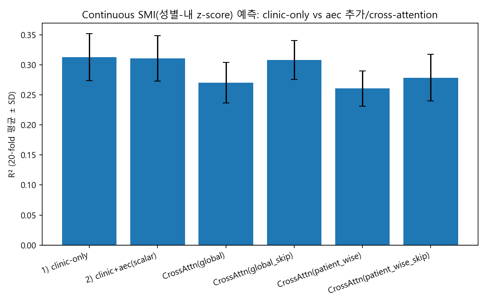
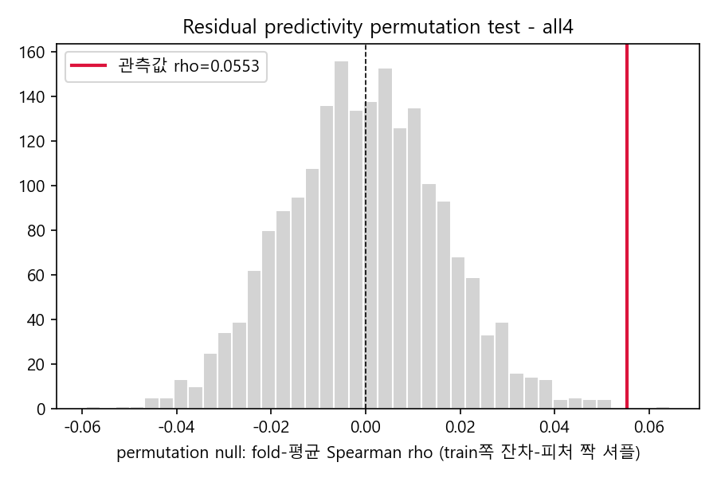
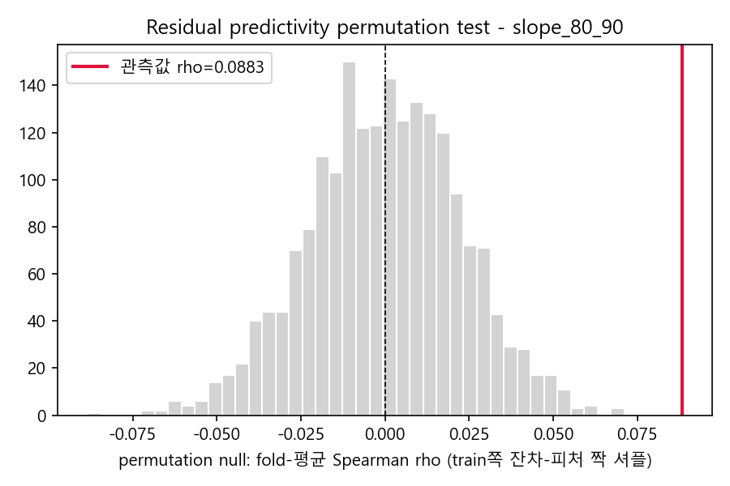
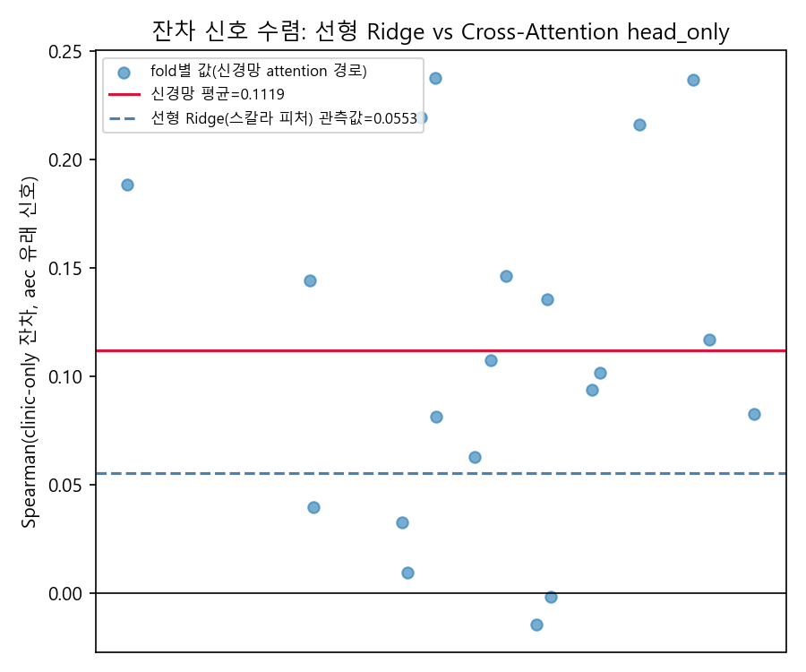

# 강남_aec_128 연구 요약 (0703) — "이분화가 신호를 숨겼는가? Continuous SMI로 재검증"

[0701_RESEARCH_SUMMARY.md](0701.md)에서 FDA로 유의구간을 찾았고, [0702.md](0702.md)에서는
그 신호를 binary Output(정상/저SMI) 예측 모델에 추가해봤지만 스칼라 피처든 cross-attention
(06~09번, 14개 변형)이든 clinic-only(ROC-AUC 0.776)를 못 이겼다. 10번(propensity matching)은
그 이유를 "원 효과크기의 대부분(47~92%)이 체격 confounding"이라고 설명했다.

이번 작업은 그 결론에 남아있던 방법론적 빈틈 하나를 짚었다: **binary화는 SMI cutoff 근방의
정보를 버린다.** cross-attention 아키텍처(09의 global/patient-wise 정규화 + clinic-skip)는
그대로 두고 타깃만 continuous SMI로 바꿔서, "지금까지 못 이긴 이유가 이분화로 인한 정보손실
때문인지, 아니면 10번처럼 정보량 자체의 한계인지"를 가렸다.

## 1. Continuous SMI Cross-Attention (`11_cross_attention_continuous_smi.py`)

### 설계

- **타깃**: SMI를 그대로 쓰지 않고 **성별 내 z-score**로 표준화(`(SMI - mu_sex) / sigma_sex`,
  mu/sigma는 매 fold의 train 데이터에서만 계산 → leakage 없음). SMI는 남녀 분포가 크게
  달라서(F 38.2±5.5, M 48.6±8.1) 그대로 회귀하면 모델이 "성별을 맞히는 것"만으로 상당한
  설명력을 얻어버리기 때문.
- **fold 분할**: 회귀라 y로 직접 stratify할 수 없어 (Sex_M × 성별-내 SMI quartile) 조합을
  층화 라벨로 쓴 `RepeatedStratifiedKFold(5-fold × 4 repeat = 20 fold)`를 처음부터 사용
  (07번의 교훈: 5-fold만 쓰면 검정력 부족).
- **아키텍처**: 09번의 `CrossAttentionNet`을 그대로 재사용하되 출력층에서 sigmoid를 떼고
  회귀 head로, 손실함수는 이상치에 덜 민감한 `SmoothL1Loss(Huber)`로 교체. 07/09에서 이미
  효과 없음이 확인된 스무딩·early-stopping·warm-start·FDA-prior는 배제하고 검증된 4개
  변형(`global`, `global_skip`, `patient_wise`, `patient_wise_skip`)만 이식.

### 결과 (20-fold)

| 변형 | R² | RMSE | Spearman ρ | vs clinic-only R²(p) | vs clinic-only Spearman(p) |
| --- | --- | --- | --- | --- | --- |
| clinic-only (Ridge) | 0.3127 | 0.8294 | 0.5539 | — | — |
| clinic+aec(scalar, Ridge) | 0.3109 | 0.8305 | 0.5561 | 0.277(n.s.) | 0.105(n.s.) |
| CrossAttn(global) | 0.2705 | 0.8546 | 0.5445 | 유의하게 낮음(1.9e-5) | 0.261(n.s.) |
| CrossAttn(global_skip) | 0.3081 | 0.8322 | 0.5716 | **차이 없음(0.87)** | **유의하게 높음(+0.018, 0.005)** |
| CrossAttn(patient_wise) | 0.2606 | 0.8604 | 0.5328 | 유의하게 낮음(1.9e-6) | 유의하게 낮음(0.002) |
| CrossAttn(patient_wise_skip) | 0.2784 | 0.8498 | 0.5424 | 유의하게 낮음(1.0e-4) | 0.368(n.s.) |

- `clinic+aec(scalar)`는 binary판(05번)과 동일하게 여전히 유의한 개선이 없다.
- **binary판과 가장 다른 지점**: `global_skip`은 binary Output에서는 clinic-only보다
  유의하게 나빴는데(07/09, ROC-AUC p=0.044), continuous SMI에서는 R²로 clinic-only와
  **구분이 안 되고**(p=0.87), Spearman 순위상관은 오히려 **유의하게 더 높다**(p=0.005).
  이분화가 정보를 일부 지웠다는 가설과 방향이 일치하는 첫 결과.

### Residual predictivity test (핵심 차별화 지표)

clinic-only Ridge의 test-fold 잔차(clinic이 설명 못 하는 부분)를 aec 스칼라 피처 4개가
예측하는지 별도 검정: **Spearman ρ=+0.0553, Wilcoxon(vs 0) p=0.0001** — 이 연구 라인
전체에서 처음 나온 "유의미한 양의 방향" 결과. (R²는 -0.0067로 거의 0이지만 Wilcoxon으로는
유의 — 해석에 주의가 필요해 12번에서 순열검정으로 재검증.)

## 2. 심화 검증: 순열검정 · 신호분해 · Cross-Attention 수렴 (`12_smi_residual_deep_dive.py`)

11번의 residual test는 Wilcoxon으로 20-fold를 마치 독립표본처럼 다뤘다는 근사가 있어
(5-fold×4-repeat는 fold가 서로 겹침), 세 방향으로 엄밀화했다.

### ① 순열검정 (train쪽 aec-잔차 짝을 셔플, 2000회 반복해 null 분포 직접 구축)

| 피처셋 | 관측 rho | null 평균±SD | permutation p |
| --- | --- | --- | --- |
| all4 (mean_mA+slope 3개) | +0.0553 | -0.0004±0.0167 | **0.001** |
| mean_mA 단독 | +0.0307 | ~0±0.0162 | 0.031 |
| slope_48_55 단독 | +0.0325 | ~0±0.0164 | 0.022 |
| slope_80_90 단독 | **+0.0883** | ~0±0.0227 | **0.0005** |
| slope_94_97 단독 | +0.0618 | ~0±0.0186 | 0.0005 |

Wilcoxon 근사가 걱정했던 "fold 중복으로 과대평가된 것 아닌가"라는 우려가 기각됐다 —
직접 시뮬레이션한 null 분포로도 여전히 유의하다. **slope_80_90(aec_103~115, 80~90%
구간)이 가장 강한 신호원**인데, 이는 10번(propensity matching)에서 confounding 제거 후
방향을 유지하며 크기가 가장 덜 줄었던 구간(원래의 21.4% 잔존, uncorrected p=0.054로
유의성에 가장 근접)과 정확히 일치한다.

### ② Cross-Attention 내부 수렴 검증

`global_skip` 모델에서 clinic-skip을 더하기 전 **순수 attention 경로 출력(head_only)**과
clinic-only 잔차의 Spearman 상관: **+0.1119±0.0788, Wilcoxon p=1.3e-5** — 선형
Ridge(스칼라 피처 4개, rho=0.055)보다 약 2배 강하다.

완전히 다른 두 방법론(손으로 고른 4개 스칼라 피처의 선형회귀 vs 128포인트 전체를 보는
신경망 attention)이 **같은 방향의 잔차 신호에 독립적으로 수렴**했고, 신경망 쪽은 4개
스칼라로 못 담은 곡선 정보를 추가로 더 포착하는 것으로 보인다. (단, 이 검증은 신경망
재학습 비용 때문에 순열검정이 아닌 Wilcoxon만 적용 — ①보다 rigor가 낮은 확인용 체크.)

### ③ 다중비교 보정 (11+12번 전체 18개 p-value, Benjamini-Hochberg FDR)

18개 중 **13개가 FDR<0.05에서 유의**했고, 이번에 새로 만든 순열검정 5개·attention
수렴검증 전부가 살아남았다. 유의하지 않은 5개는 전부 "clinic+aec를 하나로 합친 모델이
clinic-only를 이기는가"류 비교(이전 결론과 동일)였고, "clinic 잔차를 aec가 예측하는가"류
검정은 전부 살아남았다.

## 3. 종합 해석

1. **처음으로 재현 가능하고 통계적으로 견고한 양의 신호를 확인했다**: clinic이 설명 못
   하는 SMI 잔차 중 작은 부분(rho 0.05~0.11, 분산으로는 1% 안팎)을 AEC가 일관되게
   예측하며, 신호는 주로 80~90% 구간(L3 인접부)에서 나오고, 선형 Ridge와 신경망
   cross-attention이 서로 독립적으로 같은 방향에 수렴한다.
2. **이분화 손실 가설은 부분적으로만 지지된다**: `global_skip`이 binary판보다 clinic-only에
   훨씬 가까워졌고 Spearman은 오히려 앞섰다는 점에서 이분화가 일부 정보를 지운 것은 맞아
   보인다. 그러나 그 "지워졌던" 신호 자체가 원래도 작았다(10번의 매칭 후 잔여효과 d≈0.03~
   0.16과 같은 규모) — "완전히 숨겨진 큰 신호"가 아니라 "작은 신호가 이분화로 약간 더
   흐려졌던 것"이 더 정확한 요약이다.
3. **실용적 결론은 바뀌지 않는다**: 효과크기(R² 기준 거의 0, Spearman rho 0.05~0.11)가
   여전히 작아서 예측모델에 실질적 이득을 주지 못한다 — clinic 4변수 회귀/로지스틱이
   여전히 가장 간단하고 경쟁력 있는 모델이라는 0702의 결론은 유지된다.
4. **그러나 "쓸모없다"와는 다르다**: 이번 심화 검증으로 그 작은 잔여 신호가 (a) 우연이
   아니고(순열검정), (b) 구체적으로 80~90% 구간에서 나오며(신호분해), (c) 아키텍처와
   무관하게 재현된다(선형/신경망 수렴)는 것까지 특정됐다 — 향후 이 구간을 다른 outcome
   (예: myosteatosis)이나 외부 코호트(신촌)에서 재확인해볼 근거가 마련됐다.

## 4. 산출물

### 스크립트

- `11_cross_attention_continuous_smi.py` — clinic-only Ridge baseline, clinic+aec(scalar)
  Ridge, Cross-Attention 회귀 4변형(global/global_skip/patient_wise/patient_wise_skip),
  성별-내 z-score 타깃, 20-fold, residual predictivity test(1차, Wilcoxon)
- `12_smi_residual_deep_dive.py` — residual predictivity 순열검정(all4 + 개별 피처 4개,
  2000회), Cross-Attention head_only vs clinic잔차 수렴검증, 11+12번 전체 p-value FDR 보정

### 결과 파일

- `excel/model_comparison_results.xlsx` — `SMI_CV_scores`, `SMI_Summary_vs_clinic`,
  `SMI_residual_test`(11번), `SMI_Permutation_test`, `SMI_AttnConvergence`,
  `SMI_FDR_summary`(12번)
- `figures/11/cross_attention_smi_weights_{global,global_skip,patient_wise,
  patient_wise_skip}.png`, `figures/11/smi_r2_comparison.png`
- `figures/12/residual_permutation_null_{all4,mean_mA,slope_48_55,slope_80_90,
  slope_94_97}.png`, `figures/12/attn_convergence_scatter.png`
