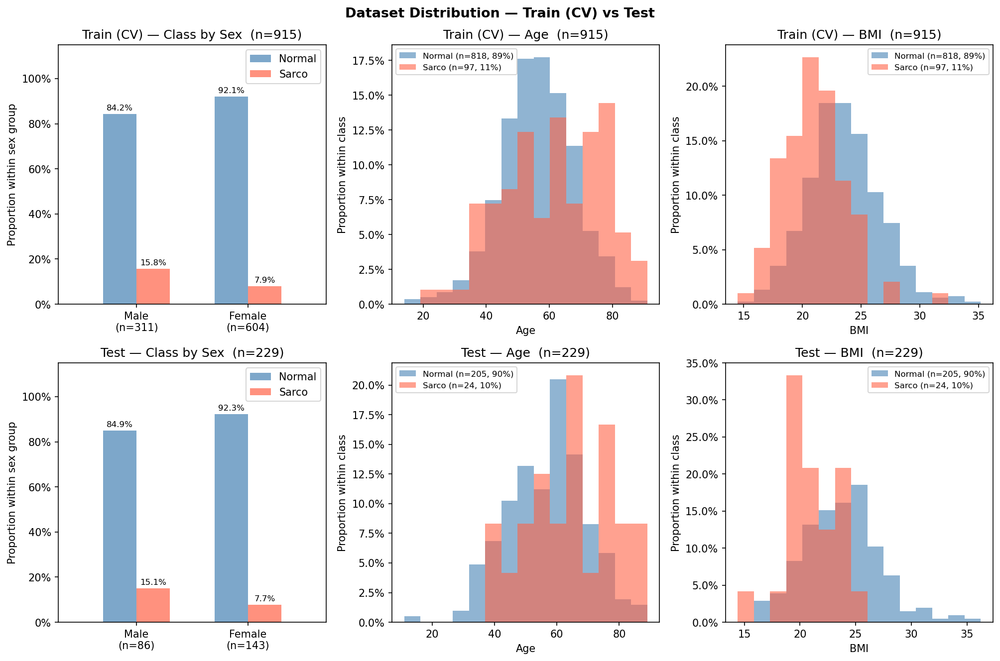

# SMI Binary Classification — CrossAttn Results

Generated: 2026-05-13 20:55  |  5-Fold CV  |  Median best epoch: 4

---

## 0. Dataset Distribution

### Class Distribution

| Split | Sex | n | Normal | Normal % | Sarco | Sarco % |
|-------|-----|--:|-------:|---------:|------:|--------:|
| Train | M | 311 | 262 | 84.2% | 49 | 15.8% |
| Train | F | 604 | 556 | 92.1% | 48 | 7.9% |
| Train | **All** | **915** | **818** | **89.4%** | **97** | **10.6%** |
| Test | M | 86 | 73 | 84.9% | 13 | 15.1% |
| Test | F | 143 | 132 | 92.3% | 11 | 7.7% |
| Test | **All** | **229** | **205** | **89.5%** | **24** | **10.5%** |

### Age

| Split | Sex | n | Mean ± Std | Min | Median | Max |
|-------|-----|--:|----------:|----:|-------:|----:|
| Train | M | 311 | 59.30 ± 12.73 | 18.00 | 60.00 | 88.00 |
| Train | F | 604 | 55.54 ± 11.62 | 14.00 | 55.50 | 91.00 |
| Train | **All** | **915** | **56.82 ± 12.14** | **14.00** | **57.00** | **91.00** |
| Test | M | 86 | 61.66 ± 10.80 | 34.00 | 61.00 | 89.00 |
| Test | F | 143 | 55.24 ± 13.24 | 11.00 | 54.00 | 86.00 |
| Test | **All** | **229** | **57.65 ± 12.77** | **11.00** | **58.00** | **89.00** |

### BMI

| Split | Sex | n | Mean ± Std | Min | Median | Max |
|-------|-----|--:|----------:|----:|-------:|----:|
| Train | M | 311 | 23.91 ± 3.12 | 14.48 | 24.03 | 35.20 |
| Train | F | 604 | 22.91 ± 3.10 | 15.62 | 22.64 | 34.29 |
| Train | **All** | **915** | **23.25 ± 3.14** | **14.48** | **23.09** | **35.20** |
| Test | M | 86 | 24.09 ± 3.18 | 16.80 | 24.42 | 33.87 |
| Test | F | 143 | 23.04 ± 3.49 | 14.40 | 22.53 | 36.24 |
| Test | **All** | **229** | **23.44 ± 3.42** | **14.40** | **23.38** | **36.24** |

---

## 1. Cross-Validation Summary

### Logistic Regression

| Fold | AUC-ROC | AUPRC | Brier | Accuracy | F1 |
|------|--------:|------:|------:|---------:|---:|
| 1 | 0.7458 | 0.2787 | 0.1721 | 0.7486 | 0.3030 |
| 2 | 0.7484 | 0.4132 | 0.1753 | 0.7650 | 0.3768 |
| 3 | 0.7141 | 0.2214 | 0.1688 | 0.7541 | 0.3077 |
| 4 | 0.8163 | 0.4369 | 0.1972 | 0.6667 | 0.3441 |
| 5 | 0.7558 | 0.2894 | 0.1742 | 0.7432 | 0.3562 |
| **Mean** | **0.7561** | **0.3279** | **0.1775** | **0.7355** | **0.3376** |
| **±Std** | 0.0333 | 0.0829 | 0.0101 | 0.0352 | 0.0283 |

### CrossAttn

| Fold | AUC-ROC | AUPRC | Brier | Accuracy | F1 |
|------|--------:|------:|------:|---------:|---:|
| 1 | 0.7567 | 0.3190 | 0.1862 | 0.7104 | 0.3614 |
| 2 | 0.8023 | 0.3628 | 0.2333 | 0.6776 | 0.3656 |
| 3 | 0.7776 | 0.2739 | 0.1802 | 0.7377 | 0.3684 |
| 4 | 0.8807 | 0.5857 | 0.1796 | 0.6721 | 0.3750 |
| 5 | 0.8334 | 0.5359 | 0.1315 | 0.7760 | 0.4384 |
| **Mean** | **0.8102** | **0.4155** | **0.1822** | **0.7148** | **0.3818** |
| **±Std** | 0.0436 | 0.1230 | 0.0323 | 0.0387 | 0.0286 |

CrossAttn best val AUC per fold: Fold1=0.7567, Fold2=0.8023, Fold3=0.7776, Fold4=0.8807, Fold5=0.8334

---

## 2. Test Set Performance

### Overall

| Model | AUC-ROC | AUPRC | Brier | Accuracy | F1 |
|-------|--------:|------:|------:|---------:|---:|
| Log. Reg. | 0.7994 | 0.3286 | 0.1801 | 0.7162 | 0.3299 |
| CrossAttn | 0.8098 | 0.3296 | 0.2402 | 0.5983 | 0.3030 |

### By Sex

#### Logistic Regression

| Sex | n | AUC-ROC | AUPRC | Brier | Accuracy | F1 |
|-----|--:|--------:|------:|------:|---------:|---:|
| M | 86 | 0.7629 | 0.3795 | 0.2305 | 0.6279 | 0.3846 |
| F | 143 | 0.8023 | 0.3240 | 0.1498 | 0.7692 | 0.2667 |

#### CrossAttn

| Sex | n | AUC-ROC | AUPRC | Brier | Accuracy | F1 |
|-----|--:|--------:|------:|------:|---------:|---:|
| M | 86 | 0.7724 | 0.3699 | 0.2836 | 0.5465 | 0.3607 |
| F | 143 | 0.8237 | 0.3784 | 0.2140 | 0.6294 | 0.2535 |

---

## 3. Confusion Matrix (Test Set)

### Logistic Regression

|  | Pred: Normal | Pred: Sarco |
|--|-------------:|------------:|
| **True: Normal** | 148 | 57 |
| **True: Sarco**  | 8 | 16 |

### CrossAttn

|  | Pred: Normal | Pred: Sarco |
|--|-------------:|------------:|
| **True: Normal** | 117 | 88 |
| **True: Sarco**  | 4 | 20 |

---

## 4. Figures

| File | Description |
|------|-------------|
| `data_distribution.png` | Train/Test class·Age·BMI distributions |
| `cv_roc_curves.png` | Per-fold ROC curves (LR & CrossAttn) |
| `cv_metric_distribution.png` | Boxplot of AUC / Acc / F1 across folds |
| `training_curves.png` | Loss & AUC training curves (mean ± std) |
| `test_roc_curves.png` | Final test-set ROC curves |
| `test_roc_by_sex.png` | Final test-set ROC curves by sex |
| `confusion_matrices.png` | Test-set confusion matrices (LR & CrossAttn) |
| `calibration.png` | Calibration plot (reliability diagram) + Precision-Recall curve |
