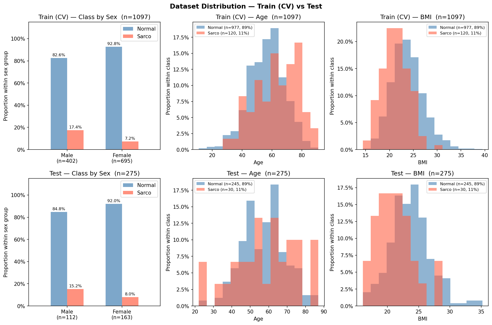

# SMI Binary Classification — CrossAttn Results

Generated: 2026-05-12 16:51  |  5-Fold CV  |  Median best epoch: 13

---

## 0. Dataset Distribution

### Class Distribution

| Split | Sex | n | Normal | Normal % | Sarco | Sarco % |
|-------|-----|--:|-------:|---------:|------:|--------:|
| Train | M | 402 | 332 | 82.6% | 70 | 17.4% |
| Train | F | 695 | 645 | 92.8% | 50 | 7.2% |
| Train | **All** | **1097** | **977** | **89.1%** | **120** | **10.9%** |
| Test | M | 112 | 95 | 84.8% | 17 | 15.2% |
| Test | F | 163 | 150 | 92.0% | 13 | 8.0% |
| Test | **All** | **275** | **245** | **89.1%** | **30** | **10.9%** |

### Age

| Split | Sex | n | Mean ± Std | Min | Median | Max |
|-------|-----|--:|----------:|----:|-------:|----:|
| Train | M | 402 | 59.81 ± 12.51 | 18.00 | 60.00 | 89.00 |
| Train | F | 695 | 55.36 ± 12.15 | 11.00 | 55.00 | 91.00 |
| Train | **All** | **1097** | **56.99 ± 12.47** | **11.00** | **58.00** | **91.00** |
| Test | M | 112 | 59.05 ± 12.52 | 23.00 | 59.50 | 84.00 |
| Test | F | 163 | 56.52 ± 12.29 | 22.00 | 56.00 | 87.00 |
| Test | **All** | **275** | **57.55 ± 12.45** | **22.00** | **58.00** | **87.00** |

### BMI

| Split | Sex | n | Mean ± Std | Min | Median | Max |
|-------|-----|--:|----------:|----:|-------:|----:|
| Train | M | 402 | 24.22 ± 3.26 | 14.48 | 24.19 | 36.76 |
| Train | F | 695 | 23.09 ± 3.43 | 14.40 | 22.70 | 39.49 |
| Train | **All** | **1097** | **23.51 ± 3.41** | **14.40** | **23.30** | **39.49** |
| Test | M | 112 | 24.07 ± 3.30 | 16.44 | 24.16 | 35.20 |
| Test | F | 163 | 22.99 ± 3.19 | 16.06 | 22.83 | 34.23 |
| Test | **All** | **275** | **23.43 ± 3.28** | **16.06** | **23.44** | **35.20** |

---

## 1. Cross-Validation Summary

### Logistic Regression

| Fold | AUC-ROC | AUPRC | Brier | Accuracy | F1 |
|------|--------:|------:|------:|---------:|---:|
| 1 | 0.5351 | 0.1374 | 0.2485 | 0.6909 | 0.2093 |
| 2 | 0.5880 | 0.1361 | 0.1819 | 0.7682 | 0.1905 |
| 3 | 0.6310 | 0.2372 | 0.1995 | 0.7169 | 0.2439 |
| 4 | 0.5791 | 0.1695 | 0.1913 | 0.7352 | 0.2564 |
| 5 | 0.5244 | 0.1476 | 0.2368 | 0.6941 | 0.1728 |
| **Mean** | **0.5715** | **0.1655** | **0.2116** | **0.7210** | **0.2146** |
| **±Std** | 0.0385 | 0.0378 | 0.0262 | 0.0285 | 0.0315 |

### CrossAttn

| Fold | AUC-ROC | AUPRC | Brier | Accuracy | F1 |
|------|--------:|------:|------:|---------:|---:|
| 1 | 0.8284 | 0.4535 | 0.1521 | 0.7818 | 0.4146 |
| 2 | 0.8214 | 0.3761 | 0.1368 | 0.8091 | 0.4324 |
| 3 | 0.7731 | 0.3296 | 0.2397 | 0.6164 | 0.3000 |
| 4 | 0.7763 | 0.2871 | 0.2648 | 0.5753 | 0.3008 |
| 5 | 0.8677 | 0.5203 | 0.1193 | 0.8219 | 0.4507 |
| **Mean** | **0.8134** | **0.3933** | **0.1825** | **0.7209** | **0.3797** |
| **±Std** | 0.0353 | 0.0841 | 0.0584 | 0.1037 | 0.0658 |

CrossAttn best val AUC per fold: Fold1=0.8284, Fold2=0.8214, Fold3=0.7731, Fold4=0.7763, Fold5=0.8677

---

## 2. Test Set Performance

### Overall

| Model | AUC-ROC | AUPRC | Brier | Accuracy | F1 |
|-------|--------:|------:|------:|---------:|---:|
| Log. Reg. | 0.6354 | 0.2331 | 0.1885 | 0.7345 | 0.2913 |
| CrossAttn | 0.7672 | 0.3188 | 0.1766 | 0.7091 | 0.3443 |

### By Sex

#### Logistic Regression

| Sex | n | AUC-ROC | AUPRC | Brier | Accuracy | F1 |
|-----|--:|--------:|------:|------:|---------:|---:|
| M | 112 | 0.6960 | 0.3593 | 0.2218 | 0.6696 | 0.3729 |
| F | 163 | 0.5297 | 0.1373 | 0.1655 | 0.7791 | 0.1818 |

#### CrossAttn

| Sex | n | AUC-ROC | AUPRC | Brier | Accuracy | F1 |
|-----|--:|--------:|------:|------:|---------:|---:|
| M | 112 | 0.7591 | 0.3867 | 0.2319 | 0.5804 | 0.3562 |
| F | 163 | 0.7733 | 0.2863 | 0.1385 | 0.7975 | 0.3265 |

---

## 3. Confusion Matrix (Test Set)

### Logistic Regression

|  | Pred: Normal | Pred: Sarco |
|--|-------------:|------------:|
| **True: Normal** | 187 | 58 |
| **True: Sarco**  | 15 | 15 |

### CrossAttn

|  | Pred: Normal | Pred: Sarco |
|--|-------------:|------------:|
| **True: Normal** | 174 | 71 |
| **True: Sarco**  | 9 | 21 |

---

## 4. Figures

| File | Description |
|------|-------------|
| `data_distribution.png` | Train/Test class·Age·BMI distributions |
| `cv_roc_curves.png` | Per-fold ROC curves (LR & CrossAttn) |
| `cv_metric_distribution.png` | Boxplot of AUC / Acc / F1 across folds |
| `training_curves.png` | Loss & AUC training curves (mean ± std) |
| `test_roc_curves.png` | Final test-set ROC curves |
| `test_roc_by_sex.png` | Final test-set ROC curves by sex |
| `confusion_matrices.png` | Test-set confusion matrices (LR & CrossAttn) |
| `calibration.png` | Calibration plot (reliability diagram) + Precision-Recall curve |
