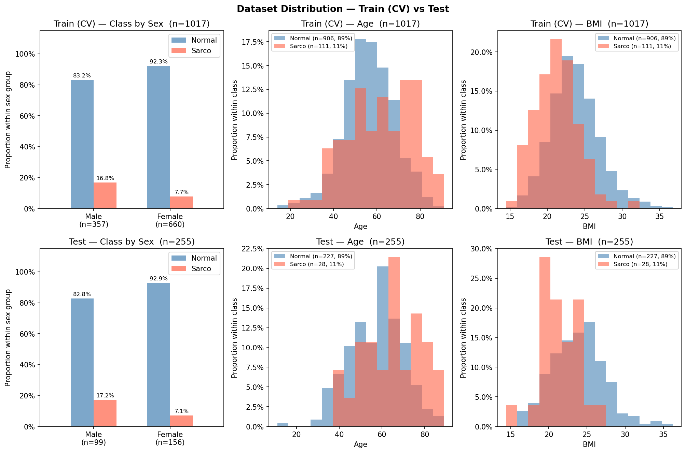

# SMI Binary Classification — CrossAttn Results

Generated: 2026-05-13 17:24  |  5-Fold CV  |  Median best epoch: 4

---

## 0. Dataset Distribution

### Class Distribution

| Split | Sex | n | Normal | Normal % | Sarco | Sarco % |
|-------|-----|--:|-------:|---------:|------:|--------:|
| Train | M | 357 | 297 | 83.2% | 60 | 16.8% |
| Train | F | 660 | 609 | 92.3% | 51 | 7.7% |
| Train | **All** | **1017** | **906** | **89.1%** | **111** | **10.9%** |
| Test | M | 99 | 82 | 82.8% | 17 | 17.2% |
| Test | F | 156 | 145 | 92.9% | 11 | 7.1% |
| Test | **All** | **255** | **227** | **89.0%** | **28** | **11.0%** |

### Age

| Split | Sex | n | Mean ± Std | Min | Median | Max |
|-------|-----|--:|----------:|----:|-------:|----:|
| Train | M | 357 | 59.35 ± 12.80 | 18.00 | 60.00 | 88.00 |
| Train | F | 660 | 55.60 ± 11.74 | 14.00 | 56.00 | 91.00 |
| Train | **All** | **1017** | **56.92 ± 12.25** | **14.00** | **57.00** | **91.00** |
| Test | M | 99 | 61.58 ± 10.97 | 34.00 | 61.00 | 89.00 |
| Test | F | 156 | 55.71 ± 13.31 | 11.00 | 55.00 | 86.00 |
| Test | **All** | **255** | **57.98 ± 12.78** | **11.00** | **59.00** | **89.00** |

### BMI

| Split | Sex | n | Mean ± Std | Min | Median | Max |
|-------|-----|--:|----------:|----:|-------:|----:|
| Train | M | 357 | 24.17 ± 3.31 | 14.48 | 24.16 | 36.76 |
| Train | F | 660 | 23.01 ± 3.24 | 15.62 | 22.69 | 34.61 |
| Train | **All** | **1017** | **23.42 ± 3.31** | **14.48** | **23.24** | **36.76** |
| Test | M | 99 | 24.03 ± 3.22 | 16.80 | 24.16 | 33.87 |
| Test | F | 156 | 23.22 ± 3.52 | 14.40 | 22.71 | 36.24 |
| Test | **All** | **255** | **23.54 ± 3.43** | **14.40** | **23.53** | **36.24** |

---

## 1. Cross-Validation Summary

### Logistic Regression

| Fold | AUC-ROC | AUPRC | Brier | Accuracy | F1 |
|------|--------:|------:|------:|---------:|---:|
| 1 | 0.8112 | 0.4798 | 0.1673 | 0.7598 | 0.3467 |
| 2 | 0.6798 | 0.2454 | 0.1935 | 0.7304 | 0.3038 |
| 3 | 0.7328 | 0.2523 | 0.2021 | 0.6749 | 0.3265 |
| 4 | 0.7961 | 0.3602 | 0.1750 | 0.7586 | 0.3636 |
| 5 | 0.8400 | 0.4214 | 0.1695 | 0.7783 | 0.4444 |
| **Mean** | **0.7720** | **0.3518** | **0.1815** | **0.7404** | **0.3570** |
| **±Std** | 0.0579 | 0.0922 | 0.0138 | 0.0362 | 0.0481 |

### CrossAttn

| Fold | AUC-ROC | AUPRC | Brier | Accuracy | F1 |
|------|--------:|------:|------:|---------:|---:|
| 1 | 0.8102 | 0.3556 | 0.1472 | 0.8186 | 0.3729 |
| 2 | 0.7101 | 0.2386 | 0.1943 | 0.6912 | 0.2921 |
| 3 | 0.7988 | 0.3527 | 0.1745 | 0.6897 | 0.3505 |
| 4 | 0.7562 | 0.3833 | 0.1570 | 0.7537 | 0.3243 |
| 5 | 0.8938 | 0.6039 | 0.1669 | 0.7044 | 0.4118 |
| **Mean** | **0.7938** | **0.3868** | **0.1680** | **0.7315** | **0.3503** |
| **±Std** | 0.0612 | 0.1194 | 0.0161 | 0.0494 | 0.0409 |

CrossAttn best val AUC per fold: Fold1=0.8102, Fold2=0.7101, Fold3=0.7988, Fold4=0.7562, Fold5=0.8938

---

## 2. Test Set Performance

### Overall

| Model | AUC-ROC | AUPRC | Brier | Accuracy | F1 |
|-------|--------:|------:|------:|---------:|---:|
| Log. Reg. | 0.8164 | 0.3145 | 0.1885 | 0.7255 | 0.3636 |
| CrossAttn | 0.7996 | 0.3269 | 0.1584 | 0.7647 | 0.4000 |

### By Sex

#### Logistic Regression

| Sex | n | AUC-ROC | AUPRC | Brier | Accuracy | F1 |
|-----|--:|--------:|------:|------:|---------:|---:|
| M | 99 | 0.7525 | 0.3237 | 0.2725 | 0.5758 | 0.4000 |
| F | 156 | 0.8276 | 0.3354 | 0.1351 | 0.8205 | 0.3000 |

#### CrossAttn

| Sex | n | AUC-ROC | AUPRC | Brier | Accuracy | F1 |
|-----|--:|--------:|------:|------:|---------:|---:|
| M | 99 | 0.7626 | 0.3733 | 0.1839 | 0.7172 | 0.4615 |
| F | 156 | 0.8332 | 0.3249 | 0.1422 | 0.7949 | 0.3333 |

---

## 3. Confusion Matrix (Test Set)

### Logistic Regression

|  | Pred: Normal | Pred: Sarco |
|--|-------------:|------------:|
| **True: Normal** | 165 | 62 |
| **True: Sarco**  | 8 | 20 |

### CrossAttn

|  | Pred: Normal | Pred: Sarco |
|--|-------------:|------------:|
| **True: Normal** | 175 | 52 |
| **True: Sarco**  | 8 | 20 |

---

## 4. Figures

| File | Description |
|------|-------------|
| `data_distribution.png` | Train/Test class·Age·BMI distributions |
| `cv_roc_curves.png` | Per-fold ROC curves (LR & CrossAttn) |
| `cv_metric_distribution.png` | Boxplot of AUC / Acc / F1 across folds |
| `training_curves.png` | Loss & AUC training curves (mean ± std) |
| `test_roc_curves.png` | Final test-set ROC curves |
| `test_roc_by_sex.png` | Final test-set ROC curves by sex |
| `confusion_matrices.png` | Test-set confusion matrices (LR & CrossAttn) |
| `calibration.png` | Calibration plot (reliability diagram) + Precision-Recall curve |
