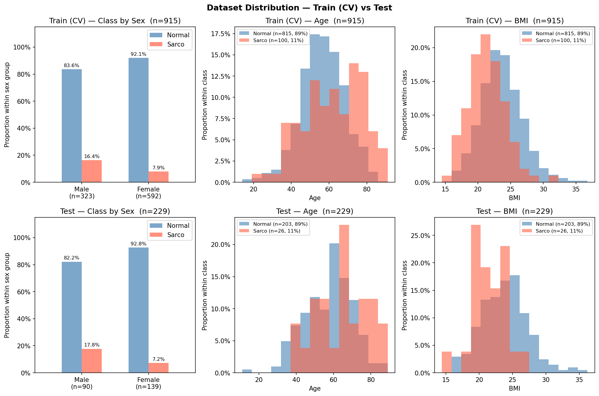

# SMI Binary Classification — CrossAttn Results

Generated: 2026-05-13 20:55  |  5-Fold CV  |  Median best epoch: 3

---

## 0. Dataset Distribution

### Class Distribution

| Split | Sex | n | Normal | Normal % | Sarco | Sarco % |
|-------|-----|--:|-------:|---------:|------:|--------:|
| Train | M | 323 | 270 | 83.6% | 53 | 16.4% |
| Train | F | 592 | 545 | 92.1% | 47 | 7.9% |
| Train | **All** | **915** | **815** | **89.1%** | **100** | **10.9%** |
| Test | M | 90 | 74 | 82.2% | 16 | 17.8% |
| Test | F | 139 | 129 | 92.8% | 10 | 7.2% |
| Test | **All** | **229** | **203** | **88.6%** | **26** | **11.4%** |

### Age

| Split | Sex | n | Mean ± Std | Min | Median | Max |
|-------|-----|--:|----------:|----:|-------:|----:|
| Train | M | 323 | 59.69 ± 12.79 | 18.00 | 60.00 | 88.00 |
| Train | F | 592 | 55.78 ± 11.79 | 14.00 | 56.00 | 91.00 |
| Train | **All** | **915** | **57.16 ± 12.30** | **14.00** | **58.00** | **91.00** |
| Test | M | 90 | 61.49 ± 11.03 | 34.00 | 61.00 | 89.00 |
| Test | F | 139 | 55.97 ± 13.56 | 11.00 | 56.00 | 86.00 |
| Test | **All** | **229** | **58.14 ± 12.91** | **11.00** | **59.00** | **89.00** |

### BMI

| Split | Sex | n | Mean ± Std | Min | Median | Max |
|-------|-----|--:|----------:|----:|-------:|----:|
| Train | M | 323 | 24.11 ± 3.23 | 14.48 | 24.16 | 36.76 |
| Train | F | 592 | 22.96 ± 3.16 | 15.62 | 22.69 | 34.61 |
| Train | **All** | **915** | **23.37 ± 3.23** | **14.48** | **23.23** | **36.76** |
| Test | M | 90 | 23.92 ± 3.19 | 16.80 | 24.05 | 33.87 |
| Test | F | 139 | 23.28 ± 3.55 | 14.40 | 22.89 | 36.24 |
| Test | **All** | **229** | **23.53 ± 3.43** | **14.40** | **23.53** | **36.24** |

---

## 1. Cross-Validation Summary

### Logistic Regression

| Fold | AUC-ROC | AUPRC | Brier | Accuracy | F1 |
|------|--------:|------:|------:|---------:|---:|
| 1 | 0.6681 | 0.2355 | 0.1998 | 0.6995 | 0.2254 |
| 2 | 0.6656 | 0.2465 | 0.2012 | 0.7049 | 0.2703 |
| 3 | 0.7702 | 0.3673 | 0.1620 | 0.7814 | 0.3548 |
| 4 | 0.7181 | 0.3149 | 0.2208 | 0.6667 | 0.3146 |
| 5 | 0.7506 | 0.2697 | 0.1741 | 0.7596 | 0.3333 |
| **Mean** | **0.7145** | **0.2868** | **0.1916** | **0.7224** | **0.2997** |
| **±Std** | 0.0423 | 0.0486 | 0.0210 | 0.0420 | 0.0464 |

### CrossAttn

| Fold | AUC-ROC | AUPRC | Brier | Accuracy | F1 |
|------|--------:|------:|------:|---------:|---:|
| 1 | 0.7666 | 0.3016 | 0.2300 | 0.6120 | 0.2970 |
| 2 | 0.7064 | 0.2523 | 0.2242 | 0.6175 | 0.2857 |
| 3 | 0.8239 | 0.5392 | 0.1786 | 0.7104 | 0.3457 |
| 4 | 0.8288 | 0.4232 | 0.2996 | 0.5410 | 0.3226 |
| 5 | 0.7653 | 0.2837 | 0.1982 | 0.7104 | 0.3614 |
| **Mean** | **0.7782** | **0.3600** | **0.2261** | **0.6383** | **0.3225** |
| **±Std** | 0.0450 | 0.1067 | 0.0411 | 0.0648 | 0.0285 |

CrossAttn best val AUC per fold: Fold1=0.7666, Fold2=0.7064, Fold3=0.8239, Fold4=0.8288, Fold5=0.7653

---

## 2. Test Set Performance

### Overall

| Model | AUC-ROC | AUPRC | Brier | Accuracy | F1 |
|-------|--------:|------:|------:|---------:|---:|
| Log. Reg. | 0.8115 | 0.2969 | 0.1885 | 0.7467 | 0.4314 |
| CrossAttn | 0.7783 | 0.3129 | 0.2252 | 0.6550 | 0.3361 |

### By Sex

#### Logistic Regression

| Sex | n | AUC-ROC | AUPRC | Brier | Accuracy | F1 |
|-----|--:|--------:|------:|------:|---------:|---:|
| M | 90 | 0.6841 | 0.2699 | 0.2843 | 0.5778 | 0.4412 |
| F | 139 | 0.8651 | 0.3966 | 0.1265 | 0.8561 | 0.4118 |

#### CrossAttn

| Sex | n | AUC-ROC | AUPRC | Brier | Accuracy | F1 |
|-----|--:|--------:|------:|------:|---------:|---:|
| M | 90 | 0.7128 | 0.2931 | 0.2660 | 0.5889 | 0.3934 |
| F | 139 | 0.8054 | 0.3690 | 0.1988 | 0.6978 | 0.2759 |

---

## 3. Confusion Matrix (Test Set)

### Logistic Regression

|  | Pred: Normal | Pred: Sarco |
|--|-------------:|------------:|
| **True: Normal** | 149 | 54 |
| **True: Sarco**  | 4 | 22 |

### CrossAttn

|  | Pred: Normal | Pred: Sarco |
|--|-------------:|------------:|
| **True: Normal** | 130 | 73 |
| **True: Sarco**  | 6 | 20 |

---

## 4. Figures

| File | Description |
|------|-------------|
| `data_distribution.png` | Train/Test class·Age·BMI distributions |
| `cv_roc_curves.png` | Per-fold ROC curves (LR & CrossAttn) |
| `cv_metric_distribution.png` | Boxplot of AUC / Acc / F1 across folds |
| `training_curves.png` | Loss & AUC training curves (mean ± std) |
| `test_roc_curves.png` | Final test-set ROC curves |
| `test_roc_by_sex.png` | Final test-set ROC curves by sex |
| `confusion_matrices.png` | Test-set confusion matrices (LR & CrossAttn) |
| `calibration.png` | Calibration plot (reliability diagram) + Precision-Recall curve |
