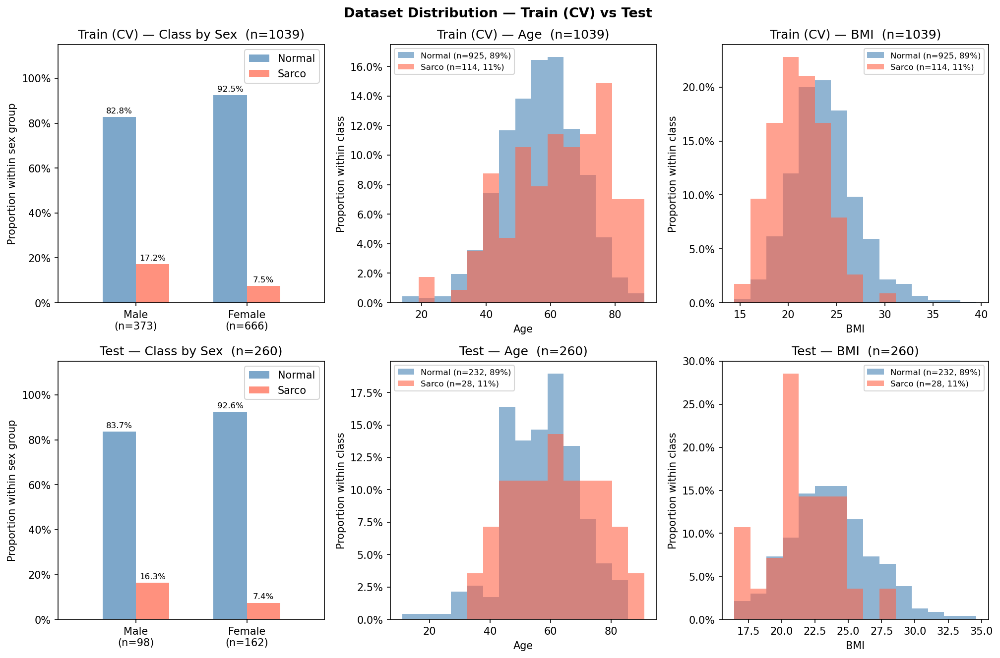

# SMI Binary Classification — CrossAttn Results

Generated: 2026-05-12 17:04  |  5-Fold CV  |  Median best epoch: 23

---

## 0. Dataset Distribution

### Class Distribution

| Split | Sex | n | Normal | Normal % | Sarco | Sarco % |
|-------|-----|--:|-------:|---------:|------:|--------:|
| Train | M | 373 | 309 | 82.8% | 64 | 17.2% |
| Train | F | 666 | 616 | 92.5% | 50 | 7.5% |
| Train | **All** | **1039** | **925** | **89.0%** | **114** | **11.0%** |
| Test | M | 98 | 82 | 83.7% | 16 | 16.3% |
| Test | F | 162 | 150 | 92.6% | 12 | 7.4% |
| Test | **All** | **260** | **232** | **89.2%** | **28** | **10.8%** |

### Age

| Split | Sex | n | Mean ± Std | Min | Median | Max |
|-------|-----|--:|----------:|----:|-------:|----:|
| Train | M | 373 | 59.36 ± 12.75 | 18.00 | 59.00 | 89.00 |
| Train | F | 666 | 55.63 ± 12.02 | 14.00 | 55.00 | 87.00 |
| Train | **All** | **1039** | **56.97 ± 12.41** | **14.00** | **57.00** | **89.00** |
| Test | M | 98 | 61.47 ± 11.63 | 20.00 | 62.50 | 84.00 |
| Test | F | 162 | 55.33 ± 12.79 | 11.00 | 55.50 | 91.00 |
| Test | **All** | **260** | **57.64 ± 12.72** | **11.00** | **58.00** | **91.00** |

### BMI

| Split | Sex | n | Mean ± Std | Min | Median | Max |
|-------|-----|--:|----------:|----:|-------:|----:|
| Train | M | 373 | 24.19 ± 3.35 | 14.48 | 24.22 | 36.76 |
| Train | F | 666 | 23.06 ± 3.39 | 14.40 | 22.75 | 39.49 |
| Train | **All** | **1039** | **23.46 ± 3.42** | **14.40** | **23.29** | **39.49** |
| Test | M | 98 | 24.06 ± 2.92 | 17.03 | 24.12 | 31.51 |
| Test | F | 162 | 23.12 ± 3.29 | 16.44 | 22.66 | 34.61 |
| Test | **All** | **260** | **23.47 ± 3.19** | **16.44** | **23.39** | **34.61** |

---

## 1. Cross-Validation Summary

### Logistic Regression

| Fold | AUC-ROC | AUPRC | Brier | Accuracy | F1 |
|------|--------:|------:|------:|---------:|---:|
| 1 | 0.5819 | 0.2390 | 0.2085 | 0.7260 | 0.2192 |
| 2 | 0.6451 | 0.1585 | 0.2033 | 0.7356 | 0.2466 |
| 3 | 0.6740 | 0.2577 | 0.1771 | 0.7692 | 0.2727 |
| 4 | 0.5450 | 0.1599 | 0.2394 | 0.6635 | 0.2045 |
| 5 | 0.7022 | 0.2443 | 0.1816 | 0.7729 | 0.3380 |
| **Mean** | **0.6297** | **0.2119** | **0.2020** | **0.7334** | **0.2562** |
| **±Std** | 0.0582 | 0.0435 | 0.0223 | 0.0395 | 0.0471 |

### CrossAttn

| Fold | AUC-ROC | AUPRC | Brier | Accuracy | F1 |
|------|--------:|------:|------:|---------:|---:|
| 1 | 0.7800 | 0.3763 | 0.1551 | 0.8029 | 0.3881 |
| 2 | 0.8296 | 0.4562 | 0.2372 | 0.5673 | 0.3077 |
| 3 | 0.8115 | 0.3921 | 0.1639 | 0.7548 | 0.3544 |
| 4 | 0.7709 | 0.3106 | 0.1907 | 0.6971 | 0.3368 |
| 5 | 0.8410 | 0.3548 | 0.1997 | 0.6425 | 0.3273 |
| **Mean** | **0.8066** | **0.3780** | **0.1893** | **0.6929** | **0.3429** |
| **±Std** | 0.0273 | 0.0477 | 0.0291 | 0.0828 | 0.0272 |

CrossAttn best val AUC per fold: Fold1=0.7800, Fold2=0.8296, Fold3=0.8115, Fold4=0.7709, Fold5=0.8410

---

## 2. Test Set Performance

### Overall

| Model | AUC-ROC | AUPRC | Brier | Accuracy | F1 |
|-------|--------:|------:|------:|---------:|---:|
| Log. Reg. | 0.6236 | 0.1591 | 0.2019 | 0.6846 | 0.2264 |
| CrossAttn | 0.7492 | 0.2158 | 0.1785 | 0.7500 | 0.3299 |

### By Sex

#### Logistic Regression

| Sex | n | AUC-ROC | AUPRC | Brier | Accuracy | F1 |
|-----|--:|--------:|------:|------:|---------:|---:|
| M | 98 | 0.6288 | 0.2323 | 0.2234 | 0.6633 | 0.3265 |
| F | 162 | 0.6117 | 0.1199 | 0.1889 | 0.6975 | 0.1404 |

#### CrossAttn

| Sex | n | AUC-ROC | AUPRC | Brier | Accuracy | F1 |
|-----|--:|--------:|------:|------:|---------:|---:|
| M | 98 | 0.6723 | 0.2293 | 0.2430 | 0.5918 | 0.3750 |
| F | 162 | 0.7139 | 0.1889 | 0.1395 | 0.8457 | 0.2424 |

---

## 3. Confusion Matrix (Test Set)

### Logistic Regression

|  | Pred: Normal | Pred: Sarco |
|--|-------------:|------------:|
| **True: Normal** | 166 | 66 |
| **True: Sarco**  | 16 | 12 |

### CrossAttn

|  | Pred: Normal | Pred: Sarco |
|--|-------------:|------------:|
| **True: Normal** | 179 | 53 |
| **True: Sarco**  | 12 | 16 |

---

## 4. Figures

| File | Description |
|------|-------------|
| `data_distribution.png` | Train/Test class·Age·BMI distributions |
| `cv_roc_curves.png` | Per-fold ROC curves (LR & CrossAttn) |
| `cv_metric_distribution.png` | Boxplot of AUC / Acc / F1 across folds |
| `training_curves.png` | Loss & AUC training curves (mean ± std) |
| `test_roc_curves.png` | Final test-set ROC curves |
| `test_roc_by_sex.png` | Final test-set ROC curves by sex |
| `confusion_matrices.png` | Test-set confusion matrices (LR & CrossAttn) |
| `calibration.png` | Calibration plot (reliability diagram) + Precision-Recall curve |
