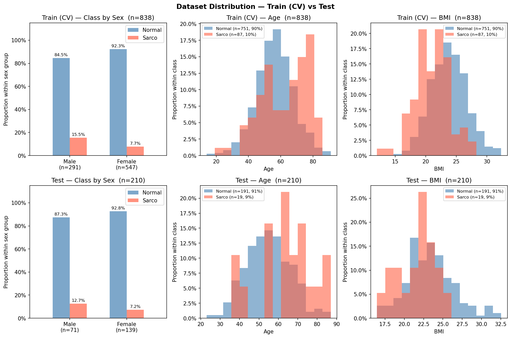

# SMI Binary Classification — CrossAttn Results

Generated: 2026-05-20 12:48  |  5-Fold CV  |  Median best epoch: 10

---

## 0. Dataset Distribution

### Class Distribution

| Split | Sex | n | Normal | Normal % | Sarco | Sarco % |
|-------|-----|--:|-------:|---------:|------:|--------:|
| Train | M | 291 | 246 | 84.5% | 45 | 15.5% |
| Train | F | 547 | 505 | 92.3% | 42 | 7.7% |
| Train | **All** | **838** | **751** | **89.6%** | **87** | **10.4%** |
| Test | M | 71 | 62 | 87.3% | 9 | 12.7% |
| Test | F | 139 | 129 | 92.8% | 10 | 7.2% |
| Test | **All** | **210** | **191** | **91.0%** | **19** | **9.0%** |

### Age

| Split | Sex | n | Mean ± Std | Min | Median | Max |
|-------|-----|--:|----------:|----:|-------:|----:|
| Train | M | 291 | 59.95 ± 12.07 | 20.00 | 60.00 | 89.00 |
| Train | F | 547 | 55.36 ± 11.78 | 14.00 | 55.00 | 91.00 |
| Train | **All** | **838** | **56.95 ± 12.08** | **14.00** | **57.00** | **91.00** |
| Test | M | 71 | 58.99 ± 11.84 | 28.00 | 60.00 | 84.00 |
| Test | F | 139 | 53.97 ± 11.40 | 23.00 | 54.00 | 87.00 |
| Test | **All** | **210** | **55.67 ± 11.79** | **23.00** | **56.00** | **87.00** |

### BMI

| Split | Sex | n | Mean ± Std | Min | Median | Max |
|-------|-----|--:|----------:|----:|-------:|----:|
| Train | M | 291 | 24.09 ± 2.89 | 14.34 | 24.12 | 32.33 |
| Train | F | 547 | 23.13 ± 3.05 | 12.02 | 23.01 | 32.24 |
| Train | **All** | **838** | **23.46 ± 3.03** | **12.02** | **23.41** | **32.33** |
| Test | M | 71 | 24.30 ± 3.04 | 17.43 | 23.88 | 32.56 |
| Test | F | 139 | 22.66 ± 2.86 | 16.44 | 22.46 | 31.50 |
| Test | **All** | **210** | **23.22 ± 3.02** | **16.44** | **23.17** | **32.56** |

---

## 1. Cross-Validation Summary

### CrossAttn

| Fold | AUC-ROC | AUPRC | Brier | Accuracy | F1 |
|------|--------:|------:|------:|---------:|---:|
| 1 | 0.8734 | 0.4537 | 0.1944 | 0.7321 | 0.4000 |
| 2 | 0.7948 | 0.4280 | 0.1283 | 0.7917 | 0.4068 |
| 3 | 0.8719 | 0.4442 | 0.1376 | 0.7917 | 0.4615 |
| 4 | 0.8192 | 0.3060 | 0.1643 | 0.7725 | 0.4242 |
| 5 | 0.8322 | 0.3732 | 0.2044 | 0.6707 | 0.3373 |
| **Mean** | **0.8383** | **0.4010** | **0.1658** | **0.7517** | **0.4060** |
| **±Std** | 0.0305 | 0.0551 | 0.0301 | 0.0460 | 0.0404 |

CrossAttn best val AUC per fold: Fold1=0.8734, Fold2=0.7948, Fold3=0.8719, Fold4=0.8192, Fold5=0.8322

---

## 2. Test Set Performance

### Overall

| Model | AUC-ROC | AUPRC | Brier | Accuracy | F1 |
|-------|--------:|------:|------:|---------:|---:|
| CrossAttn | 0.7724 | 0.2209 | 0.1864 | 0.6952 | 0.2727 |

### By Sex

| Sex | n | AUC-ROC | AUPRC | Brier | Accuracy | F1 |
|-----|--:|--------:|------:|------:|---------:|---:|
| M | 71 | 0.6703 | 0.2095 | 0.2664 | 0.5634 | 0.3111 |
| F | 139 | 0.8016 | 0.3083 | 0.1456 | 0.7626 | 0.2326 |

---

## 3. Confusion Matrix (Test Set)

|  | Pred: Normal | Pred: Sarco |
|--|-------------:|------------:|
| **True: Normal** | 134 | 57 |
| **True: Sarco**  | 7 | 12 |

---

## 4. Figures

| File | Description |
|------|-------------|
| `data_distribution.png` | Train/Test class·Age·BMI distributions |
| `cv_roc_curves.png` | Per-fold ROC curves (CrossAttn) |
| `cv_metric_distribution.png` | Boxplot of AUC / Acc / F1 across folds |
| `training_curves.png` | Loss & AUC training curves (mean ± std) |
| `test_roc_curves.png` | Final test-set ROC curve |
| `test_roc_by_sex.png` | Final test-set ROC curves by sex |
| `confusion_matrices.png` | Test-set confusion matrices |
| `calibration.png` | Calibration plot (reliability diagram) + Precision-Recall curve |
