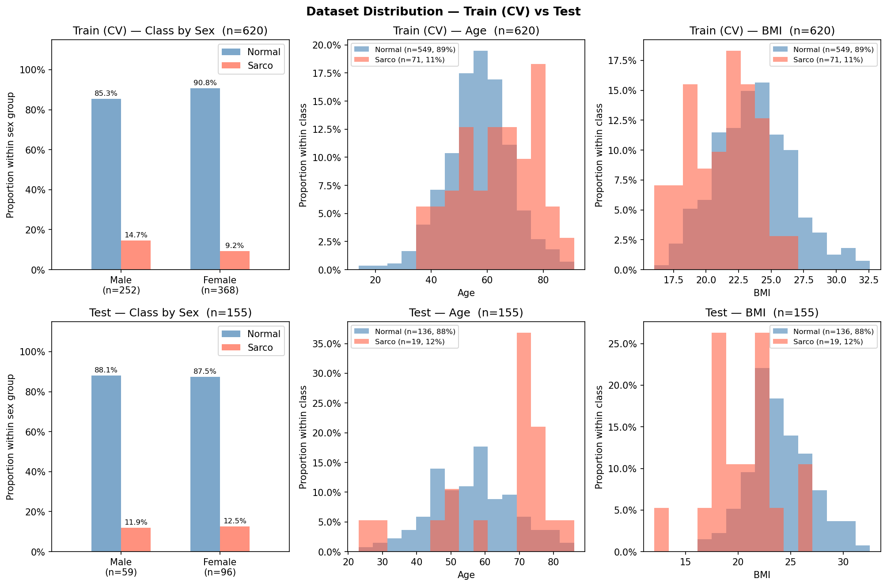

# SMI Binary Classification — CrossAttn Results

Generated: 2026-05-20 13:01  |  5-Fold CV  |  Median best epoch: 5

---

## 0. Dataset Distribution

### Class Distribution

| Split | Sex | n | Normal | Normal % | Sarco | Sarco % |
|-------|-----|--:|-------:|---------:|------:|--------:|
| Train | M | 252 | 215 | 85.3% | 37 | 14.7% |
| Train | F | 368 | 334 | 90.8% | 34 | 9.2% |
| Train | **All** | **620** | **549** | **88.5%** | **71** | **11.5%** |
| Test | M | 59 | 52 | 88.1% | 7 | 11.9% |
| Test | F | 96 | 84 | 87.5% | 12 | 12.5% |
| Test | **All** | **155** | **136** | **87.7%** | **19** | **12.3%** |

### Age

| Split | Sex | n | Mean ± Std | Min | Median | Max |
|-------|-----|--:|----------:|----:|-------:|----:|
| Train | M | 252 | 60.13 ± 11.46 | 28.00 | 60.00 | 89.00 |
| Train | F | 368 | 56.15 ± 11.95 | 14.00 | 56.00 | 91.00 |
| Train | **All** | **620** | **57.77 ± 11.91** | **14.00** | **58.00** | **91.00** |
| Test | M | 59 | 58.49 ± 12.91 | 23.00 | 59.00 | 83.00 |
| Test | F | 96 | 56.49 ± 12.82 | 23.00 | 56.00 | 86.00 |
| Test | **All** | **155** | **57.25 ± 12.90** | **23.00** | **58.00** | **86.00** |

### BMI

| Split | Sex | n | Mean ± Std | Min | Median | Max |
|-------|-----|--:|----------:|----:|-------:|----:|
| Train | M | 252 | 24.22 ± 2.95 | 16.39 | 24.22 | 32.59 |
| Train | F | 368 | 22.81 ± 2.96 | 16.02 | 22.77 | 31.50 |
| Train | **All** | **620** | **23.39 ± 3.03** | **16.02** | **23.31** | **32.59** |
| Test | M | 59 | 24.49 ± 2.86 | 17.65 | 24.06 | 32.56 |
| Test | F | 96 | 22.85 ± 3.37 | 12.02 | 22.66 | 31.14 |
| Test | **All** | **155** | **23.47 ± 3.29** | **12.02** | **23.24** | **32.56** |

---

## 1. Cross-Validation Summary

### CrossAttn

| Fold | AUC-ROC | AUPRC | Brier | Accuracy | F1 |
|------|--------:|------:|------:|---------:|---:|
| 1 | 0.7487 | 0.3157 | 0.1921 | 0.7016 | 0.3509 |
| 2 | 0.8305 | 0.4011 | 0.2565 | 0.5645 | 0.3077 |
| 3 | 0.8662 | 0.5344 | 0.1997 | 0.7016 | 0.4127 |
| 4 | 0.8162 | 0.3168 | 0.1670 | 0.7581 | 0.4444 |
| 5 | 0.8355 | 0.4550 | 0.1386 | 0.7823 | 0.4706 |
| **Mean** | **0.8194** | **0.4046** | **0.1908** | **0.7016** | **0.3973** |
| **±Std** | 0.0389 | 0.0837 | 0.0392 | 0.0755 | 0.0600 |

CrossAttn best val AUC per fold: Fold1=0.7487, Fold2=0.8305, Fold3=0.8662, Fold4=0.8162, Fold5=0.8355

---

## 2. Test Set Performance

### Overall

| Model | AUC-ROC | AUPRC | Brier | Accuracy | F1 |
|-------|--------:|------:|------:|---------:|---:|
| CrossAttn | 0.8394 | 0.4457 | 0.1690 | 0.7226 | 0.4267 |

### By Sex

| Sex | n | AUC-ROC | AUPRC | Brier | Accuracy | F1 |
|-----|--:|--------:|------:|------:|---------:|---:|
| M | 59 | 0.8214 | 0.3703 | 0.1772 | 0.7627 | 0.4615 |
| F | 96 | 0.8552 | 0.6073 | 0.1639 | 0.6979 | 0.4082 |

---

## 3. Confusion Matrix (Test Set)

|  | Pred: Normal | Pred: Sarco |
|--|-------------:|------------:|
| **True: Normal** | 96 | 40 |
| **True: Sarco**  | 3 | 16 |

---

## 4. Figures

| File | Description |
|------|-------------|
| `data_distribution.png` | Train/Test class·Age·BMI distributions |
| `cv_roc_curves.png` | Per-fold ROC curves (CrossAttn) |
| `cv_metric_distribution.png` | Boxplot of AUC / Acc / F1 across folds |
| `training_curves.png` | Loss & AUC training curves (mean ± std) |
| `test_roc_curves.png` | Final test-set ROC curve |
| `test_roc_by_sex.png` | Final test-set ROC curves by sex |
| `confusion_matrices.png` | Test-set confusion matrices |
| `calibration.png` | Calibration plot (reliability diagram) + Precision-Recall curve |
