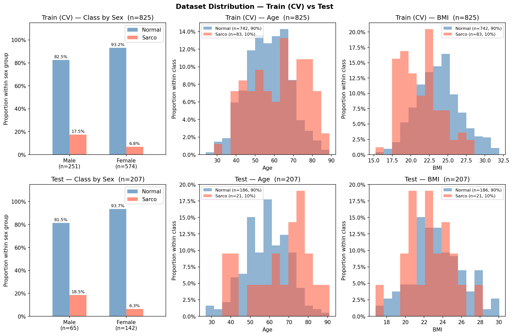

# SMI Binary Classification — CrossAttn Results

Generated: 2026-05-19 12:55  |  5-Fold CV  |  Median best epoch: 11

---

## 0. Dataset Distribution

### Class Distribution

| Split | Sex | n | Normal | Normal % | Sarco | Sarco % |
|-------|-----|--:|-------:|---------:|------:|--------:|
| Train | M | 251 | 207 | 82.5% | 44 | 17.5% |
| Train | F | 574 | 535 | 93.2% | 39 | 6.8% |
| Train | **All** | **825** | **742** | **89.9%** | **83** | **10.1%** |
| Test | M | 65 | 53 | 81.5% | 12 | 18.5% |
| Test | F | 142 | 133 | 93.7% | 9 | 6.3% |
| Test | **All** | **207** | **186** | **89.9%** | **21** | **10.1%** |

### Age

| Split | Sex | n | Mean ± Std | Min | Median | Max |
|-------|-----|--:|----------:|----:|-------:|----:|
| Train | M | 251 | 61.35 ± 11.39 | 28.00 | 62.00 | 89.00 |
| Train | F | 574 | 55.42 ± 11.49 | 24.00 | 55.00 | 87.00 |
| Train | **All** | **825** | **57.22 ± 11.78** | **24.00** | **58.00** | **89.00** |
| Test | M | 65 | 64.37 ± 11.48 | 31.00 | 66.00 | 84.00 |
| Test | F | 142 | 57.01 ± 11.61 | 27.00 | 57.00 | 91.00 |
| Test | **All** | **207** | **59.32 ± 12.06** | **27.00** | **59.00** | **91.00** |

### BMI

| Split | Sex | n | Mean ± Std | Min | Median | Max |
|-------|-----|--:|----------:|----:|-------:|----:|
| Train | M | 251 | 24.15 ± 2.76 | 15.22 | 24.34 | 31.94 |
| Train | F | 574 | 23.22 ± 3.14 | 15.63 | 23.03 | 31.93 |
| Train | **All** | **825** | **23.50 ± 3.06** | **15.22** | **23.42** | **31.94** |
| Test | M | 65 | 23.83 ± 2.48 | 19.29 | 23.55 | 29.65 |
| Test | F | 142 | 23.10 ± 2.82 | 16.80 | 22.98 | 30.05 |
| Test | **All** | **207** | **23.33 ± 2.74** | **16.80** | **23.12** | **30.05** |

---

## 1. Cross-Validation Summary

### CrossAttn

| Fold | AUC-ROC | AUPRC | Brier | Accuracy | F1 |
|------|--------:|------:|------:|---------:|---:|
| 1 | 0.8926 | 0.5139 | 0.1819 | 0.6606 | 0.3333 |
| 2 | 0.8477 | 0.3427 | 0.1828 | 0.7394 | 0.3944 |
| 3 | 0.8315 | 0.3498 | 0.1541 | 0.7515 | 0.3881 |
| 4 | 0.7568 | 0.2912 | 0.3127 | 0.2848 | 0.2133 |
| 5 | 0.8335 | 0.3414 | 0.2198 | 0.6182 | 0.3226 |
| **Mean** | **0.8324** | **0.3678** | **0.2102** | **0.6109** | **0.3303** |
| **±Std** | 0.0438 | 0.0760 | 0.0553 | 0.1704 | 0.0651 |

CrossAttn best val AUC per fold: Fold1=0.8926, Fold2=0.8477, Fold3=0.8315, Fold4=0.7568, Fold5=0.8335

---

## 2. Test Set Performance

### Overall

| Model | AUC-ROC | AUPRC | Brier | Accuracy | F1 |
|-------|--------:|------:|------:|---------:|---:|
| CrossAttn | 0.7427 | 0.2650 | 0.2037 | 0.6860 | 0.3299 |

### By Sex

| Sex | n | AUC-ROC | AUPRC | Brier | Accuracy | F1 |
|-----|--:|--------:|------:|------:|---------:|---:|
| M | 65 | 0.7170 | 0.3808 | 0.3034 | 0.5385 | 0.4231 |
| F | 142 | 0.6784 | 0.1605 | 0.1581 | 0.7535 | 0.2222 |

---

## 3. Confusion Matrix (Test Set)

|  | Pred: Normal | Pred: Sarco |
|--|-------------:|------------:|
| **True: Normal** | 126 | 60 |
| **True: Sarco**  | 5 | 16 |

---

## 4. Figures

| File | Description |
|------|-------------|
| `data_distribution.png` | Train/Test class·Age·BMI distributions |
| `cv_roc_curves.png` | Per-fold ROC curves (CrossAttn) |
| `cv_metric_distribution.png` | Boxplot of AUC / Acc / F1 across folds |
| `training_curves.png` | Loss & AUC training curves (mean ± std) |
| `test_roc_curves.png` | Final test-set ROC curve |
| `test_roc_by_sex.png` | Final test-set ROC curves by sex |
| `confusion_matrices.png` | Test-set confusion matrices |
| `calibration.png` | Calibration plot (reliability diagram) + Precision-Recall curve |
