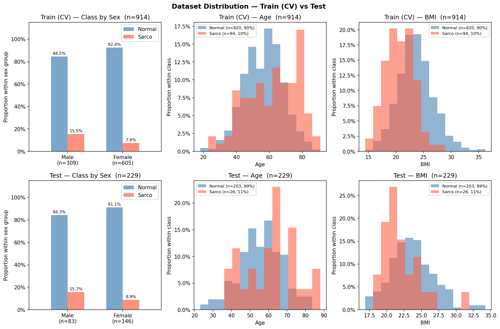

# SMI Binary Classification — CrossAttn Results

Generated: 2026-05-14 20:01  |  5-Fold CV  |  Median best epoch: 5

---

## 0. Dataset Distribution

### Class Distribution

| Split | Sex | n | Normal | Normal % | Sarco | Sarco % |
|-------|-----|--:|-------:|---------:|------:|--------:|
| Train | M | 309 | 261 | 84.5% | 48 | 15.5% |
| Train | F | 605 | 559 | 92.4% | 46 | 7.6% |
| Train | **All** | **914** | **820** | **89.7%** | **94** | **10.3%** |
| Test | M | 83 | 70 | 84.3% | 13 | 15.7% |
| Test | F | 146 | 133 | 91.1% | 13 | 8.9% |
| Test | **All** | **229** | **203** | **88.6%** | **26** | **11.4%** |

### Age

| Split | Sex | n | Mean ± Std | Min | Median | Max |
|-------|-----|--:|----------:|----:|-------:|----:|
| Train | M | 309 | 59.60 ± 12.50 | 18.00 | 60.00 | 89.00 |
| Train | F | 605 | 55.60 ± 11.93 | 18.00 | 55.00 | 91.00 |
| Train | **All** | **914** | **56.95 ± 12.27** | **18.00** | **57.00** | **91.00** |
| Test | M | 83 | 59.20 ± 12.71 | 28.00 | 60.00 | 88.00 |
| Test | F | 146 | 54.76 ± 11.42 | 23.00 | 55.00 | 86.00 |
| Test | **All** | **229** | **56.37 ± 12.09** | **23.00** | **57.00** | **88.00** |

### BMI

| Split | Sex | n | Mean ± Std | Min | Median | Max |
|-------|-----|--:|----------:|----:|-------:|----:|
| Train | M | 309 | 24.01 ± 3.23 | 14.48 | 24.07 | 35.20 |
| Train | F | 605 | 23.00 ± 3.25 | 14.40 | 22.72 | 36.24 |
| Train | **All** | **914** | **23.34 ± 3.27** | **14.40** | **23.24** | **36.24** |
| Test | M | 83 | 24.36 ± 2.96 | 18.37 | 24.39 | 33.87 |
| Test | F | 146 | 22.97 ± 3.08 | 16.87 | 22.65 | 34.23 |
| Test | **All** | **229** | **23.47 ± 3.11** | **16.87** | **23.28** | **34.23** |

---

## 1. Cross-Validation Summary

### Logistic Regression

| Fold | AUC-ROC | AUPRC | Brier | Accuracy | F1 |
|------|--------:|------:|------:|---------:|---:|
| 1 | 0.5366 | 0.2108 | 0.2016 | 0.7158 | 0.2121 |
| 2 | 0.6348 | 0.3008 | 0.1773 | 0.7596 | 0.2143 |
| 3 | 0.5523 | 0.1404 | 0.2180 | 0.7049 | 0.1818 |
| 4 | 0.5870 | 0.1585 | 0.2326 | 0.6831 | 0.2162 |
| 5 | 0.5105 | 0.1087 | 0.1947 | 0.7033 | 0.1290 |
| **Mean** | **0.5642** | **0.1839** | **0.2048** | **0.7133** | **0.1907** |
| **±Std** | 0.0431 | 0.0672 | 0.0191 | 0.0254 | 0.0333 |

### CrossAttn

| Fold | AUC-ROC | AUPRC | Brier | Accuracy | F1 |
|------|--------:|------:|------:|---------:|---:|
| 1 | 0.7770 | 0.3178 | 0.1362 | 0.8415 | 0.3830 |
| 2 | 0.8620 | 0.4611 | 0.1888 | 0.7377 | 0.4146 |
| 3 | 0.9034 | 0.4699 | 0.1936 | 0.7322 | 0.4235 |
| 4 | 0.7859 | 0.3852 | 0.2272 | 0.6339 | 0.3093 |
| 5 | 0.8645 | 0.4390 | 0.1930 | 0.6978 | 0.3529 |
| **Mean** | **0.8386** | **0.4146** | **0.1878** | **0.7286** | **0.3767** |
| **±Std** | 0.0490 | 0.0566 | 0.0292 | 0.0675 | 0.0419 |

CrossAttn best val AUC per fold: Fold1=0.7770, Fold2=0.8620, Fold3=0.9034, Fold4=0.7859, Fold5=0.8645

---

## 2. Test Set Performance

### Overall

| Model | AUC-ROC | AUPRC | Brier | Accuracy | F1 |
|-------|--------:|------:|------:|---------:|---:|
| Log. Reg. | 0.4972 | 0.1699 | 0.2266 | 0.6681 | 0.1915 |
| CrossAttn | 0.7467 | 0.2983 | 0.1670 | 0.7555 | 0.3333 |

### By Sex

#### Logistic Regression

| Sex | n | AUC-ROC | AUPRC | Brier | Accuracy | F1 |
|-----|--:|--------:|------:|------:|---------:|---:|
| M | 83 | 0.4253 | 0.1752 | 0.2628 | 0.6265 | 0.1622 |
| F | 146 | 0.5755 | 0.1897 | 0.2060 | 0.6918 | 0.2105 |

#### CrossAttn

| Sex | n | AUC-ROC | AUPRC | Brier | Accuracy | F1 |
|-----|--:|--------:|------:|------:|---------:|---:|
| M | 83 | 0.7549 | 0.3971 | 0.2060 | 0.7108 | 0.4286 |
| F | 146 | 0.7311 | 0.2086 | 0.1447 | 0.7808 | 0.2381 |

---

## 3. Confusion Matrix (Test Set)

### Logistic Regression

|  | Pred: Normal | Pred: Sarco |
|--|-------------:|------------:|
| **True: Normal** | 144 | 59 |
| **True: Sarco**  | 17 | 9 |

### CrossAttn

|  | Pred: Normal | Pred: Sarco |
|--|-------------:|------------:|
| **True: Normal** | 159 | 44 |
| **True: Sarco**  | 12 | 14 |

---

## 4. Figures

| File | Description |
|------|-------------|
| `data_distribution.png` | Train/Test class·Age·BMI distributions |
| `cv_roc_curves.png` | Per-fold ROC curves (LR & CrossAttn) |
| `cv_metric_distribution.png` | Boxplot of AUC / Acc / F1 across folds |
| `training_curves.png` | Loss & AUC training curves (mean ± std) |
| `test_roc_curves.png` | Final test-set ROC curves |
| `test_roc_by_sex.png` | Final test-set ROC curves by sex |
| `confusion_matrices.png` | Test-set confusion matrices (LR & CrossAttn) |
| `calibration.png` | Calibration plot (reliability diagram) + Precision-Recall curve |
