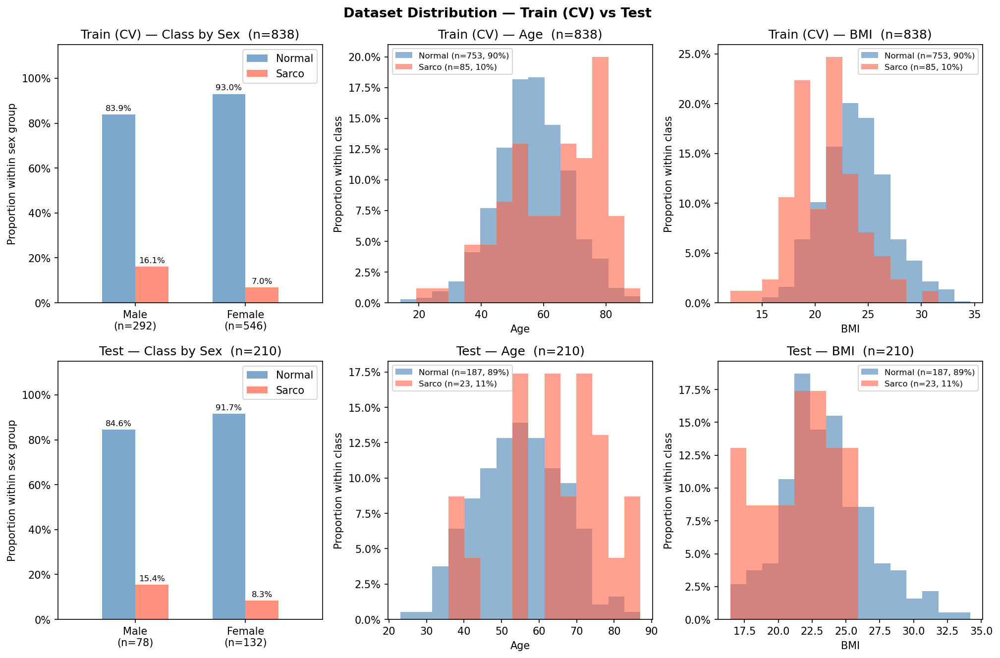

# SMI Binary Classification — CrossAttn Results

Generated: 2026-05-20 12:48  |  5-Fold CV  |  Median best epoch: 15

---

## 0. Dataset Distribution

### Class Distribution

| Split | Sex | n | Normal | Normal % | Sarco | Sarco % |
|-------|-----|--:|-------:|---------:|------:|--------:|
| Train | M | 292 | 245 | 83.9% | 47 | 16.1% |
| Train | F | 546 | 508 | 93.0% | 38 | 7.0% |
| Train | **All** | **838** | **753** | **89.9%** | **85** | **10.1%** |
| Test | M | 78 | 66 | 84.6% | 12 | 15.4% |
| Test | F | 132 | 121 | 91.7% | 11 | 8.3% |
| Test | **All** | **210** | **187** | **89.0%** | **23** | **11.0%** |

### Age

| Split | Sex | n | Mean ± Std | Min | Median | Max |
|-------|-----|--:|----------:|----:|-------:|----:|
| Train | M | 292 | 60.18 ± 12.19 | 20.00 | 60.00 | 89.00 |
| Train | F | 546 | 55.27 ± 11.82 | 14.00 | 55.00 | 91.00 |
| Train | **All** | **838** | **56.98 ± 12.18** | **14.00** | **57.00** | **91.00** |
| Test | M | 78 | 58.77 ± 11.89 | 28.00 | 61.00 | 83.00 |
| Test | F | 132 | 54.23 ± 11.82 | 23.00 | 53.50 | 87.00 |
| Test | **All** | **210** | **55.91 ± 12.05** | **23.00** | **56.00** | **87.00** |

### BMI

| Split | Sex | n | Mean ± Std | Min | Median | Max |
|-------|-----|--:|----------:|----:|-------:|----:|
| Train | M | 292 | 24.23 ± 3.03 | 14.34 | 24.15 | 32.67 |
| Train | F | 546 | 23.22 ± 3.30 | 12.02 | 23.06 | 34.61 |
| Train | **All** | **838** | **23.57 ± 3.24** | **12.02** | **23.53** | **34.61** |
| Test | M | 78 | 24.42 ± 2.96 | 17.43 | 24.01 | 32.56 |
| Test | F | 132 | 22.62 ± 3.21 | 16.44 | 22.10 | 34.20 |
| Test | **All** | **210** | **23.29 ± 3.24** | **16.44** | **23.20** | **34.20** |

---

## 1. Cross-Validation Summary

### CrossAttn

| Fold | AUC-ROC | AUPRC | Brier | Accuracy | F1 |
|------|--------:|------:|------:|---------:|---:|
| 1 | 0.8683 | 0.4359 | 0.1563 | 0.7560 | 0.4058 |
| 2 | 0.8130 | 0.3376 | 0.1188 | 0.8393 | 0.4490 |
| 3 | 0.8882 | 0.4972 | 0.1638 | 0.7798 | 0.4638 |
| 4 | 0.8498 | 0.3883 | 0.1468 | 0.7725 | 0.4062 |
| 5 | 0.8039 | 0.5064 | 0.1314 | 0.8084 | 0.3333 |
| **Mean** | **0.8447** | **0.4331** | **0.1434** | **0.7912** | **0.4116** |
| **±Std** | 0.0321 | 0.0642 | 0.0164 | 0.0294 | 0.0454 |

CrossAttn best val AUC per fold: Fold1=0.8683, Fold2=0.8130, Fold3=0.8882, Fold4=0.8498, Fold5=0.8039

---

## 2. Test Set Performance

### Overall

| Model | AUC-ROC | AUPRC | Brier | Accuracy | F1 |
|-------|--------:|------:|------:|---------:|---:|
| CrossAttn | 0.8056 | 0.3097 | 0.1778 | 0.7143 | 0.3750 |

### By Sex

| Sex | n | AUC-ROC | AUPRC | Brier | Accuracy | F1 |
|-----|--:|--------:|------:|------:|---------:|---:|
| M | 78 | 0.7386 | 0.3051 | 0.2414 | 0.6282 | 0.4082 |
| F | 132 | 0.8512 | 0.3571 | 0.1403 | 0.7652 | 0.3404 |

---

## 3. Confusion Matrix (Test Set)

|  | Pred: Normal | Pred: Sarco |
|--|-------------:|------------:|
| **True: Normal** | 132 | 55 |
| **True: Sarco**  | 5 | 18 |

---

## 4. Figures

| File | Description |
|------|-------------|
| `data_distribution.png` | Train/Test class·Age·BMI distributions |
| `cv_roc_curves.png` | Per-fold ROC curves (CrossAttn) |
| `cv_metric_distribution.png` | Boxplot of AUC / Acc / F1 across folds |
| `training_curves.png` | Loss & AUC training curves (mean ± std) |
| `test_roc_curves.png` | Final test-set ROC curve |
| `test_roc_by_sex.png` | Final test-set ROC curves by sex |
| `confusion_matrices.png` | Test-set confusion matrices |
| `calibration.png` | Calibration plot (reliability diagram) + Precision-Recall curve |
