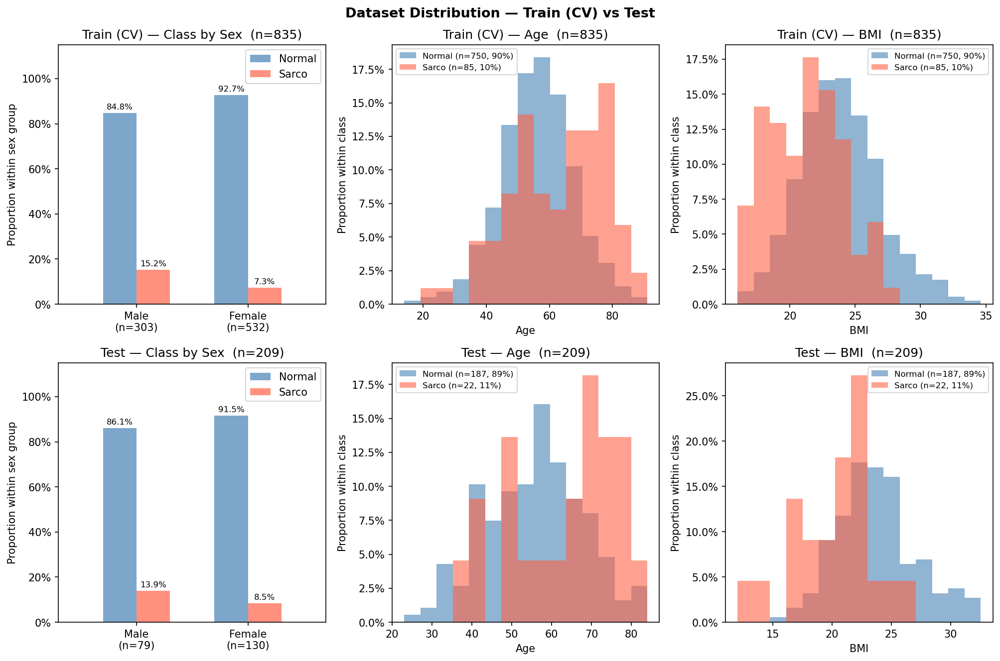

# SMI Binary Classification — CrossAttn Results

Generated: 2026-05-21 20:03  |  5-Fold CV  |  Median best epoch: 6

---

## 0. Dataset Distribution

### Class Distribution

| Split | Sex | n | Normal | Normal % | Sarco | Sarco % |
|-------|-----|--:|-------:|---------:|------:|--------:|
| Train | M | 303 | 257 | 84.8% | 46 | 15.2% |
| Train | F | 532 | 493 | 92.7% | 39 | 7.3% |
| Train | **All** | **835** | **750** | **89.8%** | **85** | **10.2%** |
| Test | M | 79 | 68 | 86.1% | 11 | 13.9% |
| Test | F | 130 | 119 | 91.5% | 11 | 8.5% |
| Test | **All** | **209** | **187** | **89.5%** | **22** | **10.5%** |

### Age

| Split | Sex | n | Mean ± Std | Min | Median | Max |
|-------|-----|--:|----------:|----:|-------:|----:|
| Train | M | 303 | 59.42 ± 12.02 | 20.00 | 59.00 | 89.00 |
| Train | F | 532 | 55.34 ± 11.97 | 14.00 | 55.00 | 91.00 |
| Train | **All** | **835** | **56.82 ± 12.15** | **14.00** | **57.00** | **91.00** |
| Test | M | 79 | 58.90 ± 12.54 | 29.00 | 60.00 | 84.00 |
| Test | F | 130 | 55.08 ± 12.01 | 23.00 | 55.00 | 83.00 |
| Test | **All** | **209** | **56.52 ± 12.35** | **23.00** | **57.00** | **84.00** |

### BMI

| Split | Sex | n | Mean ± Std | Min | Median | Max |
|-------|-----|--:|----------:|----:|-------:|----:|
| Train | M | 303 | 24.39 ± 2.93 | 17.33 | 24.28 | 32.67 |
| Train | F | 532 | 23.15 ± 3.19 | 16.00 | 22.95 | 34.61 |
| Train | **All** | **835** | **23.60 ± 3.16** | **16.00** | **23.46** | **34.61** |
| Test | M | 79 | 24.06 ± 3.31 | 14.34 | 23.94 | 32.56 |
| Test | F | 130 | 22.95 ± 3.60 | 12.02 | 22.49 | 32.48 |
| Test | **All** | **209** | **23.37 ± 3.54** | **12.02** | **23.24** | **32.56** |

---

## 1. Cross-Validation Summary

### CrossAttn

| Fold | AUC-ROC | AUPRC | Brier | Accuracy | F1 |
|------|--------:|------:|------:|---------:|---:|
| 1 | 0.8773 | 0.4116 | 0.1789 | 0.7305 | 0.4156 |
| 2 | 0.8337 | 0.4697 | 0.2479 | 0.5449 | 0.2830 |
| 3 | 0.8498 | 0.3947 | 0.1786 | 0.7186 | 0.3896 |
| 4 | 0.7733 | 0.3588 | 0.2095 | 0.6886 | 0.2973 |
| 5 | 0.8404 | 0.3986 | 0.1257 | 0.8024 | 0.4407 |
| **Mean** | **0.8349** | **0.4067** | **0.1881** | **0.6970** | **0.3652** |
| **±Std** | 0.0342 | 0.0360 | 0.0403 | 0.0847 | 0.0636 |

CrossAttn best val AUC per fold: Fold1=0.8773, Fold2=0.8337, Fold3=0.8498, Fold4=0.7733, Fold5=0.8404

---

## 2. Test Set Performance

### Overall

| Model | AUC-ROC | AUPRC | Brier | Accuracy | F1 |
|-------|--------:|------:|------:|---------:|---:|
| CrossAttn | 0.8233 | 0.3481 | 0.1866 | 0.6794 | 0.3619 |

### By Sex

| Sex | n | AUC-ROC | AUPRC | Brier | Accuracy | F1 |
|-----|--:|--------:|------:|------:|---------:|---:|
| M | 79 | 0.8235 | 0.3975 | 0.2333 | 0.6076 | 0.4151 |
| F | 130 | 0.8037 | 0.3603 | 0.1581 | 0.7231 | 0.3077 |

---

## 3. Confusion Matrix (Test Set)

|  | Pred: Normal | Pred: Sarco |
|--|-------------:|------------:|
| **True: Normal** | 123 | 64 |
| **True: Sarco**  | 3 | 19 |

---

## 4. Figures

| File | Description |
|------|-------------|
| `data_distribution.png` | Train/Test class·Age·BMI distributions |
| `cv_roc_curves.png` | Per-fold ROC curves (CrossAttn) |
| `cv_metric_distribution.png` | Boxplot of AUC / Acc / F1 across folds |
| `training_curves.png` | Loss & AUC training curves (mean ± std) |
| `test_roc_curves.png` | Final test-set ROC curve |
| `test_roc_by_sex.png` | Final test-set ROC curves by sex |
| `confusion_matrices.png` | Test-set confusion matrices |
| `calibration.png` | Calibration plot (reliability diagram) + Precision-Recall curve |
