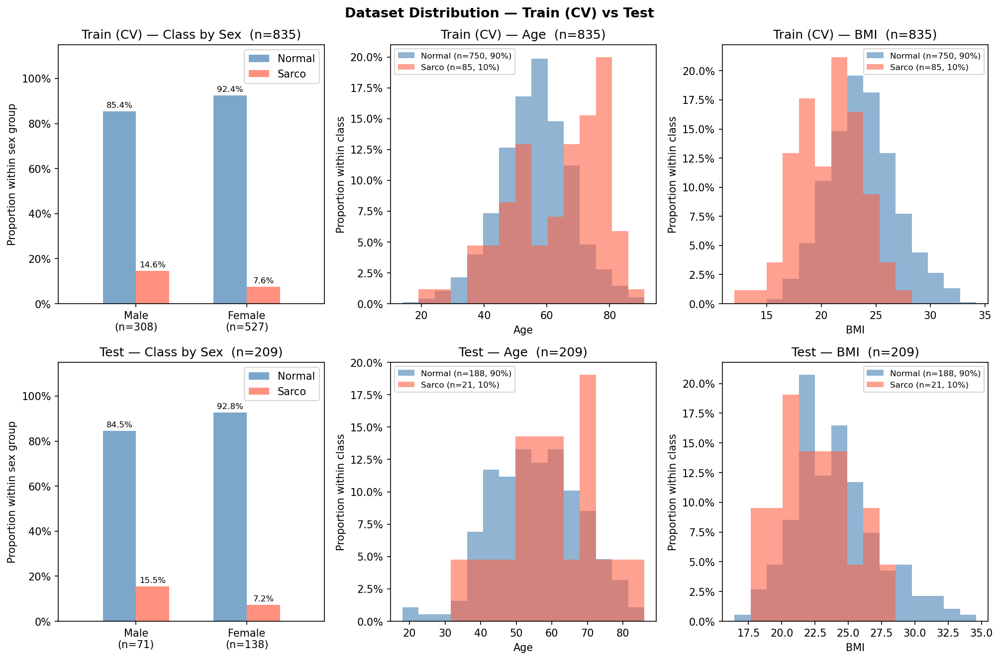

# SMI Binary Classification — CrossAttn Results

Generated: 2026-05-20 21:35  |  5-Fold CV  |  Median best epoch: 9

---

## 0. Dataset Distribution

### Class Distribution

| Split | Sex | n | Normal | Normal % | Sarco | Sarco % |
|-------|-----|--:|-------:|---------:|------:|--------:|
| Train | M | 308 | 263 | 85.4% | 45 | 14.6% |
| Train | F | 527 | 487 | 92.4% | 40 | 7.6% |
| Train | **All** | **835** | **750** | **89.8%** | **85** | **10.2%** |
| Test | M | 71 | 60 | 84.5% | 11 | 15.5% |
| Test | F | 138 | 128 | 92.8% | 10 | 7.2% |
| Test | **All** | **209** | **188** | **90.0%** | **21** | **10.0%** |

### Age

| Split | Sex | n | Mean ± Std | Min | Median | Max |
|-------|-----|--:|----------:|----:|-------:|----:|
| Train | M | 308 | 59.77 ± 11.88 | 20.00 | 60.00 | 89.00 |
| Train | F | 527 | 55.43 ± 11.97 | 14.00 | 55.00 | 91.00 |
| Train | **All** | **835** | **57.03 ± 12.12** | **14.00** | **58.00** | **91.00** |
| Test | M | 71 | 57.34 ± 12.71 | 22.00 | 57.00 | 80.00 |
| Test | F | 138 | 55.14 ± 12.03 | 18.00 | 55.00 | 86.00 |
| Test | **All** | **209** | **55.89 ± 12.31** | **18.00** | **56.00** | **86.00** |

### BMI

| Split | Sex | n | Mean ± Std | Min | Median | Max |
|-------|-----|--:|----------:|----:|-------:|----:|
| Train | M | 308 | 24.24 ± 3.02 | 14.34 | 24.12 | 32.59 |
| Train | F | 527 | 23.04 ± 3.29 | 12.02 | 22.91 | 34.20 |
| Train | **All** | **835** | **23.48 ± 3.25** | **12.02** | **23.41** | **34.20** |
| Test | M | 71 | 24.78 ± 3.04 | 18.44 | 24.43 | 32.67 |
| Test | F | 138 | 23.40 ± 3.18 | 16.44 | 22.88 | 34.61 |
| Test | **All** | **209** | **23.86 ± 3.20** | **16.44** | **23.66** | **34.61** |

---

## 1. Cross-Validation Summary

### CrossAttn

| Fold | AUC-ROC | AUPRC | Brier | Accuracy | F1 |
|------|--------:|------:|------:|---------:|---:|
| 1 | 0.8545 | 0.3782 | 0.1599 | 0.7725 | 0.4412 |
| 2 | 0.9306 | 0.6113 | 0.1586 | 0.7365 | 0.4211 |
| 3 | 0.8573 | 0.2989 | 0.1722 | 0.7425 | 0.4267 |
| 4 | 0.7918 | 0.3324 | 0.1877 | 0.7305 | 0.3478 |
| 5 | 0.8831 | 0.5747 | 0.1442 | 0.7665 | 0.4348 |
| **Mean** | **0.8635** | **0.4391** | **0.1645** | **0.7497** | **0.4143** |
| **±Std** | 0.0451 | 0.1287 | 0.0146 | 0.0167 | 0.0339 |

CrossAttn best val AUC per fold: Fold1=0.8545, Fold2=0.9306, Fold3=0.8573, Fold4=0.7918, Fold5=0.8831

---

## 2. Test Set Performance

### Overall

| Model | AUC-ROC | AUPRC | Brier | Accuracy | F1 |
|-------|--------:|------:|------:|---------:|---:|
| CrossAttn | 0.6847 | 0.1834 | 0.2172 | 0.6459 | 0.2128 |

### By Sex

| Sex | n | AUC-ROC | AUPRC | Brier | Accuracy | F1 |
|-----|--:|--------:|------:|------:|---------:|---:|
| M | 71 | 0.6333 | 0.2257 | 0.2823 | 0.5775 | 0.2500 |
| F | 138 | 0.7156 | 0.1763 | 0.1838 | 0.6812 | 0.1852 |

---

## 3. Confusion Matrix (Test Set)

|  | Pred: Normal | Pred: Sarco |
|--|-------------:|------------:|
| **True: Normal** | 125 | 63 |
| **True: Sarco**  | 11 | 10 |

---

## 4. Figures

| File | Description |
|------|-------------|
| `data_distribution.png` | Train/Test class·Age·BMI distributions |
| `cv_roc_curves.png` | Per-fold ROC curves (CrossAttn) |
| `cv_metric_distribution.png` | Boxplot of AUC / Acc / F1 across folds |
| `training_curves.png` | Loss & AUC training curves (mean ± std) |
| `test_roc_curves.png` | Final test-set ROC curve |
| `test_roc_by_sex.png` | Final test-set ROC curves by sex |
| `confusion_matrices.png` | Test-set confusion matrices |
| `calibration.png` | Calibration plot (reliability diagram) + Precision-Recall curve |
