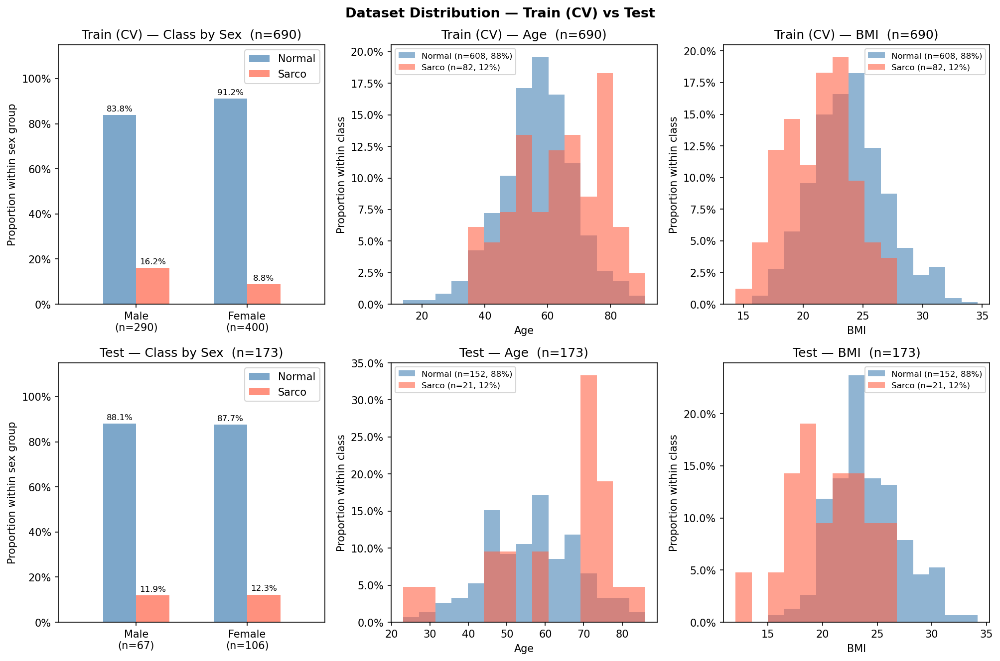

# SMI Binary Classification — CrossAttn Results

Generated: 2026-05-20 12:57  |  5-Fold CV  |  Median best epoch: 6

---

## 0. Dataset Distribution

### Class Distribution

| Split | Sex | n | Normal | Normal % | Sarco | Sarco % |
|-------|-----|--:|-------:|---------:|------:|--------:|
| Train | M | 290 | 243 | 83.8% | 47 | 16.2% |
| Train | F | 400 | 365 | 91.2% | 35 | 8.8% |
| Train | **All** | **690** | **608** | **88.1%** | **82** | **11.9%** |
| Test | M | 67 | 59 | 88.1% | 8 | 11.9% |
| Test | F | 106 | 93 | 87.7% | 13 | 12.3% |
| Test | **All** | **173** | **152** | **87.9%** | **21** | **12.1%** |

### Age

| Split | Sex | n | Mean ± Std | Min | Median | Max |
|-------|-----|--:|----------:|----:|-------:|----:|
| Train | M | 290 | 59.73 ± 11.52 | 28.00 | 60.00 | 89.00 |
| Train | F | 400 | 56.10 ± 12.16 | 14.00 | 56.50 | 91.00 |
| Train | **All** | **690** | **57.62 ± 12.03** | **14.00** | **58.00** | **91.00** |
| Test | M | 67 | 58.27 ± 12.85 | 23.00 | 59.00 | 83.00 |
| Test | F | 106 | 56.60 ± 12.49 | 23.00 | 56.50 | 86.00 |
| Test | **All** | **173** | **57.25 ± 12.65** | **23.00** | **58.00** | **86.00** |

### BMI

| Split | Sex | n | Mean ± Std | Min | Median | Max |
|-------|-----|--:|----------:|----:|-------:|----:|
| Train | M | 290 | 24.38 ± 3.07 | 14.34 | 24.28 | 32.67 |
| Train | F | 400 | 22.97 ± 3.22 | 16.00 | 22.83 | 34.61 |
| Train | **All** | **690** | **23.56 ± 3.23** | **14.34** | **23.44** | **34.61** |
| Test | M | 67 | 24.59 ± 2.87 | 17.65 | 24.11 | 32.56 |
| Test | F | 106 | 23.02 ± 3.69 | 12.02 | 22.66 | 34.20 |
| Test | **All** | **173** | **23.63 ± 3.48** | **12.02** | **23.33** | **34.20** |

---

## 1. Cross-Validation Summary

### CrossAttn

| Fold | AUC-ROC | AUPRC | Brier | Accuracy | F1 |
|------|--------:|------:|------:|---------:|---:|
| 1 | 0.8648 | 0.4744 | 0.1388 | 0.7754 | 0.4364 |
| 2 | 0.8335 | 0.3782 | 0.1510 | 0.7754 | 0.4364 |
| 3 | 0.8125 | 0.3075 | 0.1584 | 0.7826 | 0.3750 |
| 4 | 0.7900 | 0.2848 | 0.1801 | 0.6957 | 0.3824 |
| 5 | 0.8551 | 0.5896 | 0.1284 | 0.7971 | 0.4167 |
| **Mean** | **0.8312** | **0.4069** | **0.1513** | **0.7652** | **0.4093** |
| **±Std** | 0.0274 | 0.1127 | 0.0177 | 0.0357 | 0.0262 |

CrossAttn best val AUC per fold: Fold1=0.8648, Fold2=0.8335, Fold3=0.8125, Fold4=0.7900, Fold5=0.8551

---

## 2. Test Set Performance

### Overall

| Model | AUC-ROC | AUPRC | Brier | Accuracy | F1 |
|-------|--------:|------:|------:|---------:|---:|
| CrossAttn | 0.8133 | 0.4267 | 0.1638 | 0.7514 | 0.4110 |

### By Sex

| Sex | n | AUC-ROC | AUPRC | Brier | Accuracy | F1 |
|-----|--:|--------:|------:|------:|---------:|---:|
| M | 67 | 0.7669 | 0.3382 | 0.2188 | 0.6418 | 0.2941 |
| F | 106 | 0.8635 | 0.6166 | 0.1291 | 0.8208 | 0.5128 |

---

## 3. Confusion Matrix (Test Set)

|  | Pred: Normal | Pred: Sarco |
|--|-------------:|------------:|
| **True: Normal** | 115 | 37 |
| **True: Sarco**  | 6 | 15 |

---

## 4. Figures

| File | Description |
|------|-------------|
| `data_distribution.png` | Train/Test class·Age·BMI distributions |
| `cv_roc_curves.png` | Per-fold ROC curves (CrossAttn) |
| `cv_metric_distribution.png` | Boxplot of AUC / Acc / F1 across folds |
| `training_curves.png` | Loss & AUC training curves (mean ± std) |
| `test_roc_curves.png` | Final test-set ROC curve |
| `test_roc_by_sex.png` | Final test-set ROC curves by sex |
| `confusion_matrices.png` | Test-set confusion matrices |
| `calibration.png` | Calibration plot (reliability diagram) + Precision-Recall curve |
