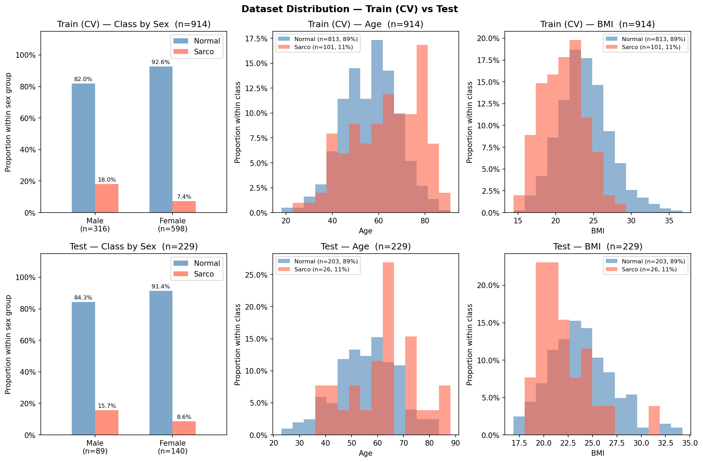

# SMI Binary Classification — CrossAttn Results

Generated: 2026-05-14 20:09  |  5-Fold CV  |  Median best epoch: 10

---

## 0. Dataset Distribution

### Class Distribution

| Split | Sex | n | Normal | Normal % | Sarco | Sarco % |
|-------|-----|--:|-------:|---------:|------:|--------:|
| Train | M | 316 | 259 | 82.0% | 57 | 18.0% |
| Train | F | 598 | 554 | 92.6% | 44 | 7.4% |
| Train | **All** | **914** | **813** | **88.9%** | **101** | **11.1%** |
| Test | M | 89 | 75 | 84.3% | 14 | 15.7% |
| Test | F | 140 | 128 | 91.4% | 12 | 8.6% |
| Test | **All** | **229** | **203** | **88.6%** | **26** | **11.4%** |

### Age

| Split | Sex | n | Mean ± Std | Min | Median | Max |
|-------|-----|--:|----------:|----:|-------:|----:|
| Train | M | 316 | 60.12 ± 12.45 | 18.00 | 60.50 | 89.00 |
| Train | F | 598 | 55.41 ± 12.04 | 18.00 | 55.00 | 91.00 |
| Train | **All** | **914** | **57.04 ± 12.39** | **18.00** | **57.00** | **91.00** |
| Test | M | 89 | 58.73 ± 12.75 | 28.00 | 60.00 | 88.00 |
| Test | F | 140 | 54.91 ± 11.71 | 23.00 | 55.50 | 86.00 |
| Test | **All** | **229** | **56.39 ± 12.26** | **23.00** | **57.00** | **88.00** |

### BMI

| Split | Sex | n | Mean ± Std | Min | Median | Max |
|-------|-----|--:|----------:|----:|-------:|----:|
| Train | M | 316 | 24.18 ± 3.43 | 14.48 | 24.16 | 36.76 |
| Train | F | 598 | 23.12 ± 3.44 | 14.40 | 22.76 | 36.24 |
| Train | **All** | **914** | **23.48 ± 3.48** | **14.40** | **23.31** | **36.76** |
| Test | M | 89 | 24.41 ± 2.94 | 18.37 | 24.53 | 33.87 |
| Test | F | 140 | 23.05 ± 3.29 | 16.87 | 22.58 | 34.23 |
| Test | **All** | **229** | **23.58 ± 3.23** | **16.87** | **23.34** | **34.23** |

---

## 1. Cross-Validation Summary

### Logistic Regression

| Fold | AUC-ROC | AUPRC | Brier | Accuracy | F1 |
|------|--------:|------:|------:|---------:|---:|
| 1 | 0.7595 | 0.3444 | 0.1412 | 0.8197 | 0.3774 |
| 2 | 0.8794 | 0.5706 | 0.1392 | 0.7923 | 0.4412 |
| 3 | 0.8387 | 0.4471 | 0.1782 | 0.7322 | 0.4096 |
| 4 | 0.7837 | 0.2800 | 0.1612 | 0.8087 | 0.4776 |
| 5 | 0.8472 | 0.3175 | 0.1724 | 0.7363 | 0.4286 |
| **Mean** | **0.8217** | **0.3919** | **0.1585** | **0.7779** | **0.4269** |
| **±Std** | 0.0438 | 0.1052 | 0.0159 | 0.0367 | 0.0333 |

### CrossAttn

| Fold | AUC-ROC | AUPRC | Brier | Accuracy | F1 |
|------|--------:|------:|------:|---------:|---:|
| 1 | 0.7571 | 0.3637 | 0.1390 | 0.7978 | 0.3729 |
| 2 | 0.8715 | 0.4909 | 0.1936 | 0.6940 | 0.3913 |
| 3 | 0.8761 | 0.5045 | 0.1486 | 0.7923 | 0.4242 |
| 4 | 0.7884 | 0.3175 | 0.1367 | 0.8361 | 0.4643 |
| 5 | 0.8747 | 0.4977 | 0.1519 | 0.7747 | 0.4533 |
| **Mean** | **0.8335** | **0.4348** | **0.1540** | **0.7790** | **0.4212** |
| **±Std** | 0.0507 | 0.0785 | 0.0206 | 0.0470 | 0.0350 |

CrossAttn best val AUC per fold: Fold1=0.7571, Fold2=0.8715, Fold3=0.8761, Fold4=0.7884, Fold5=0.8747

---

## 2. Test Set Performance

### Overall

| Model | AUC-ROC | AUPRC | Brier | Accuracy | F1 |
|-------|--------:|------:|------:|---------:|---:|
| Log. Reg. | 0.6870 | 0.2068 | 0.1794 | 0.7642 | 0.2895 |
| CrossAttn | 0.7440 | 0.2322 | 0.2104 | 0.6856 | 0.3333 |

### By Sex

#### Logistic Regression

| Sex | n | AUC-ROC | AUPRC | Brier | Accuracy | F1 |
|-----|--:|--------:|------:|------:|---------:|---:|
| M | 89 | 0.7057 | 0.2770 | 0.2284 | 0.6854 | 0.3913 |
| F | 140 | 0.6289 | 0.1345 | 0.1482 | 0.8143 | 0.1333 |

#### CrossAttn

| Sex | n | AUC-ROC | AUPRC | Brier | Accuracy | F1 |
|-----|--:|--------:|------:|------:|---------:|---:|
| M | 89 | 0.7505 | 0.2973 | 0.2438 | 0.6517 | 0.4151 |
| F | 140 | 0.7090 | 0.1702 | 0.1891 | 0.7071 | 0.2545 |

---

## 3. Confusion Matrix (Test Set)

### Logistic Regression

|  | Pred: Normal | Pred: Sarco |
|--|-------------:|------------:|
| **True: Normal** | 164 | 39 |
| **True: Sarco**  | 15 | 11 |

### CrossAttn

|  | Pred: Normal | Pred: Sarco |
|--|-------------:|------------:|
| **True: Normal** | 139 | 64 |
| **True: Sarco**  | 8 | 18 |

---

## 4. Figures

| File | Description |
|------|-------------|
| `data_distribution.png` | Train/Test class·Age·BMI distributions |
| `cv_roc_curves.png` | Per-fold ROC curves (LR & CrossAttn) |
| `cv_metric_distribution.png` | Boxplot of AUC / Acc / F1 across folds |
| `training_curves.png` | Loss & AUC training curves (mean ± std) |
| `test_roc_curves.png` | Final test-set ROC curves |
| `test_roc_by_sex.png` | Final test-set ROC curves by sex |
| `confusion_matrices.png` | Test-set confusion matrices (LR & CrossAttn) |
| `calibration.png` | Calibration plot (reliability diagram) + Precision-Recall curve |
