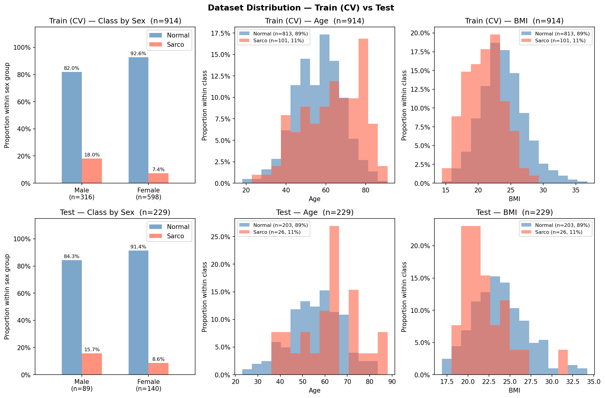

# SMI Binary Classification — CrossAttn Results

Generated: 2026-05-14 20:00  |  5-Fold CV  |  Median best epoch: 29

---

## 0. Dataset Distribution

### Class Distribution

| Split | Sex | n | Normal | Normal % | Sarco | Sarco % |
|-------|-----|--:|-------:|---------:|------:|--------:|
| Train | M | 316 | 259 | 82.0% | 57 | 18.0% |
| Train | F | 598 | 554 | 92.6% | 44 | 7.4% |
| Train | **All** | **914** | **813** | **88.9%** | **101** | **11.1%** |
| Test | M | 89 | 75 | 84.3% | 14 | 15.7% |
| Test | F | 140 | 128 | 91.4% | 12 | 8.6% |
| Test | **All** | **229** | **203** | **88.6%** | **26** | **11.4%** |

### Age

| Split | Sex | n | Mean ± Std | Min | Median | Max |
|-------|-----|--:|----------:|----:|-------:|----:|
| Train | M | 316 | 60.12 ± 12.45 | 18.00 | 60.50 | 89.00 |
| Train | F | 598 | 55.41 ± 12.04 | 18.00 | 55.00 | 91.00 |
| Train | **All** | **914** | **57.04 ± 12.39** | **18.00** | **57.00** | **91.00** |
| Test | M | 89 | 58.73 ± 12.75 | 28.00 | 60.00 | 88.00 |
| Test | F | 140 | 54.91 ± 11.71 | 23.00 | 55.50 | 86.00 |
| Test | **All** | **229** | **56.39 ± 12.26** | **23.00** | **57.00** | **88.00** |

### BMI

| Split | Sex | n | Mean ± Std | Min | Median | Max |
|-------|-----|--:|----------:|----:|-------:|----:|
| Train | M | 316 | 24.18 ± 3.43 | 14.48 | 24.16 | 36.76 |
| Train | F | 598 | 23.12 ± 3.44 | 14.40 | 22.76 | 36.24 |
| Train | **All** | **914** | **23.48 ± 3.48** | **14.40** | **23.31** | **36.76** |
| Test | M | 89 | 24.41 ± 2.94 | 18.37 | 24.53 | 33.87 |
| Test | F | 140 | 23.05 ± 3.29 | 16.87 | 22.58 | 34.23 |
| Test | **All** | **229** | **23.58 ± 3.23** | **16.87** | **23.34** | **34.23** |

---

## 1. Cross-Validation Summary

### Logistic Regression

| Fold | AUC-ROC | AUPRC | Brier | Accuracy | F1 |
|------|--------:|------:|------:|---------:|---:|
| 1 | 0.5500 | 0.1483 | 0.1911 | 0.7596 | 0.2143 |
| 2 | 0.7202 | 0.3146 | 0.1718 | 0.7541 | 0.2373 |
| 3 | 0.6426 | 0.1738 | 0.2434 | 0.6667 | 0.2469 |
| 4 | 0.5841 | 0.1461 | 0.1988 | 0.7541 | 0.2623 |
| 5 | 0.5799 | 0.1283 | 0.2502 | 0.6319 | 0.1299 |
| **Mean** | **0.6154** | **0.1822** | **0.2111** | **0.7133** | **0.2181** |
| **±Std** | 0.0604 | 0.0678 | 0.0306 | 0.0534 | 0.0468 |

### CrossAttn

| Fold | AUC-ROC | AUPRC | Brier | Accuracy | F1 |
|------|--------:|------:|------:|---------:|---:|
| 1 | 0.7620 | 0.4287 | 0.1287 | 0.8251 | 0.4286 |
| 2 | 0.8954 | 0.5501 | 0.0898 | 0.8962 | 0.5778 |
| 3 | 0.8957 | 0.5897 | 0.1759 | 0.7541 | 0.4304 |
| 4 | 0.8019 | 0.2942 | 0.1394 | 0.8087 | 0.3860 |
| 5 | 0.8571 | 0.5207 | 0.1538 | 0.7637 | 0.4267 |
| **Mean** | **0.8424** | **0.4767** | **0.1375** | **0.8096** | **0.4499** |
| **±Std** | 0.0529 | 0.1056 | 0.0286 | 0.0508 | 0.0661 |

CrossAttn best val AUC per fold: Fold1=0.7620, Fold2=0.8954, Fold3=0.8957, Fold4=0.8019, Fold5=0.8571

---

## 2. Test Set Performance

### Overall

| Model | AUC-ROC | AUPRC | Brier | Accuracy | F1 |
|-------|--------:|------:|------:|---------:|---:|
| Log. Reg. | 0.5083 | 0.1534 | 0.2503 | 0.6725 | 0.1379 |
| CrossAttn | 0.7658 | 0.2521 | 0.1464 | 0.7991 | 0.3784 |

### By Sex

#### Logistic Regression

| Sex | n | AUC-ROC | AUPRC | Brier | Accuracy | F1 |
|-----|--:|--------:|------:|------:|---------:|---:|
| M | 89 | 0.5810 | 0.2484 | 0.2496 | 0.6742 | 0.1714 |
| F | 140 | 0.4577 | 0.1208 | 0.2507 | 0.6714 | 0.1154 |

#### CrossAttn

| Sex | n | AUC-ROC | AUPRC | Brier | Accuracy | F1 |
|-----|--:|--------:|------:|------:|---------:|---:|
| M | 89 | 0.7590 | 0.3131 | 0.1851 | 0.7528 | 0.4500 |
| F | 140 | 0.7272 | 0.2127 | 0.1218 | 0.8286 | 0.2941 |

---

## 3. Confusion Matrix (Test Set)

### Logistic Regression

|  | Pred: Normal | Pred: Sarco |
|--|-------------:|------------:|
| **True: Normal** | 148 | 55 |
| **True: Sarco**  | 20 | 6 |

### CrossAttn

|  | Pred: Normal | Pred: Sarco |
|--|-------------:|------------:|
| **True: Normal** | 169 | 34 |
| **True: Sarco**  | 12 | 14 |

---

## 4. Figures

| File | Description |
|------|-------------|
| `data_distribution.png` | Train/Test class·Age·BMI distributions |
| `cv_roc_curves.png` | Per-fold ROC curves (LR & CrossAttn) |
| `cv_metric_distribution.png` | Boxplot of AUC / Acc / F1 across folds |
| `training_curves.png` | Loss & AUC training curves (mean ± std) |
| `test_roc_curves.png` | Final test-set ROC curves |
| `test_roc_by_sex.png` | Final test-set ROC curves by sex |
| `confusion_matrices.png` | Test-set confusion matrices (LR & CrossAttn) |
| `calibration.png` | Calibration plot (reliability diagram) + Precision-Recall curve |
