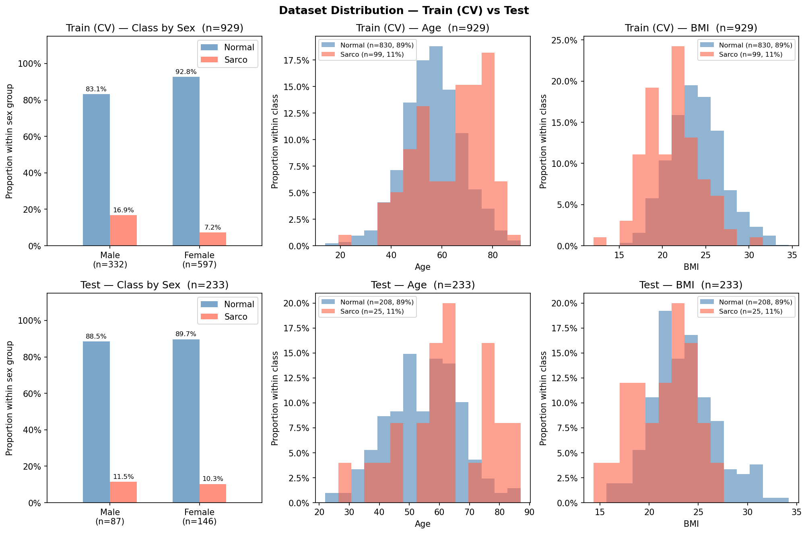

# SMI Binary Classification — CrossAttn Results

Generated: 2026-05-20 12:08  |  5-Fold CV  |  Median best epoch: 28

---

## 0. Dataset Distribution

### Class Distribution

| Split | Sex | n | Normal | Normal % | Sarco | Sarco % |
|-------|-----|--:|-------:|---------:|------:|--------:|
| Train | M | 332 | 276 | 83.1% | 56 | 16.9% |
| Train | F | 597 | 554 | 92.8% | 43 | 7.2% |
| Train | **All** | **929** | **830** | **89.3%** | **99** | **10.7%** |
| Test | M | 87 | 77 | 88.5% | 10 | 11.5% |
| Test | F | 146 | 131 | 89.7% | 15 | 10.3% |
| Test | **All** | **233** | **208** | **89.3%** | **25** | **10.7%** |

### Age

| Split | Sex | n | Mean ± Std | Min | Median | Max |
|-------|-----|--:|----------:|----:|-------:|----:|
| Train | M | 332 | 60.33 ± 11.99 | 20.00 | 60.00 | 89.00 |
| Train | F | 597 | 55.52 ± 11.67 | 14.00 | 55.00 | 91.00 |
| Train | **All** | **929** | **57.24 ± 12.01** | **14.00** | **57.00** | **91.00** |
| Test | M | 87 | 56.93 ± 12.53 | 22.00 | 58.00 | 84.00 |
| Test | F | 146 | 54.41 ± 12.53 | 23.00 | 54.00 | 87.00 |
| Test | **All** | **233** | **55.35 ± 12.59** | **22.00** | **57.00** | **87.00** |

### BMI

| Split | Sex | n | Mean ± Std | Min | Median | Max |
|-------|-----|--:|----------:|----:|-------:|----:|
| Train | M | 332 | 24.41 ± 3.03 | 16.39 | 24.39 | 32.67 |
| Train | F | 597 | 23.19 ± 3.21 | 12.02 | 22.96 | 34.61 |
| Train | **All** | **929** | **23.63 ± 3.20** | **12.02** | **23.56** | **34.61** |
| Test | M | 87 | 24.22 ± 3.01 | 14.34 | 23.94 | 32.56 |
| Test | F | 146 | 22.87 ± 3.38 | 15.84 | 22.44 | 34.20 |
| Test | **All** | **233** | **23.38 ± 3.31** | **14.34** | **23.31** | **34.20** |

---

## 1. Cross-Validation Summary

### CrossAttn

| Fold | AUC-ROC | AUPRC | Brier | Accuracy | F1 |
|------|--------:|------:|------:|---------:|---:|
| 1 | 0.8744 | 0.4354 | 0.1519 | 0.7903 | 0.4507 |
| 2 | 0.8590 | 0.4273 | 0.1518 | 0.7688 | 0.4267 |
| 3 | 0.8123 | 0.3923 | 0.1835 | 0.7366 | 0.3797 |
| 4 | 0.8187 | 0.4210 | 0.1227 | 0.8226 | 0.4590 |
| 5 | 0.8599 | 0.4289 | 0.1196 | 0.8216 | 0.4762 |
| **Mean** | **0.8449** | **0.4210** | **0.1459** | **0.7880** | **0.4385** |
| **±Std** | 0.0247 | 0.0150 | 0.0233 | 0.0327 | 0.0334 |

CrossAttn best val AUC per fold: Fold1=0.8744, Fold2=0.8590, Fold3=0.8123, Fold4=0.8187, Fold5=0.8599

---

## 2. Test Set Performance

### Overall

| Model | AUC-ROC | AUPRC | Brier | Accuracy | F1 |
|-------|--------:|------:|------:|---------:|---:|
| CrossAttn | 0.6512 | 0.2389 | 0.2236 | 0.6652 | 0.2200 |

### By Sex

| Sex | n | AUC-ROC | AUPRC | Brier | Accuracy | F1 |
|-----|--:|--------:|------:|------:|---------:|---:|
| M | 87 | 0.5675 | 0.2421 | 0.2936 | 0.5862 | 0.1818 |
| F | 146 | 0.7216 | 0.2693 | 0.1819 | 0.7123 | 0.2500 |

---

## 3. Confusion Matrix (Test Set)

|  | Pred: Normal | Pred: Sarco |
|--|-------------:|------------:|
| **True: Normal** | 144 | 64 |
| **True: Sarco**  | 14 | 11 |

---

## 4. Figures

| File | Description |
|------|-------------|
| `data_distribution.png` | Train/Test class·Age·BMI distributions |
| `cv_roc_curves.png` | Per-fold ROC curves (CrossAttn) |
| `cv_metric_distribution.png` | Boxplot of AUC / Acc / F1 across folds |
| `training_curves.png` | Loss & AUC training curves (mean ± std) |
| `test_roc_curves.png` | Final test-set ROC curve |
| `test_roc_by_sex.png` | Final test-set ROC curves by sex |
| `confusion_matrices.png` | Test-set confusion matrices |
| `calibration.png` | Calibration plot (reliability diagram) + Precision-Recall curve |
