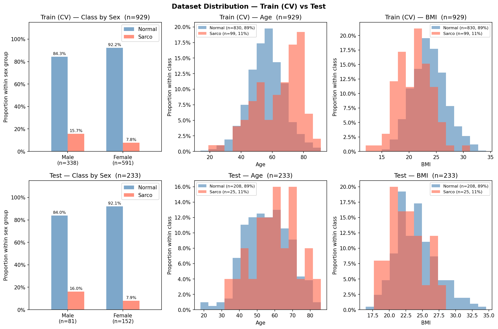

# SMI Binary Classification — CrossAttn Results

Generated: 2026-05-20 21:31  |  5-Fold CV  |  Median best epoch: 6

---

## 0. Dataset Distribution

### Class Distribution

| Split | Sex | n | Normal | Normal % | Sarco | Sarco % |
|-------|-----|--:|-------:|---------:|------:|--------:|
| Train | M | 338 | 285 | 84.3% | 53 | 15.7% |
| Train | F | 591 | 545 | 92.2% | 46 | 7.8% |
| Train | **All** | **929** | **830** | **89.3%** | **99** | **10.7%** |
| Test | M | 81 | 68 | 84.0% | 13 | 16.0% |
| Test | F | 152 | 140 | 92.1% | 12 | 7.9% |
| Test | **All** | **233** | **208** | **89.3%** | **25** | **10.7%** |

### Age

| Split | Sex | n | Mean ± Std | Min | Median | Max |
|-------|-----|--:|----------:|----:|-------:|----:|
| Train | M | 338 | 60.04 ± 11.99 | 20.00 | 60.00 | 89.00 |
| Train | F | 591 | 55.33 ± 11.80 | 14.00 | 55.00 | 91.00 |
| Train | **All** | **929** | **57.05 ± 12.08** | **14.00** | **57.00** | **91.00** |
| Test | M | 81 | 57.89 ± 12.84 | 22.00 | 58.00 | 80.00 |
| Test | F | 152 | 55.18 ± 12.05 | 18.00 | 55.00 | 86.00 |
| Test | **All** | **233** | **56.12 ± 12.40** | **18.00** | **56.00** | **86.00** |

### BMI

| Split | Sex | n | Mean ± Std | Min | Median | Max |
|-------|-----|--:|----------:|----:|-------:|----:|
| Train | M | 338 | 24.29 ± 3.03 | 14.34 | 24.20 | 32.59 |
| Train | F | 591 | 23.04 ± 3.26 | 12.02 | 22.91 | 34.20 |
| Train | **All** | **929** | **23.49 ± 3.24** | **12.02** | **23.41** | **34.20** |
| Test | M | 81 | 24.68 ± 2.98 | 18.44 | 24.26 | 32.67 |
| Test | F | 152 | 23.49 ± 3.16 | 16.44 | 22.99 | 34.61 |
| Test | **All** | **233** | **23.90 ± 3.15** | **16.44** | **23.67** | **34.61** |

---

## 1. Cross-Validation Summary

### CrossAttn

| Fold | AUC-ROC | AUPRC | Brier | Accuracy | F1 |
|------|--------:|------:|------:|---------:|---:|
| 1 | 0.8602 | 0.3499 | 0.1632 | 0.7312 | 0.4186 |
| 2 | 0.8223 | 0.3574 | 0.2032 | 0.6720 | 0.3441 |
| 3 | 0.9018 | 0.5131 | 0.1827 | 0.7419 | 0.4545 |
| 4 | 0.8684 | 0.3609 | 0.1730 | 0.7581 | 0.4304 |
| 5 | 0.8535 | 0.4715 | 0.1601 | 0.7405 | 0.3846 |
| **Mean** | **0.8612** | **0.4106** | **0.1764** | **0.7288** | **0.4064** |
| **±Std** | 0.0256 | 0.0681 | 0.0156 | 0.0296 | 0.0385 |

CrossAttn best val AUC per fold: Fold1=0.8602, Fold2=0.8223, Fold3=0.9018, Fold4=0.8684, Fold5=0.8535

---

## 2. Test Set Performance

### Overall

| Model | AUC-ROC | AUPRC | Brier | Accuracy | F1 |
|-------|--------:|------:|------:|---------:|---:|
| CrossAttn | 0.6967 | 0.2892 | 0.2122 | 0.6695 | 0.2804 |

### By Sex

| Sex | n | AUC-ROC | AUPRC | Brier | Accuracy | F1 |
|-----|--:|--------:|------:|------:|---------:|---:|
| M | 81 | 0.6776 | 0.2855 | 0.2535 | 0.6049 | 0.3600 |
| F | 152 | 0.6738 | 0.3267 | 0.1902 | 0.7039 | 0.2105 |

---

## 3. Confusion Matrix (Test Set)

|  | Pred: Normal | Pred: Sarco |
|--|-------------:|------------:|
| **True: Normal** | 141 | 67 |
| **True: Sarco**  | 10 | 15 |

---

## 4. Figures

| File | Description |
|------|-------------|
| `data_distribution.png` | Train/Test class·Age·BMI distributions |
| `cv_roc_curves.png` | Per-fold ROC curves (CrossAttn) |
| `cv_metric_distribution.png` | Boxplot of AUC / Acc / F1 across folds |
| `training_curves.png` | Loss & AUC training curves (mean ± std) |
| `test_roc_curves.png` | Final test-set ROC curve |
| `test_roc_by_sex.png` | Final test-set ROC curves by sex |
| `confusion_matrices.png` | Test-set confusion matrices |
| `calibration.png` | Calibration plot (reliability diagram) + Precision-Recall curve |
