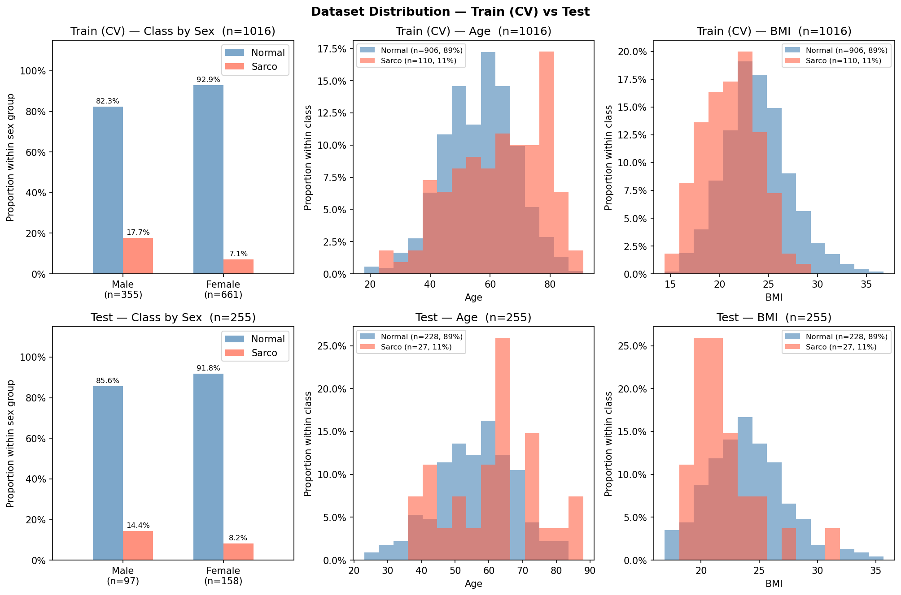

# SMI Binary Classification — CrossAttn Results

Generated: 2026-05-14 18:32  |  5-Fold CV  |  Median best epoch: 6

---

## 0. Dataset Distribution

### Class Distribution

| Split | Sex | n | Normal | Normal % | Sarco | Sarco % |
|-------|-----|--:|-------:|---------:|------:|--------:|
| Train | M | 355 | 292 | 82.3% | 63 | 17.7% |
| Train | F | 661 | 614 | 92.9% | 47 | 7.1% |
| Train | **All** | **1016** | **906** | **89.2%** | **110** | **10.8%** |
| Test | M | 97 | 83 | 85.6% | 14 | 14.4% |
| Test | F | 158 | 145 | 91.8% | 13 | 8.2% |
| Test | **All** | **255** | **228** | **89.4%** | **27** | **10.6%** |

### Age

| Split | Sex | n | Mean ± Std | Min | Median | Max |
|-------|-----|--:|----------:|----:|-------:|----:|
| Train | M | 355 | 59.92 ± 12.67 | 18.00 | 60.00 | 89.00 |
| Train | F | 661 | 55.55 ± 11.94 | 18.00 | 55.00 | 91.00 |
| Train | **All** | **1016** | **57.07 ± 12.38** | **18.00** | **57.00** | **91.00** |
| Test | M | 97 | 58.63 ± 12.43 | 28.00 | 59.00 | 88.00 |
| Test | F | 158 | 55.27 ± 11.46 | 23.00 | 56.00 | 86.00 |
| Test | **All** | **255** | **56.55 ± 11.95** | **23.00** | **57.00** | **88.00** |

### BMI

| Split | Sex | n | Mean ± Std | Min | Median | Max |
|-------|-----|--:|----------:|----:|-------:|----:|
| Train | M | 355 | 24.22 ± 3.38 | 14.48 | 24.16 | 36.76 |
| Train | F | 661 | 23.14 ± 3.39 | 14.40 | 22.83 | 36.24 |
| Train | **All** | **1016** | **23.52 ± 3.42** | **14.40** | **23.37** | **36.76** |
| Test | M | 97 | 24.50 ± 3.14 | 18.37 | 24.49 | 35.68 |
| Test | F | 158 | 23.11 ± 3.24 | 16.87 | 22.72 | 34.23 |
| Test | **All** | **255** | **23.64 ± 3.27** | **16.87** | **23.34** | **35.68** |

---

## 1. Cross-Validation Summary

### Logistic Regression

| Fold | AUC-ROC | AUPRC | Brier | Accuracy | F1 |
|------|--------:|------:|------:|---------:|---:|
| 1 | 0.6324 | 0.1989 | 0.2312 | 0.6912 | 0.2759 |
| 2 | 0.6133 | 0.1443 | 0.2069 | 0.7488 | 0.2154 |
| 3 | 0.7089 | 0.2111 | 0.1880 | 0.7488 | 0.2817 |
| 4 | 0.6703 | 0.2583 | 0.1683 | 0.7438 | 0.3500 |
| 5 | 0.6527 | 0.2913 | 0.2101 | 0.7044 | 0.3023 |
| **Mean** | **0.6555** | **0.2208** | **0.2009** | **0.7274** | **0.2851** |
| **±Std** | 0.0329 | 0.0506 | 0.0213 | 0.0246 | 0.0435 |

### CrossAttn

| Fold | AUC-ROC | AUPRC | Brier | Accuracy | F1 |
|------|--------:|------:|------:|---------:|---:|
| 1 | 0.8636 | 0.5217 | 0.1067 | 0.8333 | 0.5000 |
| 2 | 0.8528 | 0.4656 | 0.1511 | 0.7882 | 0.4557 |
| 3 | 0.8041 | 0.3471 | 0.1985 | 0.7291 | 0.3956 |
| 4 | 0.8699 | 0.5873 | 0.2035 | 0.6601 | 0.3551 |
| 5 | 0.8209 | 0.3812 | 0.1423 | 0.7931 | 0.4324 |
| **Mean** | **0.8423** | **0.4606** | **0.1604** | **0.7608** | **0.4278** |
| **±Std** | 0.0255 | 0.0883 | 0.0364 | 0.0603 | 0.0497 |

CrossAttn best val AUC per fold: Fold1=0.8636, Fold2=0.8528, Fold3=0.8041, Fold4=0.8699, Fold5=0.8209

---

## 2. Test Set Performance

### Overall

| Model | AUC-ROC | AUPRC | Brier | Accuracy | F1 |
|-------|--------:|------:|------:|---------:|---:|
| Log. Reg. | 0.5843 | 0.2035 | 0.2214 | 0.6745 | 0.2243 |
| CrossAttn | 0.7606 | 0.2759 | 0.1740 | 0.7373 | 0.3093 |

### By Sex

#### Logistic Regression

| Sex | n | AUC-ROC | AUPRC | Brier | Accuracy | F1 |
|-----|--:|--------:|------:|------:|---------:|---:|
| M | 97 | 0.5559 | 0.2395 | 0.2666 | 0.6392 | 0.2553 |
| F | 158 | 0.6101 | 0.1833 | 0.1937 | 0.6962 | 0.2000 |

#### CrossAttn

| Sex | n | AUC-ROC | AUPRC | Brier | Accuracy | F1 |
|-----|--:|--------:|------:|------:|---------:|---:|
| M | 97 | 0.7754 | 0.3763 | 0.2297 | 0.6495 | 0.3929 |
| F | 158 | 0.7167 | 0.1748 | 0.1399 | 0.7911 | 0.1951 |

---

## 3. Confusion Matrix (Test Set)

### Logistic Regression

|  | Pred: Normal | Pred: Sarco |
|--|-------------:|------------:|
| **True: Normal** | 160 | 68 |
| **True: Sarco**  | 15 | 12 |

### CrossAttn

|  | Pred: Normal | Pred: Sarco |
|--|-------------:|------------:|
| **True: Normal** | 173 | 55 |
| **True: Sarco**  | 12 | 15 |

---

## 4. Figures

| File | Description |
|------|-------------|
| `data_distribution.png` | Train/Test class·Age·BMI distributions |
| `cv_roc_curves.png` | Per-fold ROC curves (LR & CrossAttn) |
| `cv_metric_distribution.png` | Boxplot of AUC / Acc / F1 across folds |
| `training_curves.png` | Loss & AUC training curves (mean ± std) |
| `test_roc_curves.png` | Final test-set ROC curves |
| `test_roc_by_sex.png` | Final test-set ROC curves by sex |
| `confusion_matrices.png` | Test-set confusion matrices (LR & CrossAttn) |
| `calibration.png` | Calibration plot (reliability diagram) + Precision-Recall curve |
