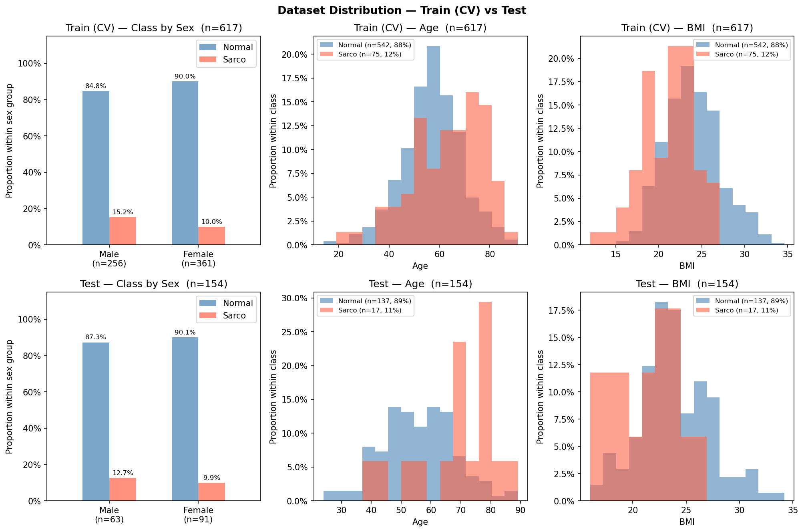

# SMI Binary Classification — CrossAttn Results

Generated: 2026-05-21 19:52  |  5-Fold CV  |  Median best epoch: 14

---

## 0. Dataset Distribution

### Class Distribution

| Split | Sex | n | Normal | Normal % | Sarco | Sarco % |
|-------|-----|--:|-------:|---------:|------:|--------:|
| Train | M | 256 | 217 | 84.8% | 39 | 15.2% |
| Train | F | 361 | 325 | 90.0% | 36 | 10.0% |
| Train | **All** | **617** | **542** | **87.8%** | **75** | **12.2%** |
| Test | M | 63 | 55 | 87.3% | 8 | 12.7% |
| Test | F | 91 | 82 | 90.1% | 9 | 9.9% |
| Test | **All** | **154** | **137** | **89.0%** | **17** | **11.0%** |

### Age

| Split | Sex | n | Mean ± Std | Min | Median | Max |
|-------|-----|--:|----------:|----:|-------:|----:|
| Train | M | 256 | 59.57 ± 11.76 | 23.00 | 59.00 | 85.00 |
| Train | F | 361 | 56.66 ± 12.28 | 14.00 | 57.00 | 91.00 |
| Train | **All** | **617** | **57.87 ± 12.15** | **14.00** | **58.00** | **91.00** |
| Test | M | 63 | 59.02 ± 12.66 | 28.00 | 61.00 | 89.00 |
| Test | F | 91 | 55.78 ± 12.86 | 24.00 | 56.00 | 86.00 |
| Test | **All** | **154** | **57.10 ± 12.87** | **24.00** | **57.50** | **89.00** |

### BMI

| Split | Sex | n | Mean ± Std | Min | Median | Max |
|-------|-----|--:|----------:|----:|-------:|----:|
| Train | M | 256 | 24.53 ± 2.97 | 14.34 | 24.45 | 32.67 |
| Train | F | 361 | 22.94 ± 3.38 | 12.02 | 22.77 | 34.61 |
| Train | **All** | **617** | **23.60 ± 3.31** | **12.02** | **23.51** | **34.61** |
| Test | M | 63 | 24.50 ± 3.21 | 17.33 | 24.12 | 32.33 |
| Test | F | 91 | 22.99 ± 3.31 | 16.00 | 22.76 | 34.20 |
| Test | **All** | **154** | **23.61 ± 3.35** | **16.00** | **23.35** | **34.20** |

---

## 1. Cross-Validation Summary

### CrossAttn

| Fold | AUC-ROC | AUPRC | Brier | Accuracy | F1 |
|------|--------:|------:|------:|---------:|---:|
| 1 | 0.7431 | 0.3228 | 0.1661 | 0.7339 | 0.3774 |
| 2 | 0.8177 | 0.4871 | 0.1643 | 0.7581 | 0.4231 |
| 3 | 0.8852 | 0.5017 | 0.1975 | 0.6585 | 0.4167 |
| 4 | 0.8241 | 0.4150 | 0.1221 | 0.8537 | 0.4706 |
| 5 | 0.7451 | 0.3698 | 0.2407 | 0.6016 | 0.3288 |
| **Mean** | **0.8030** | **0.4193** | **0.1781** | **0.7212** | **0.4033** |
| **±Std** | 0.0536 | 0.0680 | 0.0394 | 0.0864 | 0.0476 |

CrossAttn best val AUC per fold: Fold1=0.7431, Fold2=0.8177, Fold3=0.8852, Fold4=0.8241, Fold5=0.7451

---

## 2. Test Set Performance

### Overall

| Model | AUC-ROC | AUPRC | Brier | Accuracy | F1 |
|-------|--------:|------:|------:|---------:|---:|
| CrossAttn | 0.8192 | 0.3180 | 0.2003 | 0.7143 | 0.4054 |

### By Sex

| Sex | n | AUC-ROC | AUPRC | Brier | Accuracy | F1 |
|-----|--:|--------:|------:|------:|---------:|---:|
| M | 63 | 0.8500 | 0.3335 | 0.2458 | 0.6190 | 0.4000 |
| F | 91 | 0.7913 | 0.3936 | 0.1688 | 0.7802 | 0.4118 |

---

## 3. Confusion Matrix (Test Set)

|  | Pred: Normal | Pred: Sarco |
|--|-------------:|------------:|
| **True: Normal** | 95 | 42 |
| **True: Sarco**  | 2 | 15 |

---

## 4. Figures

| File | Description |
|------|-------------|
| `data_distribution.png` | Train/Test class·Age·BMI distributions |
| `cv_roc_curves.png` | Per-fold ROC curves (CrossAttn) |
| `cv_metric_distribution.png` | Boxplot of AUC / Acc / F1 across folds |
| `training_curves.png` | Loss & AUC training curves (mean ± std) |
| `test_roc_curves.png` | Final test-set ROC curve |
| `test_roc_by_sex.png` | Final test-set ROC curves by sex |
| `confusion_matrices.png` | Test-set confusion matrices |
| `calibration.png` | Calibration plot (reliability diagram) + Precision-Recall curve |
