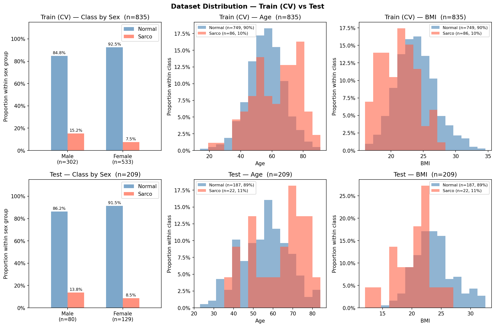

# SMI Binary Classification — CrossAttn Results

Generated: 2026-05-21 13:27  |  5-Fold CV  |  Median best epoch: 6

---

## 0. Dataset Distribution

### Class Distribution

| Split | Sex | n | Normal | Normal % | Sarco | Sarco % |
|-------|-----|--:|-------:|---------:|------:|--------:|
| Train | M | 302 | 256 | 84.8% | 46 | 15.2% |
| Train | F | 533 | 493 | 92.5% | 40 | 7.5% |
| Train | **All** | **835** | **749** | **89.7%** | **86** | **10.3%** |
| Test | M | 80 | 69 | 86.2% | 11 | 13.8% |
| Test | F | 129 | 118 | 91.5% | 11 | 8.5% |
| Test | **All** | **209** | **187** | **89.5%** | **22** | **10.5%** |

### Age

| Split | Sex | n | Mean ± Std | Min | Median | Max |
|-------|-----|--:|----------:|----:|-------:|----:|
| Train | M | 302 | 59.41 ± 12.04 | 20.00 | 59.00 | 89.00 |
| Train | F | 533 | 55.34 ± 11.98 | 14.00 | 55.00 | 91.00 |
| Train | **All** | **835** | **56.81 ± 12.16** | **14.00** | **57.00** | **91.00** |
| Test | M | 80 | 58.96 ± 12.47 | 29.00 | 60.00 | 84.00 |
| Test | F | 129 | 55.14 ± 12.04 | 23.00 | 55.00 | 83.00 |
| Test | **All** | **209** | **56.60 ± 12.35** | **23.00** | **57.00** | **84.00** |

### BMI

| Split | Sex | n | Mean ± Std | Min | Median | Max |
|-------|-----|--:|----------:|----:|-------:|----:|
| Train | M | 302 | 24.39 ± 2.93 | 17.33 | 24.26 | 32.67 |
| Train | F | 533 | 23.14 ± 3.20 | 16.00 | 22.95 | 34.61 |
| Train | **All** | **835** | **23.59 ± 3.16** | **16.00** | **23.46** | **34.61** |
| Test | M | 80 | 24.14 ± 3.35 | 14.34 | 24.03 | 32.56 |
| Test | F | 129 | 22.96 ± 3.62 | 12.02 | 22.51 | 32.48 |
| Test | **All** | **209** | **23.41 ± 3.56** | **12.02** | **23.26** | **32.56** |

---

## 1. Cross-Validation Summary

### CrossAttn

| Fold | AUC-ROC | AUPRC | Brier | Accuracy | F1 |
|------|--------:|------:|------:|---------:|---:|
| 1 | 0.9004 | 0.4631 | 0.2295 | 0.6108 | 0.3434 |
| 2 | 0.8133 | 0.3540 | 0.2588 | 0.5449 | 0.2830 |
| 3 | 0.8012 | 0.2806 | 0.2303 | 0.6347 | 0.3297 |
| 4 | 0.8235 | 0.3241 | 0.1447 | 0.7665 | 0.3390 |
| 5 | 0.8740 | 0.5145 | 0.2025 | 0.6527 | 0.3556 |
| **Mean** | **0.8425** | **0.3873** | **0.2132** | **0.6419** | **0.3301** |
| **±Std** | 0.0381 | 0.0877 | 0.0386 | 0.0722 | 0.0250 |

CrossAttn best val AUC per fold: Fold1=0.9004, Fold2=0.8133, Fold3=0.8012, Fold4=0.8235, Fold5=0.8740

---

## 2. Test Set Performance

### Overall

| Model | AUC-ROC | AUPRC | Brier | Accuracy | F1 |
|-------|--------:|------:|------:|---------:|---:|
| CrossAttn | 0.8175 | 0.4052 | 0.1691 | 0.7321 | 0.3778 |

### By Sex

| Sex | n | AUC-ROC | AUPRC | Brier | Accuracy | F1 |
|-----|--:|--------:|------:|------:|---------:|---:|
| M | 80 | 0.8696 | 0.5669 | 0.2046 | 0.6875 | 0.4444 |
| F | 129 | 0.7635 | 0.2276 | 0.1471 | 0.7597 | 0.3111 |

---

## 3. Confusion Matrix (Test Set)

|  | Pred: Normal | Pred: Sarco |
|--|-------------:|------------:|
| **True: Normal** | 136 | 51 |
| **True: Sarco**  | 5 | 17 |

---

## 4. Figures

| File | Description |
|------|-------------|
| `data_distribution.png` | Train/Test class·Age·BMI distributions |
| `cv_roc_curves.png` | Per-fold ROC curves (CrossAttn) |
| `cv_metric_distribution.png` | Boxplot of AUC / Acc / F1 across folds |
| `training_curves.png` | Loss & AUC training curves (mean ± std) |
| `test_roc_curves.png` | Final test-set ROC curve |
| `test_roc_by_sex.png` | Final test-set ROC curves by sex |
| `confusion_matrices.png` | Test-set confusion matrices |
| `calibration.png` | Calibration plot (reliability diagram) + Precision-Recall curve |
