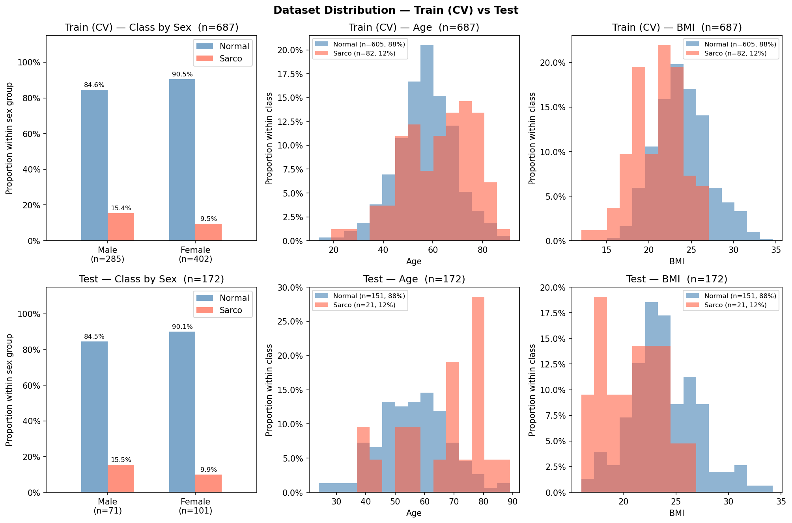

# SMI Binary Classification — CrossAttn Results

Generated: 2026-05-21 19:30  |  5-Fold CV  |  Median best epoch: 13

---

## 0. Dataset Distribution

### Class Distribution

| Split | Sex | n | Normal | Normal % | Sarco | Sarco % |
|-------|-----|--:|-------:|---------:|------:|--------:|
| Train | M | 285 | 241 | 84.6% | 44 | 15.4% |
| Train | F | 402 | 364 | 90.5% | 38 | 9.5% |
| Train | **All** | **687** | **605** | **88.1%** | **82** | **11.9%** |
| Test | M | 71 | 60 | 84.5% | 11 | 15.5% |
| Test | F | 101 | 91 | 90.1% | 10 | 9.9% |
| Test | **All** | **172** | **151** | **87.8%** | **21** | **12.2%** |

### Age

| Split | Sex | n | Mean ± Std | Min | Median | Max |
|-------|-----|--:|----------:|----:|-------:|----:|
| Train | M | 285 | 59.36 ± 11.63 | 23.00 | 59.00 | 85.00 |
| Train | F | 402 | 56.39 ± 12.21 | 14.00 | 57.00 | 91.00 |
| Train | **All** | **687** | **57.62 ± 12.06** | **14.00** | **58.00** | **91.00** |
| Test | M | 71 | 59.82 ± 12.49 | 28.00 | 61.00 | 89.00 |
| Test | F | 101 | 55.65 ± 12.38 | 24.00 | 56.00 | 86.00 |
| Test | **All** | **172** | **57.37 ± 12.59** | **24.00** | **57.50** | **89.00** |

### BMI

| Split | Sex | n | Mean ± Std | Min | Median | Max |
|-------|-----|--:|----------:|----:|-------:|----:|
| Train | M | 285 | 24.43 ± 2.95 | 14.34 | 24.28 | 32.67 |
| Train | F | 402 | 22.98 ± 3.35 | 12.02 | 22.81 | 34.61 |
| Train | **All** | **687** | **23.58 ± 3.27** | **12.02** | **23.44** | **34.61** |
| Test | M | 71 | 24.27 ± 3.24 | 17.33 | 24.12 | 32.33 |
| Test | F | 101 | 22.90 ± 3.20 | 16.00 | 22.64 | 34.20 |
| Test | **All** | **172** | **23.47 ± 3.29** | **16.00** | **23.27** | **34.20** |

---

## 1. Cross-Validation Summary

### CrossAttn

| Fold | AUC-ROC | AUPRC | Brier | Accuracy | F1 |
|------|--------:|------:|------:|---------:|---:|
| 1 | 0.7876 | 0.3218 | 0.1847 | 0.7319 | 0.3934 |
| 2 | 0.8080 | 0.4496 | 0.1702 | 0.7681 | 0.4483 |
| 3 | 0.8239 | 0.3927 | 0.1761 | 0.7007 | 0.4058 |
| 4 | 0.7913 | 0.4446 | 0.2981 | 0.5036 | 0.2917 |
| 5 | 0.7913 | 0.3104 | 0.2086 | 0.7007 | 0.3881 |
| **Mean** | **0.8004** | **0.3838** | **0.2076** | **0.6810** | **0.3854** |
| **±Std** | 0.0137 | 0.0589 | 0.0471 | 0.0921 | 0.0514 |

CrossAttn best val AUC per fold: Fold1=0.7876, Fold2=0.8080, Fold3=0.8239, Fold4=0.7913, Fold5=0.7913

---

## 2. Test Set Performance

### Overall

| Model | AUC-ROC | AUPRC | Brier | Accuracy | F1 |
|-------|--------:|------:|------:|---------:|---:|
| CrossAttn | 0.8436 | 0.5163 | 0.2238 | 0.6337 | 0.3883 |

### By Sex

| Sex | n | AUC-ROC | AUPRC | Brier | Accuracy | F1 |
|-----|--:|--------:|------:|------:|---------:|---:|
| M | 71 | 0.8561 | 0.6785 | 0.2496 | 0.6056 | 0.4400 |
| F | 101 | 0.8330 | 0.4389 | 0.2057 | 0.6535 | 0.3396 |

---

## 3. Confusion Matrix (Test Set)

|  | Pred: Normal | Pred: Sarco |
|--|-------------:|------------:|
| **True: Normal** | 89 | 62 |
| **True: Sarco**  | 1 | 20 |

---

## 4. Figures

| File | Description |
|------|-------------|
| `data_distribution.png` | Train/Test class·Age·BMI distributions |
| `cv_roc_curves.png` | Per-fold ROC curves (CrossAttn) |
| `cv_metric_distribution.png` | Boxplot of AUC / Acc / F1 across folds |
| `training_curves.png` | Loss & AUC training curves (mean ± std) |
| `test_roc_curves.png` | Final test-set ROC curve |
| `test_roc_by_sex.png` | Final test-set ROC curves by sex |
| `confusion_matrices.png` | Test-set confusion matrices |
| `calibration.png` | Calibration plot (reliability diagram) + Precision-Recall curve |
