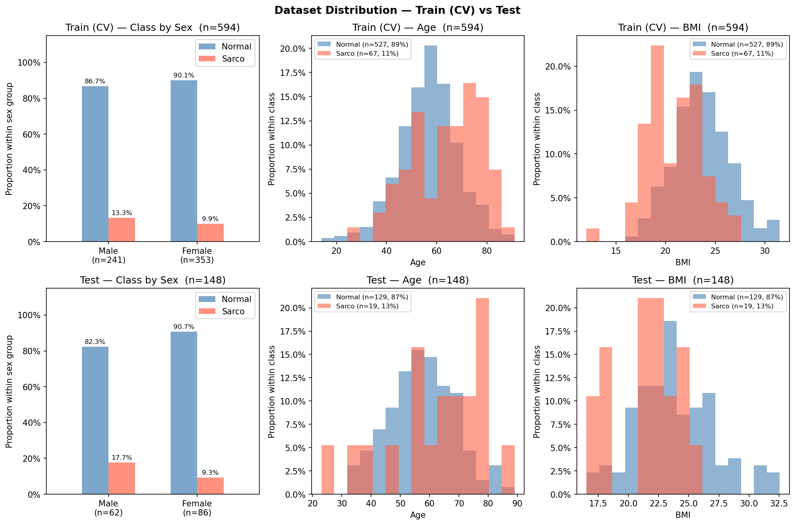

# SMI Binary Classification — CrossAttn Results

Generated: 2026-05-21 12:35  |  5-Fold CV  |  Median best epoch: 6

---

## 0. Dataset Distribution

### Class Distribution

| Split | Sex | n | Normal | Normal % | Sarco | Sarco % |
|-------|-----|--:|-------:|---------:|------:|--------:|
| Train | M | 241 | 209 | 86.7% | 32 | 13.3% |
| Train | F | 353 | 318 | 90.1% | 35 | 9.9% |
| Train | **All** | **594** | **527** | **88.7%** | **67** | **11.3%** |
| Test | M | 62 | 51 | 82.3% | 11 | 17.7% |
| Test | F | 86 | 78 | 90.7% | 8 | 9.3% |
| Test | **All** | **148** | **129** | **87.2%** | **19** | **12.8%** |

### Age

| Split | Sex | n | Mean ± Std | Min | Median | Max |
|-------|-----|--:|----------:|----:|-------:|----:|
| Train | M | 241 | 59.73 ± 11.48 | 28.00 | 59.00 | 85.00 |
| Train | F | 353 | 56.11 ± 12.43 | 14.00 | 56.00 | 91.00 |
| Train | **All** | **594** | **57.58 ± 12.18** | **14.00** | **58.00** | **91.00** |
| Test | M | 62 | 59.77 ± 13.28 | 23.00 | 61.00 | 89.00 |
| Test | F | 86 | 57.01 ± 11.20 | 32.00 | 57.00 | 87.00 |
| Test | **All** | **148** | **58.17 ± 12.19** | **23.00** | **58.00** | **89.00** |

### BMI

| Split | Sex | n | Mean ± Std | Min | Median | Max |
|-------|-----|--:|----------:|----:|-------:|----:|
| Train | M | 241 | 24.17 ± 2.79 | 16.39 | 24.17 | 31.42 |
| Train | F | 353 | 22.79 ± 3.03 | 12.02 | 22.76 | 31.50 |
| Train | **All** | **594** | **23.35 ± 3.01** | **12.02** | **23.28** | **31.50** |
| Test | M | 62 | 24.51 ± 3.33 | 17.51 | 24.44 | 32.56 |
| Test | F | 86 | 22.81 ± 3.05 | 16.51 | 22.56 | 30.85 |
| Test | **All** | **148** | **23.52 ± 3.28** | **16.51** | **23.34** | **32.56** |

---

## 1. Cross-Validation Summary

### CrossAttn

| Fold | AUC-ROC | AUPRC | Brier | Accuracy | F1 |
|------|--------:|------:|------:|---------:|---:|
| 1 | 0.8338 | 0.3708 | 0.1843 | 0.6555 | 0.3492 |
| 2 | 0.7975 | 0.2613 | 0.1972 | 0.7227 | 0.2979 |
| 3 | 0.8980 | 0.5453 | 0.1649 | 0.7143 | 0.4333 |
| 4 | 0.8782 | 0.3698 | 0.1567 | 0.7479 | 0.4643 |
| 5 | 0.8212 | 0.5726 | 0.1434 | 0.7966 | 0.4545 |
| **Mean** | **0.8458** | **0.4240** | **0.1693** | **0.7274** | **0.3998** |
| **±Std** | 0.0370 | 0.1175 | 0.0193 | 0.0460 | 0.0652 |

CrossAttn best val AUC per fold: Fold1=0.8338, Fold2=0.7975, Fold3=0.8980, Fold4=0.8782, Fold5=0.8212

---

## 2. Test Set Performance

### Overall

| Model | AUC-ROC | AUPRC | Brier | Accuracy | F1 |
|-------|--------:|------:|------:|---------:|---:|
| CrossAttn | 0.7634 | 0.3976 | 0.1525 | 0.7162 | 0.3438 |

### By Sex

| Sex | n | AUC-ROC | AUPRC | Brier | Accuracy | F1 |
|-----|--:|--------:|------:|------:|---------:|---:|
| M | 62 | 0.7398 | 0.4370 | 0.1734 | 0.6935 | 0.4242 |
| F | 86 | 0.7676 | 0.4405 | 0.1373 | 0.7326 | 0.2581 |

---

## 3. Confusion Matrix (Test Set)

|  | Pred: Normal | Pred: Sarco |
|--|-------------:|------------:|
| **True: Normal** | 95 | 34 |
| **True: Sarco**  | 8 | 11 |

---

## 4. Figures

| File | Description |
|------|-------------|
| `data_distribution.png` | Train/Test class·Age·BMI distributions |
| `cv_roc_curves.png` | Per-fold ROC curves (CrossAttn) |
| `cv_metric_distribution.png` | Boxplot of AUC / Acc / F1 across folds |
| `training_curves.png` | Loss & AUC training curves (mean ± std) |
| `test_roc_curves.png` | Final test-set ROC curve |
| `test_roc_by_sex.png` | Final test-set ROC curves by sex |
| `confusion_matrices.png` | Test-set confusion matrices |
| `calibration.png` | Calibration plot (reliability diagram) + Precision-Recall curve |
