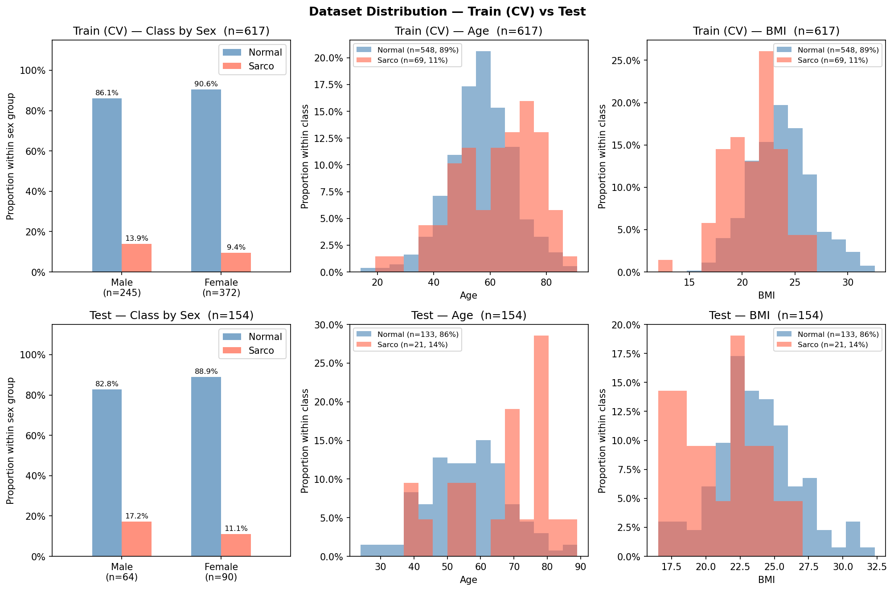

# SMI Binary Classification — CrossAttn Results

Generated: 2026-05-21 19:53  |  5-Fold CV  |  Median best epoch: 6

---

## 0. Dataset Distribution

### Class Distribution

| Split | Sex | n | Normal | Normal % | Sarco | Sarco % |
|-------|-----|--:|-------:|---------:|------:|--------:|
| Train | M | 245 | 211 | 86.1% | 34 | 13.9% |
| Train | F | 372 | 337 | 90.6% | 35 | 9.4% |
| Train | **All** | **617** | **548** | **88.8%** | **69** | **11.2%** |
| Test | M | 64 | 53 | 82.8% | 11 | 17.2% |
| Test | F | 90 | 80 | 88.9% | 10 | 11.1% |
| Test | **All** | **154** | **133** | **86.4%** | **21** | **13.6%** |

### Age

| Split | Sex | n | Mean ± Std | Min | Median | Max |
|-------|-----|--:|----------:|----:|-------:|----:|
| Train | M | 245 | 59.47 ± 11.67 | 23.00 | 59.00 | 85.00 |
| Train | F | 372 | 56.48 ± 11.97 | 14.00 | 57.00 | 91.00 |
| Train | **All** | **617** | **57.67 ± 11.95** | **14.00** | **58.00** | **91.00** |
| Test | M | 64 | 60.75 ± 12.72 | 28.00 | 62.00 | 89.00 |
| Test | F | 90 | 54.97 ± 12.65 | 24.00 | 55.00 | 86.00 |
| Test | **All** | **154** | **57.37 ± 12.99** | **24.00** | **58.00** | **89.00** |

### BMI

| Split | Sex | n | Mean ± Std | Min | Median | Max |
|-------|-----|--:|----------:|----:|-------:|----:|
| Train | M | 245 | 24.20 ± 2.76 | 16.39 | 24.17 | 32.56 |
| Train | F | 372 | 22.89 ± 3.12 | 12.02 | 22.81 | 31.50 |
| Train | **All** | **617** | **23.41 ± 3.05** | **12.02** | **23.31** | **32.56** |
| Test | M | 64 | 24.23 ± 3.36 | 17.33 | 24.12 | 32.33 |
| Test | F | 90 | 22.69 ± 2.83 | 16.51 | 22.61 | 30.63 |
| Test | **All** | **154** | **23.33 ± 3.15** | **16.51** | **23.25** | **32.33** |

---

## 1. Cross-Validation Summary

### CrossAttn

| Fold | AUC-ROC | AUPRC | Brier | Accuracy | F1 |
|------|--------:|------:|------:|---------:|---:|
| 1 | 0.7890 | 0.4797 | 0.1623 | 0.7177 | 0.3396 |
| 2 | 0.7240 | 0.2893 | 0.2038 | 0.7258 | 0.3462 |
| 3 | 0.8938 | 0.5619 | 0.1112 | 0.8211 | 0.4762 |
| 4 | 0.8191 | 0.4138 | 0.2757 | 0.4878 | 0.3077 |
| 5 | 0.7881 | 0.3482 | 0.1806 | 0.7805 | 0.3415 |
| **Mean** | **0.8028** | **0.4186** | **0.1867** | **0.7066** | **0.3622** |
| **±Std** | 0.0551 | 0.0959 | 0.0539 | 0.1157 | 0.0586 |

CrossAttn best val AUC per fold: Fold1=0.7890, Fold2=0.7240, Fold3=0.8938, Fold4=0.8191, Fold5=0.7881

---

## 2. Test Set Performance

### Overall

| Model | AUC-ROC | AUPRC | Brier | Accuracy | F1 |
|-------|--------:|------:|------:|---------:|---:|
| CrossAttn | 0.8611 | 0.5373 | 0.1357 | 0.7662 | 0.4706 |

### By Sex

| Sex | n | AUC-ROC | AUPRC | Brier | Accuracy | F1 |
|-----|--:|--------:|------:|------:|---------:|---:|
| M | 64 | 0.8731 | 0.6313 | 0.1365 | 0.7656 | 0.5455 |
| F | 90 | 0.8500 | 0.4636 | 0.1351 | 0.7667 | 0.4000 |

---

## 3. Confusion Matrix (Test Set)

|  | Pred: Normal | Pred: Sarco |
|--|-------------:|------------:|
| **True: Normal** | 102 | 31 |
| **True: Sarco**  | 5 | 16 |

---

## 4. Figures

| File | Description |
|------|-------------|
| `data_distribution.png` | Train/Test class·Age·BMI distributions |
| `cv_roc_curves.png` | Per-fold ROC curves (CrossAttn) |
| `cv_metric_distribution.png` | Boxplot of AUC / Acc / F1 across folds |
| `training_curves.png` | Loss & AUC training curves (mean ± std) |
| `test_roc_curves.png` | Final test-set ROC curve |
| `test_roc_by_sex.png` | Final test-set ROC curves by sex |
| `confusion_matrices.png` | Test-set confusion matrices |
| `calibration.png` | Calibration plot (reliability diagram) + Precision-Recall curve |
