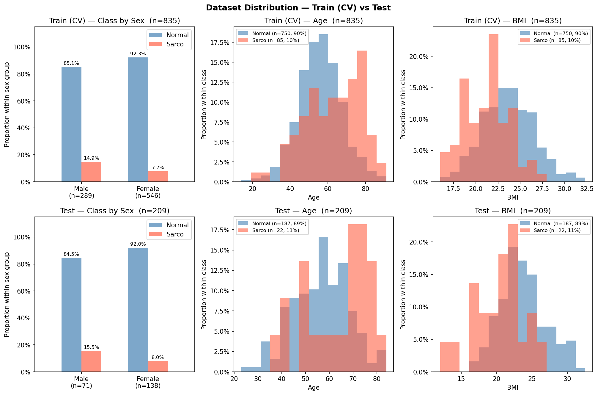

# SMI Binary Classification — CrossAttn Results

Generated: 2026-05-21 13:27  |  5-Fold CV  |  Median best epoch: 11

---

## 0. Dataset Distribution

### Class Distribution

| Split | Sex | n | Normal | Normal % | Sarco | Sarco % |
|-------|-----|--:|-------:|---------:|------:|--------:|
| Train | M | 289 | 246 | 85.1% | 43 | 14.9% |
| Train | F | 546 | 504 | 92.3% | 42 | 7.7% |
| Train | **All** | **835** | **750** | **89.8%** | **85** | **10.2%** |
| Test | M | 71 | 60 | 84.5% | 11 | 15.5% |
| Test | F | 138 | 127 | 92.0% | 11 | 8.0% |
| Test | **All** | **209** | **187** | **89.5%** | **22** | **10.5%** |

### Age

| Split | Sex | n | Mean ± Std | Min | Median | Max |
|-------|-----|--:|----------:|----:|-------:|----:|
| Train | M | 289 | 59.77 ± 12.01 | 20.00 | 60.00 | 89.00 |
| Train | F | 546 | 54.95 ± 11.82 | 14.00 | 55.00 | 91.00 |
| Train | **All** | **835** | **56.62 ± 12.10** | **14.00** | **57.00** | **91.00** |
| Test | M | 71 | 59.92 ± 12.32 | 29.00 | 61.00 | 84.00 |
| Test | F | 138 | 55.92 ± 11.36 | 23.00 | 55.50 | 83.00 |
| Test | **All** | **209** | **57.28 ± 11.85** | **23.00** | **58.00** | **84.00** |

### BMI

| Split | Sex | n | Mean ± Std | Min | Median | Max |
|-------|-----|--:|----------:|----:|-------:|----:|
| Train | M | 289 | 24.10 ± 2.75 | 17.33 | 24.12 | 32.33 |
| Train | F | 546 | 23.05 ± 2.97 | 16.00 | 22.95 | 32.24 |
| Train | **All** | **835** | **23.41 ± 2.94** | **16.00** | **23.33** | **32.33** |
| Test | M | 71 | 24.15 ± 3.49 | 14.34 | 23.88 | 32.56 |
| Test | F | 138 | 22.96 ± 3.29 | 12.02 | 22.64 | 30.84 |
| Test | **All** | **209** | **23.36 ± 3.41** | **12.02** | **23.17** | **32.56** |

---

## 1. Cross-Validation Summary

### CrossAttn

| Fold | AUC-ROC | AUPRC | Brier | Accuracy | F1 |
|------|--------:|------:|------:|---------:|---:|
| 1 | 0.8490 | 0.4007 | 0.1467 | 0.7844 | 0.4375 |
| 2 | 0.8816 | 0.4470 | 0.1409 | 0.8263 | 0.4528 |
| 3 | 0.8125 | 0.4391 | 0.2481 | 0.6168 | 0.3043 |
| 4 | 0.6847 | 0.2619 | 0.2434 | 0.6168 | 0.2381 |
| 5 | 0.8545 | 0.4345 | 0.2137 | 0.6946 | 0.3704 |
| **Mean** | **0.8165** | **0.3967** | **0.1986** | **0.7078** | **0.3606** |
| **±Std** | 0.0695 | 0.0692 | 0.0463 | 0.0856 | 0.0809 |

CrossAttn best val AUC per fold: Fold1=0.8490, Fold2=0.8816, Fold3=0.8125, Fold4=0.6847, Fold5=0.8545

---

## 2. Test Set Performance

### Overall

| Model | AUC-ROC | AUPRC | Brier | Accuracy | F1 |
|-------|--------:|------:|------:|---------:|---:|
| CrossAttn | 0.8116 | 0.4055 | 0.1772 | 0.7273 | 0.3736 |

### By Sex

| Sex | n | AUC-ROC | AUPRC | Brier | Accuracy | F1 |
|-----|--:|--------:|------:|------:|---------:|---:|
| M | 71 | 0.8182 | 0.5299 | 0.2312 | 0.6479 | 0.4444 |
| F | 138 | 0.7788 | 0.3292 | 0.1494 | 0.7681 | 0.3043 |

---

## 3. Confusion Matrix (Test Set)

|  | Pred: Normal | Pred: Sarco |
|--|-------------:|------------:|
| **True: Normal** | 135 | 52 |
| **True: Sarco**  | 5 | 17 |

---

## 4. Figures

| File | Description |
|------|-------------|
| `data_distribution.png` | Train/Test class·Age·BMI distributions |
| `cv_roc_curves.png` | Per-fold ROC curves (CrossAttn) |
| `cv_metric_distribution.png` | Boxplot of AUC / Acc / F1 across folds |
| `training_curves.png` | Loss & AUC training curves (mean ± std) |
| `test_roc_curves.png` | Final test-set ROC curve |
| `test_roc_by_sex.png` | Final test-set ROC curves by sex |
| `confusion_matrices.png` | Test-set confusion matrices |
| `calibration.png` | Calibration plot (reliability diagram) + Precision-Recall curve |
