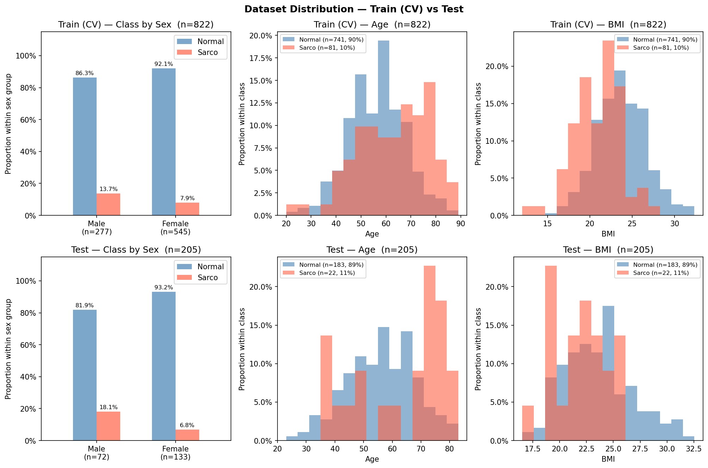

# SMI Binary Classification — CrossAttn Results

Generated: 2026-05-28 19:38  |  5-Fold CV  |  Median best epoch: 6

---

## 0. Dataset Distribution

### Class Distribution

| Split | Sex | n | Normal | Normal % | Sarco | Sarco % |
|-------|-----|--:|-------:|---------:|------:|--------:|
| Train | M | 277 | 239 | 86.3% | 38 | 13.7% |
| Train | F | 545 | 502 | 92.1% | 43 | 7.9% |
| Train | **All** | **822** | **741** | **90.1%** | **81** | **9.9%** |
| Test | M | 72 | 59 | 81.9% | 13 | 18.1% |
| Test | F | 133 | 124 | 93.2% | 9 | 6.8% |
| Test | **All** | **205** | **183** | **89.3%** | **22** | **10.7%** |

### Age

| Split | Sex | n | Mean ± Std | Min | Median | Max |
|-------|-----|--:|----------:|----:|-------:|----:|
| Train | M | 277 | 60.19 ± 11.83 | 20.00 | 60.00 | 89.00 |
| Train | F | 545 | 55.20 ± 11.34 | 23.00 | 55.00 | 87.00 |
| Train | **All** | **822** | **56.88 ± 11.75** | **20.00** | **57.00** | **89.00** |
| Test | M | 72 | 59.21 ± 12.53 | 29.00 | 58.50 | 81.00 |
| Test | F | 133 | 54.96 ± 12.06 | 23.00 | 55.00 | 83.00 |
| Test | **All** | **205** | **56.45 ± 12.40** | **23.00** | **57.00** | **83.00** |

### BMI

| Split | Sex | n | Mean ± Std | Min | Median | Max |
|-------|-----|--:|----------:|----:|-------:|----:|
| Train | M | 277 | 24.10 ± 2.87 | 14.34 | 24.11 | 32.33 |
| Train | F | 545 | 23.04 ± 3.02 | 12.02 | 22.95 | 32.24 |
| Train | **All** | **822** | **23.40 ± 3.01** | **12.02** | **23.32** | **32.33** |
| Test | M | 72 | 24.20 ± 3.16 | 18.78 | 24.12 | 32.56 |
| Test | F | 133 | 22.93 ± 3.01 | 16.51 | 22.55 | 30.84 |
| Test | **All** | **205** | **23.38 ± 3.12** | **16.51** | **23.18** | **32.56** |

---

## 1. Cross-Validation Summary

### CrossAttn

| Fold | AUC-ROC | AUPRC | Brier | Accuracy | F1 |
|------|--------:|------:|------:|---------:|---:|
| 1 | 0.8068 | 0.3972 | 0.1836 | 0.7818 | 0.4194 |
| 2 | 0.8410 | 0.4784 | 0.2435 | 0.7515 | 0.3881 |
| 3 | 0.9265 | 0.5774 | 0.1232 | 0.8598 | 0.5490 |
| 4 | 0.6981 | 0.2951 | 0.1946 | 0.5915 | 0.2947 |
| 5 | 0.8459 | 0.3591 | 0.1789 | 0.6585 | 0.3636 |
| **Mean** | **0.8237** | **0.4215** | **0.1847** | **0.7286** | **0.4030** |
| **±Std** | 0.0741 | 0.0980 | 0.0384 | 0.0941 | 0.0838 |

CrossAttn best val AUC per fold: Fold1=0.8068, Fold2=0.8410, Fold3=0.9265, Fold4=0.6981, Fold5=0.8459

---

## 2. Test Set Performance

### Overall

| Model | AUC-ROC | AUPRC | Brier | Accuracy | F1 |
|-------|--------:|------:|------:|---------:|---:|
| CrossAttn | 0.7923 | 0.2954 | 0.1924 | 0.7073 | 0.3478 |

### By Sex

| Sex | n | AUC-ROC | AUPRC | Brier | Accuracy | F1 |
|-----|--:|--------:|------:|------:|---------:|---:|
| M | 72 | 0.7210 | 0.3573 | 0.2408 | 0.6944 | 0.4500 |
| F | 133 | 0.8217 | 0.2945 | 0.1663 | 0.7143 | 0.2692 |

---

## 3. Confusion Matrix (Test Set)

|  | Pred: Normal | Pred: Sarco |
|--|-------------:|------------:|
| **True: Normal** | 129 | 54 |
| **True: Sarco**  | 6 | 16 |

---

## 4. Figures

| File | Description |
|------|-------------|
| `data_distribution.png` | Train/Test class·Age·BMI distributions |
| `cv_roc_curves.png` | Per-fold ROC curves (CrossAttn) |
| `cv_metric_distribution.png` | Boxplot of AUC / Acc / F1 across folds |
| `training_curves.png` | Loss & AUC training curves (mean ± std) |
| `test_roc_curves.png` | Final test-set ROC curve |
| `test_roc_by_sex.png` | Final test-set ROC curves by sex |
| `confusion_matrices.png` | Test-set confusion matrices |
| `calibration.png` | Calibration plot (reliability diagram) + Precision-Recall curve |
