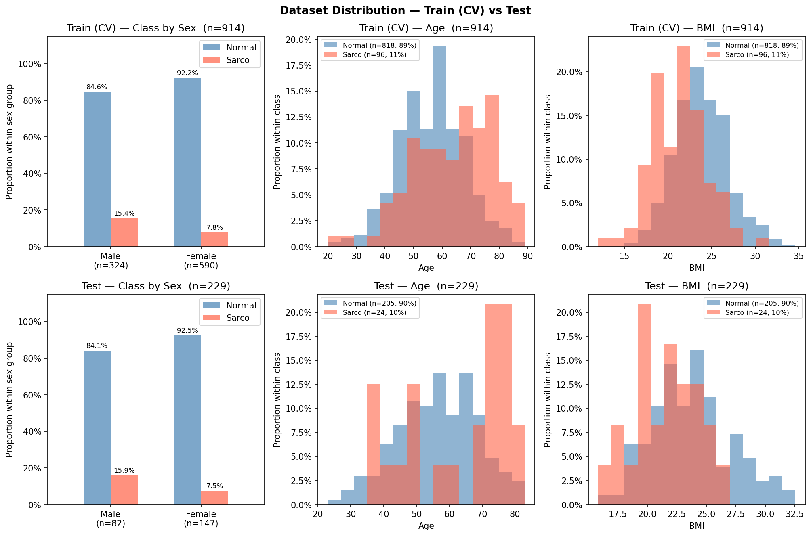

# SMI Binary Classification — CrossAttn Results

Generated: 2026-05-28 22:01  |  5-Fold CV  |  Median best epoch: 18

---

## 0. Dataset Distribution

### Class Distribution

| Split | Sex | n | Normal | Normal % | Sarco | Sarco % |
|-------|-----|--:|-------:|---------:|------:|--------:|
| Train | M | 324 | 274 | 84.6% | 50 | 15.4% |
| Train | F | 590 | 544 | 92.2% | 46 | 7.8% |
| Train | **All** | **914** | **818** | **89.5%** | **96** | **10.5%** |
| Test | M | 82 | 69 | 84.1% | 13 | 15.9% |
| Test | F | 147 | 136 | 92.5% | 11 | 7.5% |
| Test | **All** | **229** | **205** | **89.5%** | **24** | **10.5%** |

### Age

| Split | Sex | n | Mean ± Std | Min | Median | Max |
|-------|-----|--:|----------:|----:|-------:|----:|
| Train | M | 324 | 59.79 ± 12.13 | 20.00 | 60.00 | 89.00 |
| Train | F | 590 | 55.39 ± 11.41 | 23.00 | 55.00 | 87.00 |
| Train | **All** | **914** | **56.95 ± 11.86** | **20.00** | **57.00** | **89.00** |
| Test | M | 82 | 59.71 ± 12.20 | 29.00 | 60.00 | 81.00 |
| Test | F | 147 | 55.03 ± 12.43 | 23.00 | 55.00 | 83.00 |
| Test | **All** | **229** | **56.71 ± 12.55** | **23.00** | **57.00** | **83.00** |

### BMI

| Split | Sex | n | Mean ± Std | Min | Median | Max |
|-------|-----|--:|----------:|----:|-------:|----:|
| Train | M | 324 | 24.36 ± 3.00 | 14.34 | 24.26 | 32.67 |
| Train | F | 590 | 23.15 ± 3.19 | 12.02 | 22.95 | 34.61 |
| Train | **All** | **914** | **23.58 ± 3.17** | **12.02** | **23.44** | **34.61** |
| Test | M | 82 | 24.32 ± 3.06 | 18.78 | 24.17 | 32.56 |
| Test | F | 147 | 23.08 ± 3.44 | 15.84 | 22.60 | 32.48 |
| Test | **All** | **229** | **23.52 ± 3.36** | **15.84** | **23.41** | **32.56** |

---

## 1. Cross-Validation Summary

### CrossAttn

| Fold | AUC-ROC | AUPRC | Brier | Accuracy | F1 |
|------|--------:|------:|------:|---------:|---:|
| 1 | 0.8193 | 0.3477 | 0.2130 | 0.6885 | 0.3871 |
| 2 | 0.8517 | 0.4486 | 0.1592 | 0.8033 | 0.4857 |
| 3 | 0.7847 | 0.2668 | 0.2416 | 0.6721 | 0.3617 |
| 4 | 0.7628 | 0.3477 | 0.1527 | 0.6448 | 0.3299 |
| 5 | 0.8092 | 0.4650 | 0.1749 | 0.7033 | 0.3721 |
| **Mean** | **0.8055** | **0.3752** | **0.1883** | **0.7024** | **0.3873** |
| **±Std** | 0.0303 | 0.0731 | 0.0339 | 0.0540 | 0.0527 |

CrossAttn best val AUC per fold: Fold1=0.8193, Fold2=0.8517, Fold3=0.7847, Fold4=0.7628, Fold5=0.8092

---

## 2. Test Set Performance

### Overall

| Model | AUC-ROC | AUPRC | Brier | Accuracy | F1 |
|-------|--------:|------:|------:|---------:|---:|
| CrossAttn | 0.8039 | 0.3706 | 0.1968 | 0.7074 | 0.3495 |

### By Sex

| Sex | n | AUC-ROC | AUPRC | Brier | Accuracy | F1 |
|-----|--:|--------:|------:|------:|---------:|---:|
| M | 82 | 0.7480 | 0.3923 | 0.2610 | 0.6463 | 0.4082 |
| F | 147 | 0.8215 | 0.3722 | 0.1609 | 0.7415 | 0.2963 |

---

## 3. Confusion Matrix (Test Set)

|  | Pred: Normal | Pred: Sarco |
|--|-------------:|------------:|
| **True: Normal** | 144 | 61 |
| **True: Sarco**  | 6 | 18 |

---

## 4. Bootstrap 95% CI  (n_boot=2000)

> Estimate: 원본 test set 기준. 95% CI: 2.5th–97.5th percentile.

| Metric | Estimate | CI Lower | CI Upper |
|--------|--------:|---------:|---------:|
| AUC-ROC | 0.8039 | 0.7098 | 0.8874 |
| AUPRC | 0.3706 | 0.2200 | 0.5675 |
| Brier | 0.1968 | 0.1657 | 0.2287 |
| Accuracy | 0.7074 | 0.6507 | 0.7686 |
| F1 | 0.3495 | 0.2307 | 0.4615 |

---

## 5. Figures

| File | Description |
|------|-------------|
| `data_distribution.png` | Train/Test class·Age·BMI distributions |
| `cv_roc_curves.png` | Per-fold ROC curves (CrossAttn) |
| `cv_metric_distribution.png` | Boxplot of AUC / Acc / F1 across folds |
| `training_curves.png` | Loss & AUC training curves (mean ± std) |
| `test_roc_curves.png` | Final test-set ROC curve |
| `test_roc_by_sex.png` | Final test-set ROC curves by sex |
| `confusion_matrices.png` | Test-set confusion matrices |
| `calibration.png` | Calibration plot (reliability diagram) + Precision-Recall curve |
