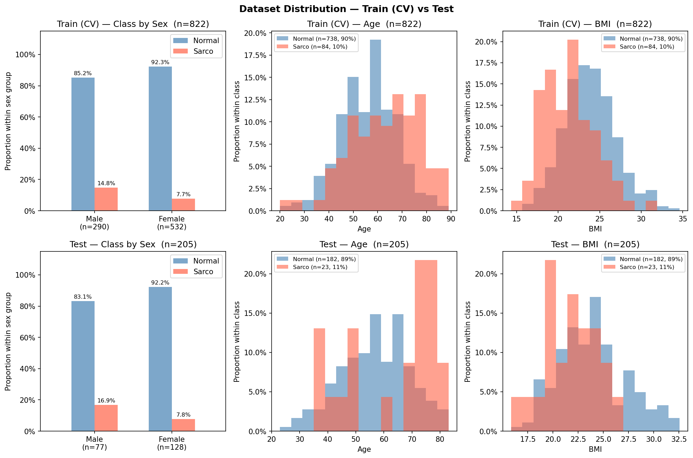

# SMI Binary Classification — CrossAttn Results

Generated: 2026-05-28 21:29  |  5-Fold CV  |  Median best epoch: 17

---

## 0. Dataset Distribution

### Class Distribution

| Split | Sex | n | Normal | Normal % | Sarco | Sarco % |
|-------|-----|--:|-------:|---------:|------:|--------:|
| Train | M | 290 | 247 | 85.2% | 43 | 14.8% |
| Train | F | 532 | 491 | 92.3% | 41 | 7.7% |
| Train | **All** | **822** | **738** | **89.8%** | **84** | **10.2%** |
| Test | M | 77 | 64 | 83.1% | 13 | 16.9% |
| Test | F | 128 | 118 | 92.2% | 10 | 7.8% |
| Test | **All** | **205** | **182** | **88.8%** | **23** | **11.2%** |

### Age

| Split | Sex | n | Mean ± Std | Min | Median | Max |
|-------|-----|--:|----------:|----:|-------:|----:|
| Train | M | 290 | 59.75 ± 12.17 | 20.00 | 60.00 | 89.00 |
| Train | F | 532 | 55.09 ± 11.42 | 23.00 | 55.00 | 87.00 |
| Train | **All** | **822** | **56.73 ± 11.90** | **20.00** | **57.00** | **89.00** |
| Test | M | 77 | 60.06 ± 12.23 | 29.00 | 61.00 | 81.00 |
| Test | F | 128 | 55.41 ± 12.71 | 23.00 | 55.00 | 83.00 |
| Test | **All** | **205** | **57.16 ± 12.73** | **23.00** | **58.00** | **83.00** |

### BMI

| Split | Sex | n | Mean ± Std | Min | Median | Max |
|-------|-----|--:|----------:|----:|-------:|----:|
| Train | M | 290 | 24.36 ± 3.08 | 14.34 | 24.33 | 32.67 |
| Train | F | 532 | 23.17 ± 3.21 | 16.00 | 22.95 | 34.61 |
| Train | **All** | **822** | **23.59 ± 3.21** | **14.34** | **23.38** | **34.61** |
| Test | M | 77 | 24.46 ± 3.07 | 18.78 | 24.26 | 32.56 |
| Test | F | 128 | 23.14 ± 3.45 | 15.84 | 22.76 | 32.48 |
| Test | **All** | **205** | **23.63 ± 3.38** | **15.84** | **23.51** | **32.56** |

---

## 1. Cross-Validation Summary

### CrossAttn

| Fold | AUC-ROC | AUPRC | Brier | Accuracy | F1 |
|------|--------:|------:|------:|---------:|---:|
| 1 | 0.8621 | 0.3963 | 0.1966 | 0.7636 | 0.4507 |
| 2 | 0.7405 | 0.3253 | 0.1800 | 0.8182 | 0.4444 |
| 3 | 0.8784 | 0.5224 | 0.1459 | 0.7439 | 0.4324 |
| 4 | 0.7927 | 0.2951 | 0.1831 | 0.8293 | 0.4400 |
| 5 | 0.7530 | 0.3840 | 0.1373 | 0.7500 | 0.3692 |
| **Mean** | **0.8053** | **0.3846** | **0.1686** | **0.7810** | **0.4274** |
| **±Std** | 0.0560 | 0.0783 | 0.0229 | 0.0356 | 0.0297 |

CrossAttn best val AUC per fold: Fold1=0.8621, Fold2=0.7405, Fold3=0.8784, Fold4=0.7927, Fold5=0.7530

---

## 2. Test Set Performance

### Overall

| Model | AUC-ROC | AUPRC | Brier | Accuracy | F1 |
|-------|--------:|------:|------:|---------:|---:|
| CrossAttn | 0.7845 | 0.3114 | 0.1843 | 0.7854 | 0.3714 |

### By Sex

| Sex | n | AUC-ROC | AUPRC | Brier | Accuracy | F1 |
|-----|--:|--------:|------:|------:|---------:|---:|
| M | 77 | 0.7091 | 0.3418 | 0.2438 | 0.7013 | 0.4651 |
| F | 128 | 0.8203 | 0.3193 | 0.1485 | 0.8359 | 0.2222 |

---

## 3. Confusion Matrix (Test Set)

|  | Pred: Normal | Pred: Sarco |
|--|-------------:|------------:|
| **True: Normal** | 148 | 34 |
| **True: Sarco**  | 10 | 13 |

---

## 4. Figures

| File | Description |
|------|-------------|
| `data_distribution.png` | Train/Test class·Age·BMI distributions |
| `cv_roc_curves.png` | Per-fold ROC curves (CrossAttn) |
| `cv_metric_distribution.png` | Boxplot of AUC / Acc / F1 across folds |
| `training_curves.png` | Loss & AUC training curves (mean ± std) |
| `test_roc_curves.png` | Final test-set ROC curve |
| `test_roc_by_sex.png` | Final test-set ROC curves by sex |
| `confusion_matrices.png` | Test-set confusion matrices |
| `calibration.png` | Calibration plot (reliability diagram) + Precision-Recall curve |
