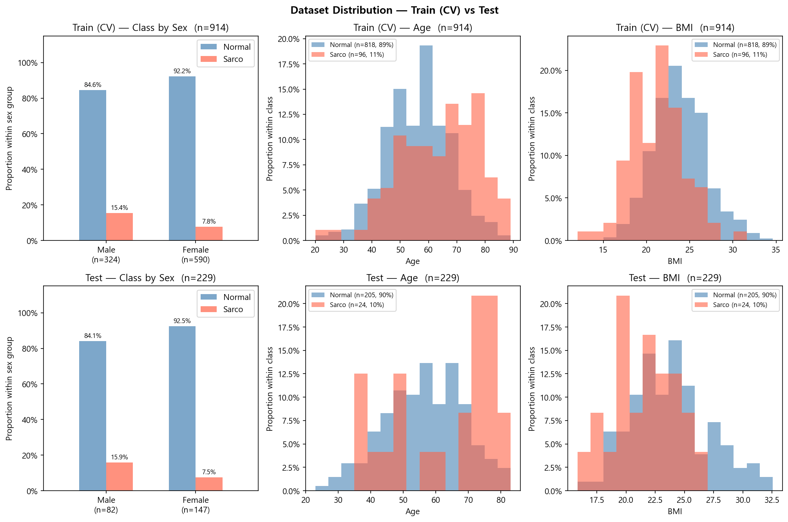

# SMI Binary Classification — CrossAttn Results

Generated: 2026-06-08 17:32  |  5-Fold CV  |  Median best epoch: 377

---

## 0. Dataset Distribution

### Class Distribution

| Split | Sex | n | Normal | Normal % | Sarco | Sarco % |
|-------|-----|--:|-------:|---------:|------:|--------:|
| Train | M | 324 | 274 | 84.6% | 50 | 15.4% |
| Train | F | 590 | 544 | 92.2% | 46 | 7.8% |
| Train | **All** | **914** | **818** | **89.5%** | **96** | **10.5%** |
| Test | M | 82 | 69 | 84.1% | 13 | 15.9% |
| Test | F | 147 | 136 | 92.5% | 11 | 7.5% |
| Test | **All** | **229** | **205** | **89.5%** | **24** | **10.5%** |

### Age

| Split | Sex | n | Mean ± Std | Min | Median | Max |
|-------|-----|--:|----------:|----:|-------:|----:|
| Train | M | 324 | 59.79 ± 12.13 | 20.00 | 60.00 | 89.00 |
| Train | F | 590 | 55.39 ± 11.41 | 23.00 | 55.00 | 87.00 |
| Train | **All** | **914** | **56.95 ± 11.86** | **20.00** | **57.00** | **89.00** |
| Test | M | 82 | 59.71 ± 12.20 | 29.00 | 60.00 | 81.00 |
| Test | F | 147 | 55.03 ± 12.43 | 23.00 | 55.00 | 83.00 |
| Test | **All** | **229** | **56.71 ± 12.55** | **23.00** | **57.00** | **83.00** |

### BMI

| Split | Sex | n | Mean ± Std | Min | Median | Max |
|-------|-----|--:|----------:|----:|-------:|----:|
| Train | M | 324 | 24.36 ± 3.00 | 14.34 | 24.26 | 32.67 |
| Train | F | 590 | 23.15 ± 3.19 | 12.02 | 22.95 | 34.61 |
| Train | **All** | **914** | **23.58 ± 3.17** | **12.02** | **23.44** | **34.61** |
| Test | M | 82 | 24.32 ± 3.06 | 18.78 | 24.17 | 32.56 |
| Test | F | 147 | 23.08 ± 3.44 | 15.84 | 22.60 | 32.48 |
| Test | **All** | **229** | **23.52 ± 3.36** | **15.84** | **23.41** | **32.56** |

---

## 1. Cross-Validation Summary

### CrossAttn

| Fold | AUC-ROC | AUPRC | Brier | Accuracy | F1 |
|------|--------:|------:|------:|---------:|---:|
| 1 | 0.8043 | 0.3455 | 0.2598 | 0.6503 | 0.3600 |
| 2 | 0.8383 | 0.4759 | 0.2213 | 0.7104 | 0.3908 |
| 3 | 0.7805 | 0.3169 | 0.2771 | 0.7322 | 0.3636 |
| 4 | 0.7927 | 0.3159 | 0.2512 | 0.7432 | 0.4051 |
| 5 | 0.8163 | 0.4083 | 0.2414 | 0.8681 | 0.5200 |
| **Mean** | **0.8064** | **0.3725** | **0.2502** | **0.7408** | **0.4079** |
| **±Std** | 0.0199 | 0.0616 | 0.0186 | 0.0713 | 0.0585 |

CrossAttn best val AUC per fold: Fold1=0.8043, Fold2=0.8383, Fold3=0.7805, Fold4=0.7927, Fold5=0.8163

---

## 2. Test Set Performance

### Overall

| Model | AUC-ROC | AUPRC | Brier | Accuracy | F1 |
|-------|--------:|------:|------:|---------:|---:|
| CrossAttn | 0.8171 | 0.2953 | 0.2567 | 0.7074 | 0.3738 |

### By Sex

| Sex | n | AUC-ROC | AUPRC | Brier | Accuracy | F1 |
|-----|--:|--------:|------:|------:|---------:|---:|
| M | 82 | 0.7492 | 0.3177 | 0.2919 | 0.6707 | 0.4255 |
| F | 147 | 0.8409 | 0.3158 | 0.2370 | 0.7279 | 0.3333 |

---

## 3. Confusion Matrix (Test Set)

|  | Pred: Normal | Pred: Sarco |
|--|-------------:|------------:|
| **True: Normal** | 142 | 63 |
| **True: Sarco**  | 4 | 20 |

---

## 4. Bootstrap 95% CI  (n_boot=2000)

> Estimate: 원본 test set 기준. 95% CI: 2.5th–97.5th percentile.

| Metric | Estimate | CI Lower | CI Upper |
|--------|--------:|---------:|---------:|
| AUC-ROC | 0.8171 | 0.7411 | 0.8881 |
| AUPRC | 0.2953 | 0.1942 | 0.4813 |
| Brier | 0.2567 | 0.2301 | 0.2817 |
| Accuracy | 0.7074 | 0.6463 | 0.7686 |
| F1 | 0.3738 | 0.2524 | 0.4909 |

---

## 5. Figures

| File | Description |
|------|-------------|
| `data_distribution.png` | Train/Test class·Age·BMI distributions |
| `cv_roc_curves.png` | Per-fold ROC curves (CrossAttn) |
| `cv_metric_distribution.png` | Boxplot of AUC / Acc / F1 across folds |
| `training_curves.png` | Loss & AUC training curves (mean ± std) |
| `test_roc_curves.png` | Final test-set ROC curve |
| `test_roc_by_sex.png` | Final test-set ROC curves by sex |
| `confusion_matrices.png` | Test-set confusion matrices |
| `calibration.png` | Calibration plot (reliability diagram) + Precision-Recall curve |
