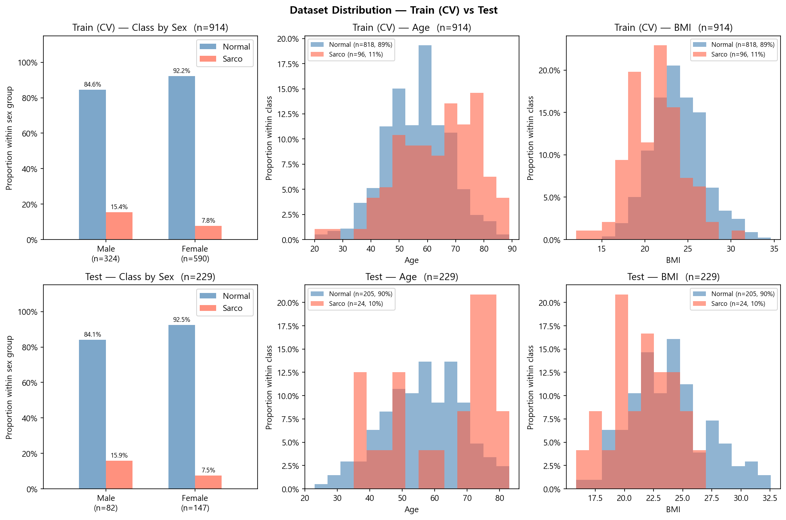

# SMI Binary Classification — Results

Generated: 2026-06-09 11:48  |  5-Fold CV  |  Model 1 (Clinic Only, LR)

---

## 0. Dataset Distribution

### Class Distribution

| Split | Sex | n | Normal | Normal % | Sarco | Sarco % |
|-------|-----|--:|-------:|---------:|------:|--------:|
| Train | M | 324 | 274 | 84.6% | 50 | 15.4% |
| Train | F | 590 | 544 | 92.2% | 46 | 7.8% |
| Train | **All** | **914** | **818** | **89.5%** | **96** | **10.5%** |
| Test | M | 82 | 69 | 84.1% | 13 | 15.9% |
| Test | F | 147 | 136 | 92.5% | 11 | 7.5% |
| Test | **All** | **229** | **205** | **89.5%** | **24** | **10.5%** |

### Age

| Split | Sex | n | Mean ± Std | Min | Median | Max |
|-------|-----|--:|----------:|----:|-------:|----:|
| Train | M | 324 | 59.79 ± 12.13 | 20.00 | 60.00 | 89.00 |
| Train | F | 590 | 55.39 ± 11.41 | 23.00 | 55.00 | 87.00 |
| Train | **All** | **914** | **56.95 ± 11.86** | **20.00** | **57.00** | **89.00** |
| Test | M | 82 | 59.71 ± 12.20 | 29.00 | 60.00 | 81.00 |
| Test | F | 147 | 55.03 ± 12.43 | 23.00 | 55.00 | 83.00 |
| Test | **All** | **229** | **56.71 ± 12.55** | **23.00** | **57.00** | **83.00** |

### BMI

| Split | Sex | n | Mean ± Std | Min | Median | Max |
|-------|-----|--:|----------:|----:|-------:|----:|
| Train | M | 324 | 24.36 ± 3.00 | 14.34 | 24.26 | 32.67 |
| Train | F | 590 | 23.15 ± 3.19 | 12.02 | 22.95 | 34.61 |
| Train | **All** | **914** | **23.58 ± 3.17** | **12.02** | **23.44** | **34.61** |
| Test | M | 82 | 24.32 ± 3.06 | 18.78 | 24.17 | 32.56 |
| Test | F | 147 | 23.08 ± 3.44 | 15.84 | 22.60 | 32.48 |
| Test | **All** | **229** | **23.52 ± 3.36** | **15.84** | **23.41** | **32.56** |

---

## 1. Cross-Validation Summary

### Logistic Regression

| Fold | AUC-ROC | AUPRC | Brier | Accuracy | F1 |
|------|--------:|------:|------:|---------:|---:|
| 1 | 0.8273 | 0.3419 | 0.1867 | 0.7760 | 0.4384 |
| 2 | 0.8678 | 0.4915 | 0.1454 | 0.7869 | 0.4658 |
| 3 | 0.7253 | 0.2821 | 0.2094 | 0.7377 | 0.3333 |
| 4 | 0.7683 | 0.3329 | 0.1711 | 0.7049 | 0.3721 |
| 5 | 0.8276 | 0.5305 | 0.1726 | 0.8626 | 0.5098 |
| **Mean** | **0.8032** | **0.3958** | **0.1770** | **0.7736** | **0.4239** |
| **±Std** | 0.0503 | 0.0970 | 0.0210 | 0.0531 | 0.0636 |

---

## 2. Test Set Performance

### Overall

| Model | AUC-ROC | AUPRC | Brier | Accuracy | F1 |
|-------|--------:|------:|------:|---------:|---:|
| Log. Reg. | 0.7874 | 0.2809 | 0.1885 | 0.7598 | 0.3820 |

### By Sex

| Sex | n | AUC-ROC | AUPRC | Brier | Accuracy | F1 |
|-----|--:|--------:|------:|------:|---------:|---:|
| M | 82 | 0.6901 | 0.2692 | 0.2601 | 0.6707 | 0.4490 |
| F | 147 | 0.8229 | 0.3465 | 0.1485 | 0.8095 | 0.3000 |

---

## 3. Confusion Matrix (Test Set)

|  | Pred: Normal | Pred: Sarco |
|--|-------------:|------------:|
| **True: Normal** | 157 | 48 |
| **True: Sarco**  | 7 | 17 |

---

## 4. Bootstrap 95% CI  (n_boot=2000)

> Estimate: 원본 test set 기준. 95% CI: 2.5th–97.5th percentile.

| Metric | Estimate | CI Lower | CI Upper |
|--------|--------:|---------:|---------:|
| AUC-ROC | 0.7874 | 0.7000 | 0.8624 |
| AUPRC | 0.2809 | 0.1711 | 0.4662 |
| Brier | 0.1885 | 0.1610 | 0.2154 |
| Accuracy | 0.7598 | 0.7031 | 0.8166 |
| F1 | 0.3820 | 0.2500 | 0.5055 |

---

## 5. Figures

| File | Description |
|------|-------------|
| `data_distribution.png` | Train/Test class·Age·BMI distributions |
| `cv_roc_curves.png` | Per-fold ROC curves (LR) |
| `cv_metric_distribution.png` | Boxplot of AUC / Acc / F1 across folds |
| `confusion_matrices.png` | Test-set confusion matrices (overall + by sex) |
| `test_roc_curves.png` | Final test-set ROC curve (overall) |
| `test_roc_by_sex.png` | Final test-set ROC curves split by sex |
| `calibration.png` | Calibration plot (reliability diagram) + Precision-Recall curve |
