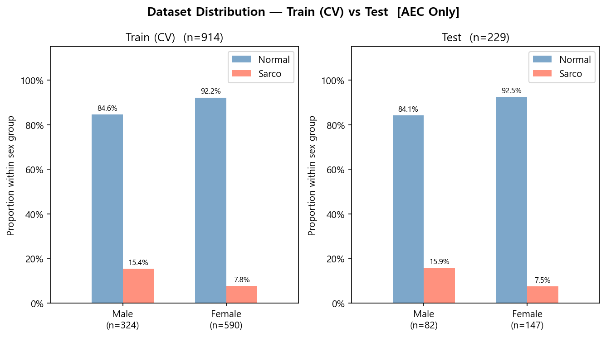

# SMI Binary Classification — AECOnly Results

Generated: 2026-06-11 14:13  |  5-Fold CV  |  Median best epoch: 4

---

## 0. Dataset Distribution

### Class Distribution

| Split | Sex | n | Normal | Normal % | Sarco | Sarco % |
|-------|-----|--:|-------:|---------:|------:|--------:|
| Train | M | 324 | 274 | 84.6% | 50 | 15.4% |
| Train | F | 590 | 544 | 92.2% | 46 | 7.8% |
| Train | **All** | **914** | **818** | **89.5%** | **96** | **10.5%** |
| Test | M | 82 | 69 | 84.1% | 13 | 15.9% |
| Test | F | 147 | 136 | 92.5% | 11 | 7.5% |
| Test | **All** | **229** | **205** | **89.5%** | **24** | **10.5%** |

---

## 1. Cross-Validation Summary

### AECOnly

| Fold | AUC-ROC | AUPRC | Brier | Accuracy | F1 |
|------|--------:|------:|------:|---------:|---:|
| 1 | 0.6178 | 0.1556 | 0.3496 | 0.6940 | 0.3171 |
| 2 | 0.5003 | 0.1194 | 0.2568 | 0.5683 | 0.2020 |
| 3 | 0.5504 | 0.1622 | 0.3144 | 0.4809 | 0.2149 |
| 4 | 0.4994 | 0.1065 | 0.2633 | 0.6120 | 0.2022 |
| 5 | 0.4931 | 0.1575 | 0.3082 | 0.8901 | 0.2308 |
| **Mean** | **0.5322** | **0.1402** | **0.2985** | **0.6491** | **0.2334** |
| **±Std** | 0.0475 | 0.0228 | 0.0345 | 0.1388 | 0.0431 |

AECOnly best val AUC per fold: Fold1=0.6178, Fold2=0.5003, Fold3=0.5504, Fold4=0.4994, Fold5=0.4931

---

## 2. Test Set Performance

### Overall

| Model | AUC-ROC | AUPRC | Brier | Accuracy | F1 |
|-------|--------:|------:|------:|---------:|---:|
| AECOnly | 0.5386 | 0.1490 | 0.2529 | 0.8952 | 0.0000 |

### By Sex

| Sex | n | AUC-ROC | AUPRC | Brier | Accuracy | F1 |
|-----|--:|--------:|------:|------:|---------:|---:|
| M | 82 | 0.5741 | 0.2140 | 0.2534 | 0.8415 | 0.0000 |
| F | 147 | 0.4158 | 0.1095 | 0.2526 | 0.9252 | 0.0000 |

---

## 3. Confusion Matrix (Test Set)

|  | Pred: Normal | Pred: Sarco |
|--|-------------:|------------:|
| **True: Normal** | 205 | 0 |
| **True: Sarco**  | 24 | 0 |

---

## 4. Bootstrap 95% CI  (n_boot=2000)

> Estimate: 원본 test set 기준. 95% CI: 2.5th–97.5th percentile.

| Metric | Estimate | CI Lower | CI Upper |
|--------|--------:|---------:|---------:|
| AUC-ROC | 0.5386 | 0.4010 | 0.6694 |
| AUPRC | 0.1490 | 0.0862 | 0.2802 |
| Brier | 0.2529 | 0.2523 | 0.2535 |
| Accuracy | 0.8952 | 0.8515 | 0.9301 |
| F1 | 0.0000 | 0.0000 | 0.0000 |

---

## 5. Figures

| File | Description |
|------|-------------|
| `label_distribution.png` | Train/Test class·sex distributions |
| `cv_roc_curves.png` | Per-fold ROC curves (AECOnly) |
| `cv_metric_distribution.png` | Boxplot of AUC / Acc / F1 across folds |
| `training_curves.png` | Loss & AUC training curves (mean ± std) |
| `test_roc_curves.png` | Final test-set ROC curve |
| `test_roc_by_sex.png` | Final test-set ROC curves by sex |
| `confusion_matrices.png` | Test-set confusion matrices |
| `calibration.png` | Calibration plot + Precision-Recall curve |
| `cam_aec_mean.png` | Grad-CAM mean ± std per class |
| `cam_aec_lines.png` | Grad-CAM individual samples per class |
| `cam_aec_heatmap.png` | Grad-CAM sample-level heatmap |
